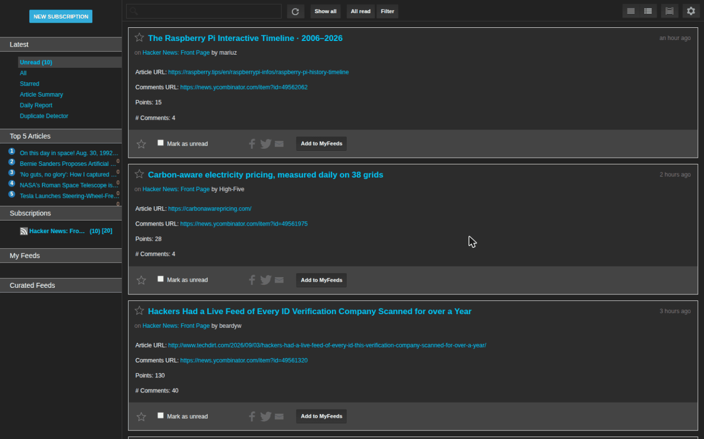
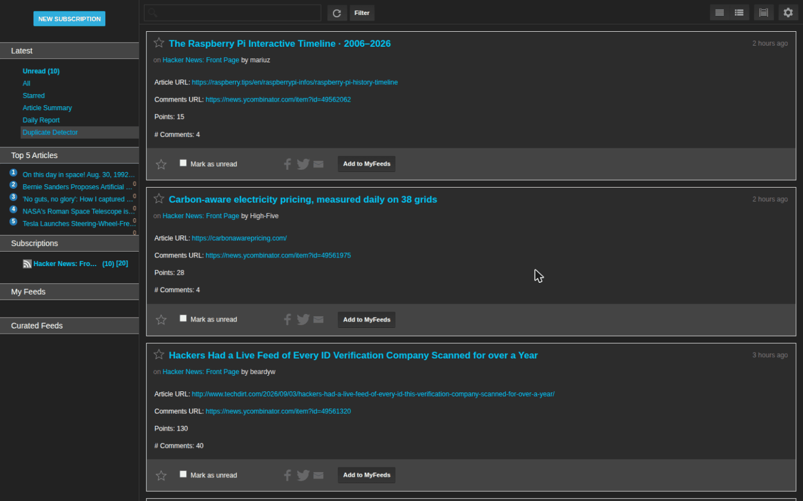
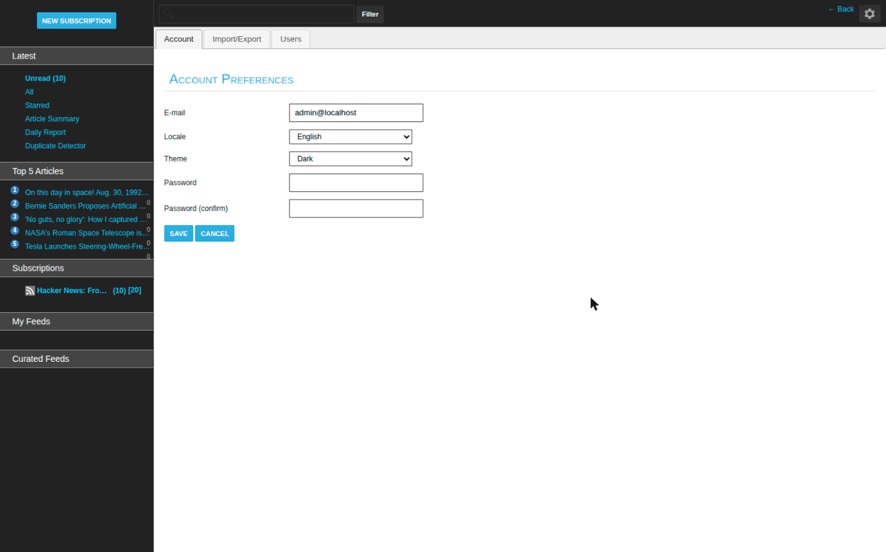
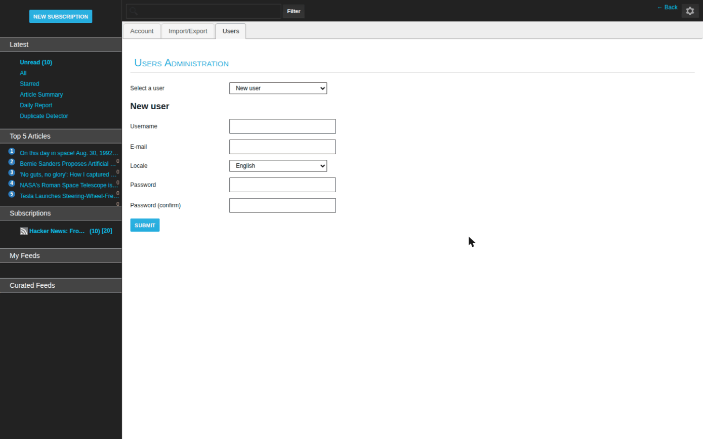
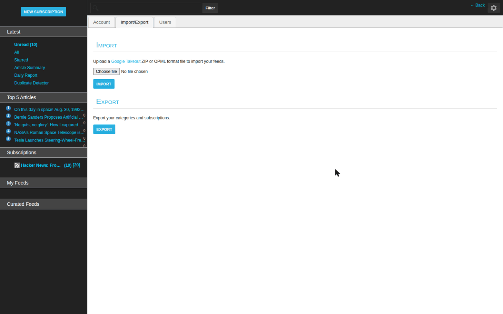

<div align="center">

<picture>
  <source media="(prefers-color-scheme: dark)" srcset="./docs/assets/adk_dev_logo_light.png">
  
</picture>

# FeedStack

**A self-hosted RSS and Atom reader. Subscribe to feeds, FeedStack polls them on a schedule, and everything new lands in one list you can organise, search, star and read from a browser or an Android phone.**


<br>


<br><br>

**[Developer documentation](./DEVDOC.md)** · [Features](#features) · [Running it](#running-it)

<p><b>Dark mode</b> · <a href="./README-light.md">View this page in light mode</a></p>

</div>

---

It started as a fork of [Sismics Reader](https://github.com/sismics/reader) used for a two-part software engineering project: part one refactored the codebase to remove design smells, part two added new reader features on top. Both parts live in this repository.

## Contents

- [Why this project matters](#why-this-project-matters)
- [Screenshots](#screenshots)
- [Features](#features)
- [Roles](#roles)
- [Running it](#running-it)
- [Tech stack](#tech-stack)
- [Project documentation](#project-documentation)
- [Contributors](#contributors)
- [Licence](#licence)

---

## Why this project matters

A feed reader is a deceptively good subject for a refactoring exercise, which is
what this started as. It has a scheduler, a parser for two formats that disagree
with each other, a full-text index, a REST API, a web client and a mobile client,
and none of those can be faked. There is nowhere to hide a design smell.

The parts worth reading are the ones that had to survive being changed. Feed
polling is a scheduled job that has to cope with feeds that are slow, malformed,
gone, or returning a redirect chain; a reader that falls over on one bad feed is
useless. Article state is per user, so the same article is unread for one person
and starred by another. And the Lucene index has to stay in step with the
database without either one blocking a request, which is why the work happens on
Guava events rather than inline.

Part two added the features on top of that: a summariser, a daily report, and a
duplicate detector for the same story arriving through three different feeds.

## Screenshots

Every image is a real 1440x900 viewport render against a live instance with three
subscriptions. This page shows **dark mode**; the same gallery in light mode is at **[README-light.md](./README-light.md)**.

<table>
  <tr>
    <td width="33%" valign="top">
      
      <p align="center"><b>Reader</b><br><sub>Unread articles, with per-feed counts in the sidebar.</sub></p>
    </td>
    <td width="33%" valign="top">
      
      <p align="center"><b>Duplicate detector</b><br><sub>The same story arriving through more than one feed.</sub></p>
    </td>
    <td width="33%" valign="top">
      
      <p align="center"><b>Account</b><br><sub>Locale and theme are per user, stored server side.</sub></p>
    </td>
  </tr>
  <tr>
    <td width="33%" valign="top">
      
      <p align="center"><b>Users</b><br><sub>Admin-only, behind the ADMIN base function.</sub></p>
    </td>
    <td width="33%" valign="top">
      
      <p align="center"><b>Import and export</b><br><sub>OPML or a Google Takeout ZIP, in and out.</sub></p>
    </td>
    <td width="33%" valign="top">
      
      <p align="center"><b>Themes</b><br><sub>Three ship: default, dark and high contrast, per user.</sub></p>
    </td>
  </tr>
</table>

## Features

### Reading

- Subscribe to any RSS or Atom feed by URL
- Unread counts per subscription, per category, and across everything
- Mark a single article, a whole subscription, or a whole category as read
- Star articles you want to come back to, with a separate starred view
- Full text search across every article you have ever received
- Keyboard shortcuts for moving through the article list
- Themes, including a dark theme and a high contrast theme
- Eleven interface languages

### Organising

- Group subscriptions into categories, and fold categories you are not using
- Import an existing setup from an OPML file, and export yours back out
- Feed favicons are fetched and cached so the list stays scannable

### Clients

- Web interface, laid out for desktop and for phones
- Native Android app in `reader-android`
- A REST API that both clients use, so you can drive it from your own scripts

### Added in part two

All merged into `master` as of v2.0.0:

- Self service registration with username, email and password validation
- Filter the article list by source or by other criteria without leaving the page
- Report a bug from inside the app, with a status that moves as it gets handled
- Richer category management
- Simulated and user-created feeds, so you can build a feed out of an API that does not publish one
- A daily report that summarises your unread articles with an LLM
- Duplicate article detection, so the same story from two sources collapses
- A trending view of the top news items

## Roles

| Role | Can do |
|---|---|
| **user** | Everything above for their own account: subscriptions, categories, starred articles, search, import and export |
| **admin** | All of the above, plus create and delete users, reindex the search index, and read the application log |

The first run wizard creates the `admin` account. The default credentials are `admin` / `admin`, and the app asks you to change the password on first login.

## Running it

You need JDK 8 and Maven 3. From the repository root:

```bash
mvn clean -DskipTests install -e
```

Then from `reader-web`:

```bash
mvn jetty:run
```

Open <http://localhost:8080/reader-web/src/#/wizard> and complete the setup wizard.

Full build options, including the WAR, the Docker image, the native installers and the Android APK, are in [DEVDOC.md](./DEVDOC.md).

## Tech stack

Java 8, Jersey (JAX-RS), Hibernate over HSQLDB or PostgreSQL, Lucene for search, Jetty for serving, and a jQuery and Backbone front end built with LESS. The Android client is a separate Gradle project.

## Project documentation

The coursework write-ups live in `docs/`:

| Document | What is in it |
|---|---|
| [`docs/designSmells.md`](./docs/designSmells.md) | The eight design smells found and how each was refactored |
| [`docs/Task1_UMLdiagrams/`](./docs/Task1_UMLdiagrams/) | UML for the user management, feed organisation and subscription subsystems |
| [`docs/Task2B_Code_Metrics/`](./docs/Task2B_Code_Metrics/) | Code metrics before and after the refactoring |
| [`docs/designite/`](./docs/designite/) | Raw DesigniteJava output |
| [`docs/llm_pipeline/`](./docs/llm_pipeline/) | The automated LLM refactoring pipeline |
| [`docs/llm_responses/`](./docs/llm_responses/) | LLM transcripts for each smell |
| [`docs/bonus/`](./docs/bonus/) | Bonus task: comparing free LLMs at code analysis |
| `docs/project_2_20.md` (on `project2_20`) | The part two features and the design patterns behind each |

## Contributors

<table>
  <tr>
    <td align="center">
      <a href="https://github.com/Dileepadari">
        
        <br><sub><b>Dileep Adari</b></sub>
      </a>
      <br><sub>Fork author and maintainer</sub>
    </td>
    <td align="center">
      <a href="https://github.com/Keshavakishorananda">
        
        <br><sub><b>Keshava kishora nanda Veerapuneni</b></sub>
      </a>
      <br><sub>Contributor</sub>
    </td>
    <td align="center">
      <a href="https://github.com/nagarevanth">
        
        <br><sub><b>Revanth Reddy</b></sub>
      </a>
      <br><sub>Contributor</sub>
    </td>
    <td align="center">
      <a href="https://github.com/ritvikmns">
        
        <br><sub><b>Modumudi Naga Sai Ritvik</b></sub>
      </a>
      <br><sub>Contributor</sub>
    </td>
    <td align="center">
      <a href="https://github.com/ShailenderGoyal">
        
        <br><sub><b>Shailender Goyal</b></sub>
      </a>
      <br><sub>Contributor</sub>
    </td>
  </tr>
</table>

Plus the [Sismics Reader](https://github.com/sismics/reader) authors, whose work
this is built on and whose copyright stays with it.

## Licence

GPL 2.0, inherited from Sismics Reader. See [`COPYING`](./COPYING).
