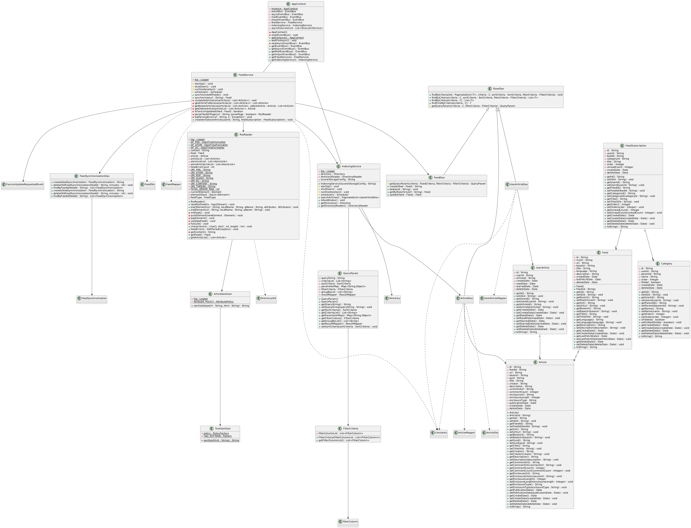
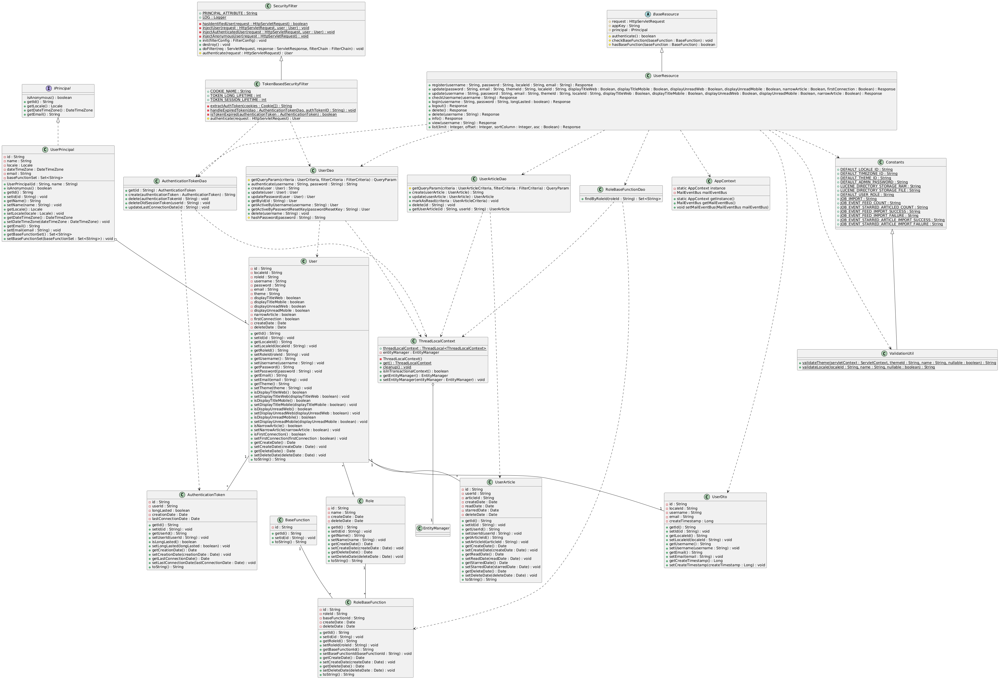

#  CS6.401 Software Engineering - Rudra’s Subscription Service (RSS) Reader

There are three subsystem which are under the project, The relevant class diagrams of the following three subsystems are provided in the separate uml files and the details of them are as are as follows:        

## Subscription and Content Subsystem:        
**Description:** This is where new feed is added to the reader. The feed can be fetched from a URL or imported via a Google Takeout ZIP or OPML format file. You can also export your subscriptions to an xml. The system also displays the 10 most recent articles when you add a new feed. Now that you’ve added a feed, you can read the articles from it or follow the link to the original site. The system only supports RSS feed formats.        

**Class Diagram:**

These are class that we feel are the main classes from the Subscription and Content Subsystem and we provided the detailed explanation of the classes and the system:

#### **Core Classes**  

##### **AppContext**  
- **Role**: The AppContext class is a central component in the application, designed to manage and provide access to core services and event buses. It follows the Singleton design pattern to ensure that only one instance of the application context exists throughout the application's lifecycle. This class is responsible for initializing and managing event buses for synchronous and asynchronous events, as well as providing access to key services like 'FeedService' and 'IndexingService'.
- **Key Functionality**:  
  - `Constructor` initializes the application context by setting up event buses and starting core services.
  - Initializes synchronous/asynchronous event buses (`eventBus`, `asyncEventBus`).  
  - Provides access to critical services (`FeedService`, `IndexingService`).  
  - Centralizes event listener registration (e.g., `SubscriptionImportAsyncListener`).  
- **Behavior**:  
  - Uses `resetEventBus()` during initialization to register listeners. This method is called during initialization and when resetting the context.
  - `newAsyncEventBus()` creates thread-safe executors for async operations.  

##### **SubscriptionImportedEvent**  
- **Role**: Event raised when a subscription file (OPML/Google Takeout ZIP) is imported.  
- **Data**: Contains `User` (importer) and `File` (import file). It contains Setters and Getters for User and File.  
- **Flow**: Triggered by user upload, processed asynchronously by `SubscriptionImportAsyncListener`.

---

#### **Import Processing**  

##### **SubscriptionImportAsyncListener**  
- **Role**: Handles `SubscriptionImportedEvent` to process OPML/Starred articles. This class is part of the event-driven architecture, allowing asynchronous handling of import requests. It interacts with various services and DAOs to perform the import operations. 
- **Key Methods**:  
  - `onSubscriptionImport()`:  
    1. Checks if the file is a ZIP (Google Takeout) or OPML.  
    2. Extracts ZIP contents (OPML + Starred JSON) or processes OPML directly.  
    3. Uses `OpmlReader`/`StarredReader` to parse data.  
    4. Creates `Job` to track import progress.
  - `createJob()`: Determines the number of feeds and starred articles in the import file and creates a new tracking job.
  - `processImportFile()`: Extracts and imports feeds and starred articles from ZIP archives and OPML files
  - `importOutline()`: Flattens OPML categories via `OpmlFlattener`, creates feeds via `FeedService.synchronize()`.  
  - `importFeedFromStarred()`: Imports feeds from starred articles (e.g., Google Takeout JSON).  
  - `getFeedCount()`: Gets the number of feeds in a Outline list.

##### **OPML Processing Components**  
- **OpmlReader**: Parses OPML XML into a tree of `Outline` objects (hierarchy of feeds/categories).  
- **OpmlFlattener**: Converts (Flattens) the tree (hierarchical list of Outline objects) into a `Map<String, List<Outline>>` (category → feeds).  
- **Outline**: Represents an individual outline in an OPML document, containing properties like text, title, URLs, type, and sub-outlines.

##### **StarredReader & StarredArticleImportedEvent**  
- **StarredReader**: Parses JSON files (from Google Takeout ZIP), emits `StarredArticleImportedEvent` per article.  
- **StarredArticleImportedEvent**: Event raised when a starred article is imported.
- **StarredArticleImportAsyncListener**: Listens to events, creates/updates `Feed`, `Article`, and `UserArticle` records.  
- The `setStarredArticleListener()` registers a listener for starred articles and `read()` method reads and processes the starred articles, triggering events accordingly.      

---

#### **Feed & Article Management**  

##### **FeedService**  
- **Role**: Manages feed synchronization and processing of RSS/Atom feeds, handling fetching, parsing, updating, and synchronization of feeds. 
- **Key Methods**:  
  - `synchronize(url)`:  
    1. Fetches feed via `RssReader` (RSS/Atom) or `RssExtractor` (HTML links).  
    2. Compares new articles with existing DB entries.  
    3. Emits `ArticleCreated/Updated/DeletedAsyncEvent` for changes.  
  - `createInitialUserArticle()`: Generates initial unread articles for new subscriptions.  
  - `completeArticleList()`: Ensures all articles have necessary metadata.
  - `getArticleToRemove()`: Identifies articles removed from the feed since the last synchronization.
  - `parseFeedOrPage()`: Parses RSS/Atom feeds or extracts feeds from HTML pages.
- **Dependencies**: Uses `RssReader` and `XmlReader` (XML parsing) and `RssExtractor` (HTML link discovery).  

##### **RssReader & RssExtractor**  
- **RssReader**: SAX parser for RSS/Atom feeds. Extracts `Feed` metadata and `Article` list.  
- **RssExtractor**: Parses HTML pages to discover RSS/Atom feed URLs.  

---

#### **Pagination & Data Retrieval**  

##### **PaginatedLists & PaginatedList**  
- **Role**: Provides utilities for managing paginated lists of database query results, ensuring efficient retrieval and display.
- **Key Features**:  
  - `create()`: Constructs a paginated list with defined constraints.   
  - `executePaginatedQuery()`: Runs two queries (count + data retrieval).  
  - `getOrderByClause()`: Constructs ORDER BY clauses.
  - Supports sorting (`SortCriteria`) and filtering (`FilterCriteria`).  
- **Usage**: Used by `SubscriptionResource` to paginate subscription lists.  

---

### Flow of Control

1. **Initialization**: `AppContext` registers `SubscriptionImportAsyncListener` with the event bus.
2. **Event Handling**: `SubscriptionImportAsyncListener` listens for `SubscriptionImportedEvent`.
3. **Processing**: Upon event reception, `onSubscriptionImport` processes the import file.
4. **File Handling**:
   - If the file is a ZIP archive:
     - Extract and process JSON (for starred articles) using `StarredReader`.
     - Create `StarredArticleImportedEvent`, triggering `StarredArticleImportAsyncListener`.
     - Extract and process OPML to retrieve `Outline` (feeds).
   - If the file is an OPML file, process it directly using `OpmlReader`.
5. **Feed and Article Creation**:
   - `Outline` maps feeds to categories.
   - New categories are created as needed.
   - Feeds are extracted, and `FeedService` synchronizes them using `RssReader` and `RssExtractor`.
6. **Synchronization**: `FeedService` ensures all articles are updated or removed accordingly.
7. **Pagination**: User articles are created and handled using `PaginatedList` and `PaginatedLists`.

This subsystem enables seamless subscription management, efficient feed processing, and real-time content updates through event-driven mechanisms.

---

### **Observations & Comments**  
**Strengths**:  
- **Event-Driven Architecture**: Decouples import processing (`SubscriptionImportAsyncListener`), feed synchronization (`FeedService`), and indexing (`IndexingService`).  
- **Modular Parsing**: `OpmlReader`/`StarredReader` handle diverse file formats cleanly.  
- **Pagination Utility**: `PaginatedLists` simplifies large dataset management.  

**Weaknesses**:  
- **Singleton Overuse**: `AppContext` as a global singleton may hinder testability.  
- **Thread Safety**: `asyncEventBus` uses a single-thread executor; bottlenecks possible for large imports.  
- **Error Handling**: Limited logging in `RssReader`/`OpmlReader` could obscure parsing failures.  

---

### **Assumptions**  
1. About Dao's, Dto's, Criteria and Entity's
    - For the sake of clear visbility and clear representation. We have not represented the relation of main classes like **FeedService**, **RssReader**, **RssExtractor**, **ArticleCreatedAsyncEvent**, **ArticleUpdatedAsyncEvent** and **ArticleDeletedAsyncEvent** etc... with Dao's, Dto's, criteria and Entity's.

    - But in actual implementation, these classes are related to each other and are used to perform operations like creating, updating, deleting and reading the data from the database.

    - But we represented relations among Dao's, Dto's, criteria and Entity's.

2. Many of the external packages like **EntityManager**, **TransactionUtil**, **DocumentBuilderFcatory** etc... are not shown in UML diagram.

---

      
## Feed Organization Subsystem:           
**Description:** Now that you have a lot of feeds and articles to comb through, you want some way to order them. Rudra has provided you with the ability to star articles, mark them as read and organize them into folders. You can also share these articles through Facebook, Twitter and Email. You can also search for articles based on their name/content (its quite primitive though). 

**Class Diagram:**

These are class that we feel are the main classes from the Feed Organization Subsystem and we provided the detailed explanation of the classes and the system:

#### **Core Classes**

##### **Article**
- **Role**: Represents an individual article fetched from a feed. Stores metadata and content of the article.
- **Key Functionality**:  
  - Stores article metadata such as title, URL, publication date, and content.
  - Provides methods to retrieve and update article information.
- **Behavior**:  
  - Interacts with `Feed` to associate articles with their respective feeds.
  - Can be marked as read or starred by users.

##### **Feed**
- **Role**: Represents a feed that contains multiple articles. Stores metadata about the feed.
- **Key Functionality**:  
  - Stores feed metadata such as title, URL, and description.
  - Provides methods to retrieve and update feed information.
- **Behavior**:  
  - Contains a list of `Article` objects.
  - Can be organized into folders and shared via social media.

##### **Category**
- **Role**: Represents a category that can contain multiple feeds. Allows users to organize their feeds.
- **Key Functionality**:  
  - Stores category metadata such as name and description.
  - Provides methods to add, remove, and retrieve feeds within the category.
- **Behavior**:  
  - Interacts with `Feed` to manage the organization of feeds.
  - Supports hierarchical organization of feeds.

##### **IndexingService**
- **Role**: Provides functionality to search for articles based on their name or content.
- **Key Functionality**:  
  - Provides methods to search for articles using keywords.
  - Supports basic search functionality.
- **Behavior**:  
  - Interacts with `Article` to retrieve search results.
  - Can be used to filter articles based on user preferences.

##### **UserArticle**
- **Role**: Represents the relationship between a user and an article.
- **Key Functionality**:  
  - Stores user-specific information about an article, such as read status and starred status.
  - Provides methods to manage the user's interaction with the article.
- **Behavior**:  
  - Interacts with `Article` and `User` to manage the user's interaction with the article.

##### **FeedSubscriptionDao**
- **Role**: Data access object for `FeedSubscription`.
- **Key Functionality**:  
  - Provides methods to create, update, and delete feed subscriptions.
  - Provides methods to retrieve feed subscriptions based on various criteria.
- **Behavior**:  
  - Interacts with the database to manage feed subscriptions.

##### **UserArticleDao**
- **Role**: Data access object for `UserArticle`.
- **Key Functionality**:  
  - Provides methods to create, update, and delete user articles.
  - Provides methods to retrieve user articles based on various criteria.
- **Behavior**:  
  - Interacts with the database to manage user articles.

##### **CategoryDao**
- **Role**: Data access object for `Category`.
- **Key Functionality**:  
  - Provides methods to create, update, and delete categories.
  - Provides methods to retrieve categories based on various criteria.
- **Behavior**:  
  - Interacts with the database to manage categories.

##### **FeedDao**
- **Role**: Data access object for `Feed`.
- **Key Functionality**:  
  - Provides methods to create, update, and delete feeds.
  - Provides methods to retrieve feeds based on various criteria.
- **Behavior**:  
  - Interacts with the database to manage feeds.

##### **ArticleDao**
- **Role**: Data access object for `Article`.
- **Key Functionality**:  
  - Provides methods to create, update, and delete articles.
  - Provides methods to retrieve articles based on various criteria.
- **Behavior**:  
  - Interacts with the database to manage articles.

##### **ArticleResource**
- **Role**: REST API endpoint for managing articles.
- **Key Functionality**:
  - Provides endpoints for creating, updating, and deleting articles.
  - Provides endpoints for retrieving articles based on various criteria.
- **Behavior**:
  - Interacts with `ArticleDao` to manage articles.
  - Provides RESTful endpoints for article management.

##### **StarredResource**
- **Role**: REST API endpoint for managing starred articles.
- **Key Functionality**:
  - Provides endpoints for marking articles as starred.
  - Provides endpoints for retrieving starred articles.
- **Behavior**:
  - Interacts with `UserArticleDao` to manage user articles.
  - Provides RESTful endpoints for managing starred articles.

##### **SearchResource**
- **Role**: REST API endpoint for searching articles.
- **Key Functionality**:
  - Provides endpoints for searching articles based on keywords.
  - Provides endpoints for filtering search results.
- **Behavior**:
  - Interacts with `IndexingService` to perform searches.
  - Provides RESTful endpoints for searching articles.

---

### Flow of Control
#### **1. Initialization**
- **User logs into the RSS reader application**.
- The system loads user-specific settings, categories, and subscribed feeds.
- Unread and starred articles are fetched and displayed based on user preferences.

#### **2. Feed Organization**
- Users can create, update, and delete **Categories**.
- Feeds are added to **Categories**, allowing hierarchical organization.
- **Category interacts with Feed** to manage groupings.
- Users can reorder and nest categories for better management.

#### **3. Feed Management**
- Feeds store metadata such as name, URL, and description.
- **FeedService synchronizes feeds**:
  - Calls `synchronize(url)`, using **RssReader** (for RSS/Atom feeds) or **RssExtractor** (for discovering RSS links in HTML pages).
  - Updates feed metadata and refreshes the associated articles.
  - Removes articles that no longer exist in the feed.
- **FeedDao handles database interactions** (CRUD operations for feeds).

#### **4. Article Processing**
- Articles are fetched and stored under their respective **Feed**.
- **Article contains metadata** (title, URL, content, publication date).
- Articles can be marked **read/starred**, modifying **UserArticle** records.
- **ArticleDao interacts with the database** to manage articles.

#### **5. User Interactions with Articles**
- Users can mark articles as:
  - **Read:** Updates `UserArticle.read_status`.
  - **Starred:** Marks articles as important for later reference.
- Articles can be **shared on social media** via external APIs.
- **UserArticleDAO manages user-specific actions** (read/star status retrieval and modification).

#### **6. Search & Indexing**
- **IndexingService** provides keyword-based search for articles.
- Uses **Article metadata and content** to filter search results.
- **Basic search functionality** (title, content search; lacks advanced queries like full-text ranking).

#### **7. Database Layer**
- Data Access Objects (DAOs) handle storage and retrieval:
  - **ArticleDao**: Manages articles.
  - **FeedDao**: Manages feeds.
  - **CategoryDao**: Manages categories.
  - **UserArticleDao**: Manages user-article relationships.

--- 

## **Advantages**
1. **Modular Design:** DAOs separate business logic from data storage.
2. **Scalability:** Can accommodate a growing number of feeds/articles.

---

## **Disadvantages**
1. **No Advanced Filtering:** No support for filters like date range or tag-based search.
2. **High Synchronization Load:** Frequent updates may cause performance issues.

---

## User Management Subsystem:       
**Description:** Self-explanatory. The Rudra (the admin) can add, delete and update users. Users can also change their password.

**Class Diagram:**

These are class that we feel are the main classes from the User Management Subsystem and we provided the detailed explanation of the classes and the system:

#### **Core Classes**
##### **User**
- **Role**: Primary entity representing system users. Stores essential user information including credentials, preferences, and profile data. Manages user state through creation and deletion dates. Contains display preferences for web and mobile interfaces.
- **Key Functionality**:  
  - Manages user credentials and profile information.
  - Stores user preferences (e.g., theme and display settings).
  - Tracks the lifecycle of the account by recording creation and deletion dates.
  - Provides a method (`isFirstConnection()`) to trigger initial setup workflows.
  - Offers a method (`setTheme()`) to update UI preferences across different platforms.
- **Behavior**:  
  - Interacts with other classes to record user interactions (e.g., through UserArticle).
  - Establishes relationships with Role (for access control) and UserDto (for secure data transfer).
  
##### **UserDto**
- **Role**:  
  - Acts as a secure Data Transfer Object for user data.
  - Provides a secure way to transfer user data between layers by excluding sensitive information like passwords. Contains only essential user information needed for client communication.
- **Key Functionality**:  
  - Transmits public user details such as username (`getUsername()`), email (`getEmail()`), and creation timestamp (`getCreateTimestamp()`).
- **Behavior**:  
  - Maps one-to-one from the User entity, providing a read-only view for client communications.
  
##### **UserArticle**
- **Role**:
  - Represents the relationship between users and articles. 
  - Tracks user interactions with articles including read status, starred status, and deletion state. Essential for managing user-specific article preferences and history
- **Key Functionality**:  
  - Records whether an article has been read or marked as starred.
  - Logs timestamps for these key actions.
- **Behavior**:  
  - Maintains a connection back to the User who performed the action, enabling personalized content management.

##### **Role**
- **Role**:  
  - Defines the various roles that users can have in the application.
  - Essential for implementing Role-Based Access Control (RBAC) and permission management.
- **Key Functionality**:  
  - Provides the `getName()` method to retrieve the role identifier.
  - Supports soft deletion, allowing roles to be deactivated without losing historical data.
- **Behavior**:  
  - Connects with `BaseFunction` via `RoleBaseFunction` to manage permissions dynamically.

##### **BaseFunction**
- **Role**:  
  - Represents atomic permissions in the system. 
  - Defines individual capabilities that can be assigned to roles. 
  - Forms the foundation of the permission system
-  **Key Functionality**:  
  - Serves as the building blocks for role permissions.
- **Behavior**:  
  - Works in combination with the Role class (via `RoleBaseFunction`) to define what actions are allowed for a given role.
  
##### **RoleBaseFunction**
- **Role**:  
  - Junction entity connecting `Roles` and `BaseFunctions`. 
  - Implements many-to-many relationship between roles and permissions. 
  - Tracks creation and deletion of permission assignments.
- **Key Functionality**:  
  - Manages the assignment and removal of permissions (BaseFunctions) to roles.
- **Behavior**:  
  - Operates as a junction table that connects the Role and BaseFunction classes.
  
##### **RoleBaseFunctionDao**
- **Role**:  
  - Manages role-permission relationships. 
  - Provides methods to query and modify role permissions. 
  - Essential for role-based access control.
- **Key Functionality**:  
  - `findByRoleId()`: Retrieves role permissions

--- 

#### **Data Access & Security Classes**
##### **UserDao**
- **Role**:  
  - Manages User entity persistence and authentication.
  - Handles user CRUD operations, password management, and user queries. 
  - Implements soft deletion and password hashing
- **Key Functionality**:  
  - Provides the `authenticate()` method to validate user credentials.
  - Uses `hashPassword()` to secure users' passwords before storage.
- **Behavior**:  
  - Integrates with the User entity and employs a thread-bound context (via `ThreadLocalContext`) to ensure transaction integrity during database operations.

##### **AuthenticationTokenDao**
- **Role**:  
  - Manages authentication tokens for user sessions. 
  - Handles token lifecycle including creation, deletion, and updates. 
  - Supports both session-based and persistent tokens.
- **Key Functionality**:  
  - Creates and validates authentication tokens.
  - Uses `updateLastConnectionDate()` to refresh session activity timestamps.
- **Behavior**:  
  - Ensures that tokens are properly expired and renewed, thereby maintaining secure user sessions.

##### **UserResource**
- **Role**:  
  - REST API endpoint handling user-related operations. 
  - Coordinates between various DAOs and services for user management
- **Key Functionality**:  
  - Facilitates actions such as user registration, login, and profile updates.
  - Leverages AuthenticationTokenDao to generate and manage tokens during login.
  - Utilizes ValidationUtil to sanitize and validate user inputs.
- **Behavior**:  
  - Extends a base resource class to integrate with the overall application infrastructure.
  - Coordinates between various DAOs and utility classes to maintain consistent user management.

##### **UserPrincipal**
- **Role**:  
  - Security context holder for authenticated users. 
  - Stores user identity and permissions. 
  - Provides methods for permission checking and user information access.
- **Key Functionality**:  
  - Retrieves the set of permissions for a user using the `getBaseFunctionSet()` method.
- **Behavior**:  
  - Implements a standardized security interface (IPrincipal) to ensure consistent access control across the system.
  - Encapsulates the User data to streamline permission checks and access decisions.

---

#### **Infrastructure & Utility Classes**
##### **AppContext**
- **Role**:  
  - Application-wide singleton managing system services. 
  - Handles email notifications and other system-wide services. 
  - Provides access to core system functionality
- **Key Functionality**:  
  - Initializes key components, such as email notifications and event buses.
  - Provides the `getMailEventBus()` method to facilitate coordinated event handling.
- **Behavior**:  
  - Ensures that essential services are consistently available across the application.

##### **Constants**
- **Role**:  
  - Stores system-wide configuration constants. 
  - Defines defaults for locale, timezone, themes, and other system settings. 
  - Contains security-related constants and configuration values.
- **Behavior**:  
  - Provides a single point of reference for configuration values, supporting consistency and ease of maintenance across different components.
  
##### **ThreadLocalContext**
- **Role**:  
  - Manages thread-bound `EntityManager` instances. 
  - Ensures proper transaction management and resource cleanup. 
  - Essential for database operations.
- **Key Functionality**:  
  - Provides a dedicated `EntityManager` for each thread to ensure safe, isolated transactions.
- **Behavior**:  
  - Prevents cross-thread interference, ensuring that each database session remains consistent and secure.

### Flow of Control

- **UserResource** is the gateway that receives client requests and, based on the operation, interacts with the **UserDao** (for user data) and **AuthenticationTokenDao** (for session management).  
- The **UserDao** works with the **User** entity, and any outgoing data is packaged as a **UserDto** to avoid exposing sensitive information.  
- When authorization is needed, **UserPrincipal** provides the current user’s identity and roles. The system then consults **RoleBaseFunctionDao** to verify that the necessary **BaseFunction** permissions (as defined by **Role** and **RoleBaseFunction**) are in place.  
- Throughout these operations, **ThreadLocalContext** ensures that database interactions via the EntityManager are managed per thread, while **AppContext** and **Constants** supply global configurations and services like email notifications.

---

### **Advantages**
1. **Role-Based Access Control (RBAC):** Enables fine-grained access control.
2. **Secure Data Transfer:** UserDto ensures sensitive data is not exposed.
3. **Thread-Safe Database Operations:** ThreadLocalContext ensures transaction integrity.

---

### **Disadvantages**
1. **Complexity:** RBAC setup may require additional configuration.
2. **Performance Overhead:** ThreadLocalContext may introduce overhead in multi-threaded environments.
