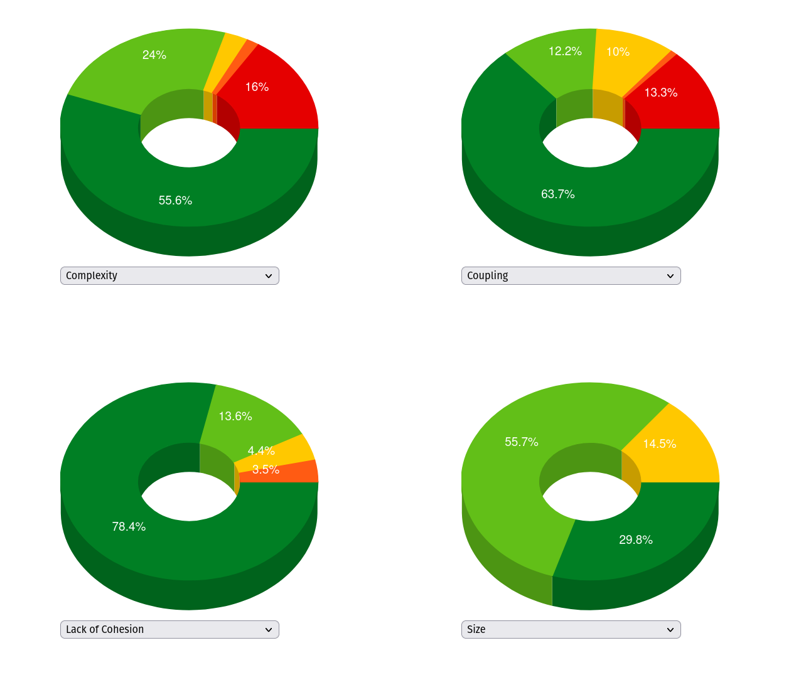
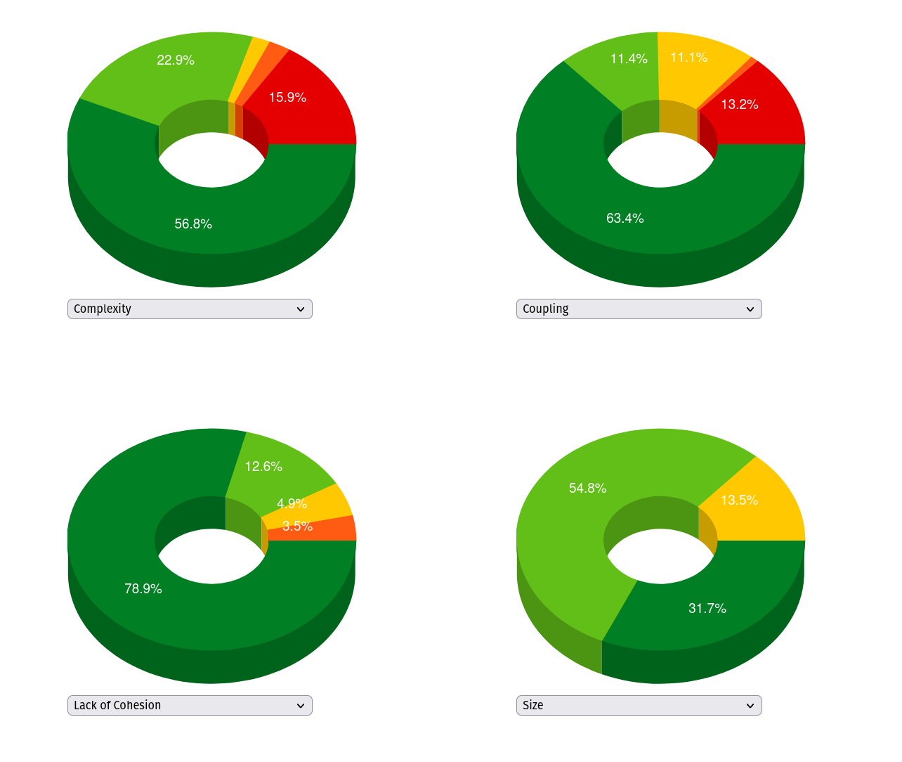
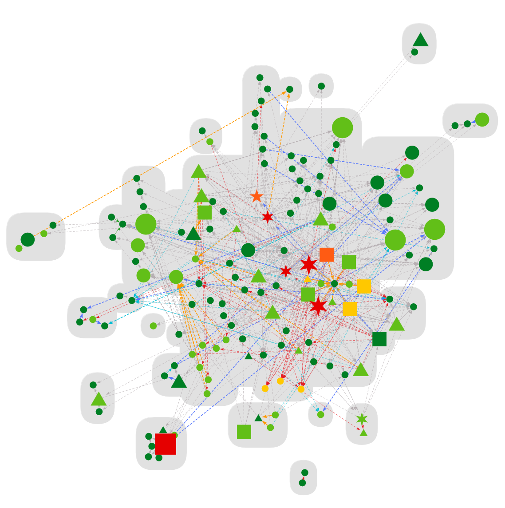
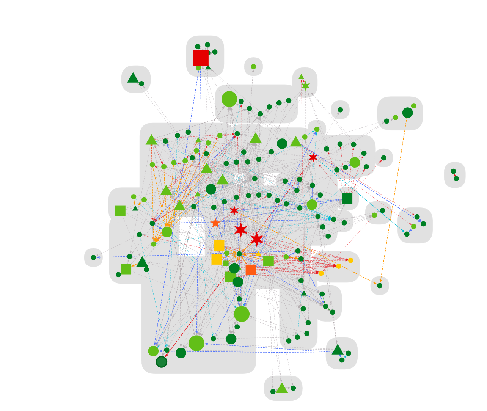

## Initial Readings

Obtained from CodeMR
Overall Stats
Total lines of code: 10211
Number of classes: 232
Number of packages: 58
Number of external packages: 89
Number of external classes: 340
Number of problematic classes: 8
Number of highly problematic classes: 0

## **Chosen Metrics for Code Quality Assessment**

### **1. McCabe Cyclomatic Complexity**
Cyclomatic complexity assesses the complexity of a method by counting the number of decision points (e.g., `if`, `for`, `while`, `case`) in a method, plus one for the method entry. High cyclomatic complexity indicates more potential execution paths, making the code harder to maintain and test.

**Formula:**
\[ CC = E - N + 2P \]
where:
- \( E \) = Number of edges in the control flow graph
- \( N \) = Number of nodes in the control flow graph
- \( P \) = Number of connected components (usually 1 for a single method)

**Design Smells Impacting This Metric:**
- **Cyclic Dependency**: Increases complexity as interdependent services introduce multiple paths.
- **Insufficient Modularization**: Leads to large methods with multiple responsibilities, increasing decision points.
- **Deficient Encapsulation**: Directly exposing internal data increases branching logic for handling multiple states.

---

### **2. Lines of Code (LOC)**
Measures the number of lines in a codebase, which helps estimate maintainability, readability, and complexity. High LOC often indicates bloated classes or methods.

**Formula:**
\[ LOC = \sum_{i=1}^{n} LoC_{i} \]
where \( LoC_{i} \) is the number of lines in each file/method.

**Design Smells Impacting This Metric:**
- **Broken Modularization**: Large constant files add unnecessary LOC.
- **Wide Hierarchy**: Many direct subclasses can increase LOC through repeated or unnecessary code.
- **Insufficient Modularization**: Bloated DTOs lead to excessive getter/setter methods, increasing LOC.

---

### **3. Number of Children (NOC)**
Represents the number of immediate subclasses of a class. A high NOC value can indicate a deep hierarchy, which affects maintainability.

**Formula:**
\[ NOC = \text{Number of immediate subclasses} \]

**Design Smells Impacting This Metric:**
- **Wide Hierarchy**: Too many direct subclasses of `BaseResource` increase NOC, making the system harder to refactor.
- **Unutilized Abstraction**: If inheritance is used inefficiently, it can lead to unnecessary subclassing.

---

### **4. Weighted Method Count (WMC)**
The sum of the complexities of all methods in a class. A high WMC suggests a class is doing too much, violating the Single Responsibility Principle (SRP).

**Formula:**
\[ WMC = \sum_{i=1}^{n} CC_{i} \]
where \( CC_{i} \) is the cyclomatic complexity of method \( i \).

**Design Smells Impacting This Metric:**
- **Deficient Encapsulation**: Public fields and large data exposure increase method counts due to additional validation logic.
- **Cyclic Dependency**: Leads to classes with a high number of interconnected methods.
- **Insufficient Modularization**: Bloated DTOs result in unnecessary methods, increasing WMC.

---

### **5. Efferent Coupling (Ce)**
Measures the number of classes that a given class depends on. High efferent coupling indicates tight coupling, reducing modularity and reusability.

**Formula:**
\[ Ce = \text{Number of external classes used} \]

**Design Smells Impacting This Metric:**
- **Cyclic Dependency**: Creates excessive coupling between services and DAOs, increasing Ce.
- **Unutilized Abstraction**: Lack of proper inheritance increases direct dependencies, raising efferent coupling.
- **Broken Modularization**: Poorly structured constants lead to unnecessary dependencies across modules.

---

### **6. Lack of Cohesion Across Methods (LCOM)**
Measures the degree to which methods in a class operate on the same set of instance variables. High LCOM indicates a class is trying to do too many things, violating SRP.

**Formula:**
\[ LCOM = \frac{|M| - |I|}{|M| - 1} \]
where:
- \( M \) = Number of methods in a class
- \( I \) = Number of method pairs sharing at least one field

**Design Smells Impacting This Metric:**
- **Broken Modularization**: Unrelated constants force methods to interact with different concerns, increasing LCOM.
- **Deficient Encapsulation**: Exposed internal structures result in methods interacting with unrelated parts of the class.
- **Insufficient Modularization**: Large DTOs introduce mixed responsibilities, reducing cohesion.

---

### **7. Instability**
Measures the ratio of efferent coupling (outgoing dependencies) to total coupling (incoming + outgoing). Higher instability suggests a module is highly dependent on others and prone to changes.

**Formula:**
\[ I = \frac{Ce}{Ce + Ca} \]
where:
- \( Ce \) = Efferent Coupling (number of classes a module depends on)
- \( Ca \) = Afferent Coupling (number of classes depending on this module)

**Design Smells Impacting This Metric:**
- **Cyclic Dependency**: Services relying on each other create an unstable system with high dependency.
- **Insufficient Modularization**: Large DTOs with cross-domain data make the system fragile to changes.
- **Wide Hierarchy**: Deep inheritance trees increase dependency and instability.

---

# Before Refactoring
| QualifiedName                                                                                                                                                            | Name                                                                                                     | Complexity  | Coupling    | Size        | Lack of Cohesion | CBO | NOC | LOC  | LCAM  | EC | Ins   | WMC | MCC |   |
|--------------------------------------------------------------------------------------------------------------------------------------------------------------------------|----------------------------------------------------------------------------------------------------------|-------------|-------------|-------------|------------------|-----|-----|------|-------|----|-------|-----|-----|---|
| <Package>com.sismics.reader.core.model.jpa                                                                                                                               | com.sismics.reader.core.model.jpa                                                                        | low-medium  | medium-high | medium-high | low              |     |     | 784  |       | 15 | 0.268 | 227 |     |   |
| com.sismics.reader.core.model.jpa.Article                                                                                                                                | Article                                                                                                  | low-medium  | low         | medium-high | low-medium       | 2   | 0   | 110  | 0.629 |    |       | 35  |     |   |
| com.sismics.reader.core.model.jpa.AuthenticationToken                                                                                                                    | AuthenticationToken                                                                                      | low         | low         | low         | low-medium       | 2   | 0   | 41   | 0.636 |    |       | 11  |     |   |
| com.sismics.reader.core.model.jpa.BaseFunction                                                                                                                           | BaseFunction                                                                                             | low         | low         | low         | low              | 2   | 0   | 15   | 0.333 |    |       | 3   |     |   |
| com.sismics.reader.core.model.jpa.Category                                                                                                                               | Category                                                                                                 | low         | low         | low-medium  | medium-high      | 2   | 0   | 58   | 0.706 |    |       | 17  |     |   |
| com.sismics.reader.core.model.jpa.Config                                                                                                                                 | Config                                                                                                   | low         | low         | low         | low              | 3   | 0   | 22   | 0.533 |    |       | 5   |     |   |
| com.sismics.reader.core.model.jpa.Feed                                                                                                                                   | Feed                                                                                                     | low-medium  | low         | low-medium  | low              | 2   | 0   | 73   | 0.507 |    |       | 23  |     |   |
| com.sismics.reader.core.model.jpa.FeedSubscription                                                                                                                       | FeedSubscription                                                                                         | low         | low         | low-medium  | low-medium       | 2   | 0   | 66   | 0.632 |    |       | 19  |     |   |
| com.sismics.reader.core.model.jpa.FeedSynchronization                                                                                                                    | FeedSynchronization                                                                                      | low         | low         | low         | medium-high      | 2   | 0   | 48   | 0.708 |    |       | 13  |     |   |
| com.sismics.reader.core.model.jpa.Job                                                                                                                                    | Job                                                                                                      | low         | low         | low-medium  | low              | 2   | 0   | 56   | 0.51  |    |       | 17  |     |   |
| com.sismics.reader.core.model.jpa.JobEvent                                                                                                                               | JobEvent                                                                                                 | low         | low         | low-medium  | low              | 2   | 0   | 52   | 0.511 |    |       | 15  |     |   |
| com.sismics.reader.core.model.jpa.Locale                                                                                                                                 | Locale                                                                                                   | low         | low         | low         | low              | 2   | 0   | 15   | 0.333 |    |       | 3   |     |   |
| com.sismics.reader.core.model.jpa.Role                                                                                                                                   | Role                                                                                                     | low         | low         | low         | low              | 2   | 0   | 34   | 0.519 |    |       | 9   |     |   |
| com.sismics.reader.core.model.jpa.RoleBaseFunction                                                                                                                       | RoleBaseFunction                                                                                         | low         | low         | low         | low              | 2   | 0   | 41   | 0.515 |    |       | 11  |     |   |
| com.sismics.reader.core.model.jpa.User                                                                                                                                   | User                                                                                                     | low-medium  | low         | medium-high | low-medium       | 2   | 0   | 100  | 0.629 |    |       | 31  |     |   |
| com.sismics.reader.core.model.jpa.UserArticle                                                                                                                            | UserArticle                                                                                              | low         | low         | low-medium  | low              | 2   | 0   | 53   | 0.511 |    |       | 15  |     |   |
| <Package>com.sismics.reader.core.model.context                                                                                                                           | com.sismics.reader.core.model.context                                                                    | low         | low         | low         | low              |     |     | 66   |       | 1  | 0.1   | 17  |     |   |
| com.sismics.reader.core.model.context.AppContext                                                                                                                         | AppContext                                                                                               | low         | medium-high | low-medium  | low              | 14  | 0   | 66   | 0.0   |    |       | 17  |     |   |
| <Method>com.sismics.reader.core.model.context.AppContext.private AppContext( ): void                                                                                     | AppContext( ): void                                                                                      | low         | low-medium  | low         | low              | 5   |     |      |       |    |       |     | 2   |   |
| <Method>com.sismics.reader.core.model.context.AppContext.public getAsyncEventBus( ): EventBus                                                                            | getAsyncEventBus( ): EventBus                                                                            | low         | low         | low         | low              | 1   |     |      |       |    |       |     | 1   |   |
| <Method>com.sismics.reader.core.model.context.AppContext.public getEventBus( ): EventBus                                                                                 | getEventBus( ): EventBus                                                                                 | low         | low         | low         | low              | 1   |     |      |       |    |       |     | 1   |   |
| <Method>com.sismics.reader.core.model.context.AppContext.public getFeedService( ): FeedService                                                                           | getFeedService( ): FeedService                                                                           | low         | low         | low         | low              | 1   |     |      |       |    |       |     | 1   |   |
| <Method>com.sismics.reader.core.model.context.AppContext.public getImportEventBus( ): EventBus                                                                           | getImportEventBus( ): EventBus                                                                           | low         | low         | low         | low              | 1   |     |      |       |    |       |     | 1   |   |
| <Method>com.sismics.reader.core.model.context.AppContext.public getIndexingService( ): IndexingService                                                                   | getIndexingService( ): IndexingService                                                                   | low         | low         | low         | low              | 1   |     |      |       |    |       |     | 1   |   |
| <Method>com.sismics.reader.core.model.context.AppContext.public getMailEventBus( ): EventBus                                                                             | getMailEventBus( ): EventBus                                                                             | low         | low         | low         | low              | 1   |     |      |       |    |       |     | 1   |   |
| <Method>com.sismics.reader.core.model.context.AppContext.private newAsyncEventBus( ): EventBus                                                                           | newAsyncEventBus( ): EventBus                                                                            | low         | low         | low         | low              | 2   |     |      |       |    |       |     | 2   |   |
| <Method>com.sismics.reader.core.model.context.AppContext.private resetEventBus( ): void                                                                                  | resetEventBus( ): void                                                                                   | low         | medium-high | low         | low              | 8   |     |      |       |    |       |     | 1   |   |
| <Method>com.sismics.reader.core.model.context.AppContext.public static getInstance( ): AppContext                                                                        | static getInstance( ): AppContext                                                                        | low         | low         | low         | low              | 0   |     |      |       |    |       |     | 2   |   |
| <Method>com.sismics.reader.core.model.context.AppContext.public waitForAsync( ): void                                                                                    | waitForAsync( ): void                                                                                    | low         | low         | low         | low              | 0   |     |      |       |    |       |     | 4   |   |
| <Package>com.sismics.reader.core.dao.jpa                                                                                                                                 | com.sismics.reader.core.dao.jpa                                                                          | low         | medium-high | medium-high | low              |     |     | 680  |       | 13 | 0.419 | 132 |     |   |
| com.sismics.reader.core.dao.jpa.ArticleDao                                                                                                                               | ArticleDao                                                                                               | low-medium  | low-medium  | low-medium  | low              | 8   | 0   | 96   | 0.6   |    |       | 15  |     |   |
| <Method>com.sismics.reader.core.dao.jpa.ArticleDao.public create( Article ): String                                                                                      | create( Article ): String                                                                                | low         | low         | low         | low              | 3   |     |      |       |    |       |     | 3   |   |
| <Method>com.sismics.reader.core.dao.jpa.ArticleDao.public delete( String ): void                                                                                         | delete( String ): void                                                                                   | low         | low         | low         | low              | 1   |     |      |       |    |       |     | 1   |   |
| <Method>com.sismics.reader.core.dao.jpa.ArticleDao.public findAll( ): List                                                                                               | findAll( ): List                                                                                         | low         | low         | low         | low              | 1   |     |      |       |    |       |     | 1   |   |
| <Method>com.sismics.reader.core.dao.jpa.ArticleDao.protected getQueryParam( ArticleCriteria, FilterCriteria ): QueryParam                                                | getQueryParam( ArticleCriteria, FilterCriteria ): QueryParam                                             | low         | low-medium  | low         | low              | 5   |     |      |       |    |       |     | 7   |   |
| <Method>com.sismics.reader.core.dao.jpa.ArticleDao.public update( Article ): Article                                                                                     | update( Article ): Article                                                                               | low         | low         | low         | low              | 3   |     |      |       |    |       |     | 3   |   |
| com.sismics.reader.core.dao.jpa.FeedSubscriptionDao                                                                                                                      | FeedSubscriptionDao                                                                                      | low-medium  | low-medium  | low-medium  | low-medium       | 8   | 0   | 93   | 0.667 |    |       | 20  |     |   |
| <Method>com.sismics.reader.core.dao.jpa.FeedSubscriptionDao.public create( FeedSubscription ): String                                                                    | create( FeedSubscription ): String                                                                       | low         | low         | low         | low              | 2   |     |      |       |    |       |     | 1   |   |
| <Method>com.sismics.reader.core.dao.jpa.FeedSubscriptionDao.public delete( String ): void                                                                                | delete( String ): void                                                                                   | low         | low         | low         | low              | 2   |     |      |       |    |       |     | 1   |   |
| <Method>com.sismics.reader.core.dao.jpa.FeedSubscriptionDao.public findByCategory( String ): List                                                                        | findByCategory( String ): List                                                                           | low         | low         | low         | low              | 1   |     |      |       |    |       |     | 1   |   |
| <Method>com.sismics.reader.core.dao.jpa.FeedSubscriptionDao.public getCategoryCount( String, String ): int                                                               | getCategoryCount( String, String ): int                                                                  | low         | low         | low         | low              | 1   |     |      |       |    |       |     | 1   |   |
| <Method>com.sismics.reader.core.dao.jpa.FeedSubscriptionDao.public getFeedSubscription( String, String ): FeedSubscription                                               | getFeedSubscription( String, String ): FeedSubscription                                                  | low         | low         | low         | low              | 2   |     |      |       |    |       |     | 2   |   |
| <Method>com.sismics.reader.core.dao.jpa.FeedSubscriptionDao.protected getQueryParam( FeedSubscriptionCriteria, FilterCriteria ): QueryParam                              | getQueryParam( FeedSubscriptionCriteria, FilterCriteria ): QueryParam                                    | low         | low-medium  | low         | low              | 6   |     |      |       |    |       |     | 7   |   |
| <Method>com.sismics.reader.core.dao.jpa.FeedSubscriptionDao.public reorder( FeedSubscription, int ): void                                                                | reorder( FeedSubscription, int ): void                                                                   | low         | low         | low         | low              | 2   |     |      |       |    |       |     | 5   |   |
| <Method>com.sismics.reader.core.dao.jpa.FeedSubscriptionDao.public update( FeedSubscription ): FeedSubscription                                                          | update( FeedSubscription ): FeedSubscription                                                             | low         | low         | low         | low              | 2   |     |      |       |    |       |     | 1   |   |
| <Method>com.sismics.reader.core.dao.jpa.FeedSubscriptionDao.public updateUnreadCount( String, Integer ): void                                                            | updateUnreadCount( String, Integer ): void                                                               | low         | low         | low         | low              | 1   |     |      |       |    |       |     | 1   |   |
| com.sismics.reader.core.dao.jpa.UserArticleDao                                                                                                                           | UserArticleDao                                                                                           | low-medium  | low-medium  | low-medium  | low              | 7   | 0   | 118  | 0.567 |    |       | 32  |     |   |
| <Method>com.sismics.reader.core.dao.jpa.UserArticleDao.public create( UserArticle ): String                                                                              | create( UserArticle ): String                                                                            | low         | low         | low         | low              | 2   |     |      |       |    |       |     | 1   |   |
| <Method>com.sismics.reader.core.dao.jpa.UserArticleDao.public delete( String ): void                                                                                     | delete( String ): void                                                                                   | low         | low         | low         | low              | 2   |     |      |       |    |       |     | 1   |   |
| <Method>com.sismics.reader.core.dao.jpa.UserArticleDao.protected getQueryParam( UserArticleCriteria, FilterCriteria ): QueryParam                                        | getQueryParam( UserArticleCriteria, FilterCriteria ): QueryParam                                         | medium-high | low-medium  | medium-high | low              | 5   |     |      |       |    |       |     | 20  |   |
| <Method>com.sismics.reader.core.dao.jpa.UserArticleDao.public getUserArticle( String, String ): UserArticle                                                              | getUserArticle( String, String ): UserArticle                                                            | low         | low         | low         | low              | 2   |     |      |       |    |       |     | 2   |   |
| <Method>com.sismics.reader.core.dao.jpa.UserArticleDao.public markAsRead( UserArticleCriteria ): void                                                                    | markAsRead( UserArticleCriteria ): void                                                                  | low         | low         | low         | low              | 2   |     |      |       |    |       |     | 7   |   |
| <Method>com.sismics.reader.core.dao.jpa.UserArticleDao.public update( UserArticle ): UserArticle                                                                         | update( UserArticle ): UserArticle                                                                       | low         | low         | low         | low              | 2   |     |      |       |    |       |     | 1   |   |
| com.sismics.reader.core.dao.file.rss.RssReader                                                                                                                           | RssReader                                                                                                | very-high   | medium-high | medium-high | high             | 18  | 0   | 362  | 0.804 |    |       | 217 |     |   |
| com.sismics.reader.core.dao.file.rss.RssReader.Element                                                                                                                   | Element                                                                                                  | low         | low         | low         | low              | 0   | 0   | 36   | 0.0   |    |       | 0   |     |   |
| com.sismics.reader.core.dao.file.rss.RssReader.FeedType                                                                                                                  | FeedType                                                                                                 | low         | low         | low         | low              | 0   | 0   | 4    | 0.0   |    |       | 0   |     |   |
| <Method>com.sismics.reader.core.dao.file.rss.RssReader.public RssReader( ): void                                                                                         | RssReader( ): void                                                                                       | low         | low         | low         | low              | 0   |     |      |       |    |       |     | 1   |   |
| <Method>com.sismics.reader.core.dao.file.rss.RssReader.public characters( char, int, int ): void                                                                         | characters( char, int, int ): void                                                                       | low         | low         | low         | low              | 0   |     |      |       |    |       |     | 2   |   |
| <Method>com.sismics.reader.core.dao.file.rss.RssReader.public endElement( String, String, String ): void                                                                 | endElement( String, String, String ): void                                                               | very-high   | medium-high | medium-high | low              | 7   |     |      |       |    |       |     | 58  |   |
| <Method>com.sismics.reader.core.dao.file.rss.RssReader.public fatalError( SAXParseException ): void                                                                      | fatalError( SAXParseException ): void                                                                    | low         | low         | low         | low              | 3   |     |      |       |    |       |     | 2   |   |
| <Method>com.sismics.reader.core.dao.file.rss.RssReader.private fixGuid( ): void                                                                                          | fixGuid( ): void                                                                                         | low         | low         | low         | low              | 2   |     |      |       |    |       |     | 3   |   |
| <Method>com.sismics.reader.core.dao.file.rss.RssReader.public getArticleList( ): List                                                                                    | getArticleList( ): List                                                                                  | low         | low         | low         | low              | 0   |     |      |       |    |       |     | 1   |   |
| <Method>com.sismics.reader.core.dao.file.rss.RssReader.private getContent( ): String                                                                                     | getContent( ): String                                                                                    | low         | low         | low         | low              | 1   |     |      |       |    |       |     | 1   |   |
| <Method>com.sismics.reader.core.dao.file.rss.RssReader.public getFeed( ): Feed                                                                                           | getFeed( ): Feed                                                                                         | low         | low         | low         | low              | 1   |     |      |       |    |       |     | 1   |   |
| <Method>com.sismics.reader.core.dao.file.rss.RssReader.private initFeed( ): void                                                                                         | initFeed( ): void                                                                                        | low         | low         | low         | low              | 1   |     |      |       |    |       |     | 1   |   |
| <Method>com.sismics.reader.core.dao.file.rss.RssReader.private popElement( ): void                                                                                       | popElement( ): void                                                                                      | low         | low         | low         | low              | 1   |     |      |       |    |       |     | 3   |   |
| <Method>com.sismics.reader.core.dao.file.rss.RssReader.private pushElement( Element ): void                                                                              | pushElement( Element ): void                                                                             | low         | low         | low         | low              | 2   |     |      |       |    |       |     | 3   |   |
| <Method>com.sismics.reader.core.dao.file.rss.RssReader.public readRssFeed( InputStream ): void                                                                           | readRssFeed( InputStream ): void                                                                         | low         | medium-high | low         | low              | 7   |     |      |       |    |       |     | 6   |   |
| <Method>com.sismics.reader.core.dao.file.rss.RssReader.public startElement( String, String, String, Attributes ): void                                                   | startElement( String, String, String, Attributes ): void                                                 | very-high   | medium-high | high        | low              | 9   |     |      |       |    |       |     | 133 |   |
| <Method>com.sismics.reader.core.dao.file.rss.RssReader.private validateFeed( ): void                                                                                     | validateFeed( ): void                                                                                    | low         | low         | low         | low              | 0   |     |      |       |    |       |     | 2   |   |
| <Package>com.sismics.reader.core.dao.file.html                                                                                                                           | com.sismics.reader.core.dao.file.html                                                                    | low         | low         | low         | low              |     |     | 141  |       | 3  | 0.75  | 34  |     |   |
| com.sismics.reader.core.dao.file.html.FaviconDownloader                                                                                                                  | FaviconDownloader                                                                                        | low         | low         | low-medium  | low              | 5   | 0   | 80   | 0.0   |    |       | 14  |     |   |
| <Anonymous> : Lcom.sismics.reader.core.dao.file.html.FaviconDownloader$2065;                                                                                             | Lcom.sismics.reader.core.dao.file.html.FaviconDownloader$2065;                                           | low         | low         | low         | low              | 0   | 0   | 5    | 0.0   |    |       | 0   |     |   |
| <Anonymous> : Lcom.sismics.reader.core.dao.file.html.FaviconDownloader$5046;                                                                                             | Lcom.sismics.reader.core.dao.file.html.FaviconDownloader$5046;                                           | low         | low         | low         | low              | 0   | 0   | 23   | 0.0   |    |       | 0   |     |   |
| <Method>com.sismics.reader.core.dao.file.html.FaviconDownloader.public downloadFavicon( String, String, String ): String                                                 | downloadFavicon( String, String, String ): String                                                        | low         | low         | low-medium  | low              | 2   |     |      |       |    |       |     | 3   |   |
| <Method>com.sismics.reader.core.dao.file.html.FaviconDownloader.public downloadFaviconFromPage( String, String, String ): String                                         | downloadFaviconFromPage( String, String, String ): String                                                | low         | low         | low         | low              | 3   |     |      |       |    |       |     | 7   |   |
| <Method>com.sismics.reader.core.dao.file.html.FaviconDownloader.public getFaviconUrl( String, String ): String                                                           | getFaviconUrl( String, String ): String                                                                  | low         | low         | low         | low              | 1   |     |      |       |    |       |     | 4   |   |
| <Package>com.sismics.reader.core.service                                                                                                                                 | com.sismics.reader.core.service                                                                          | low         | low         | low-medium  | low              |     |     | 360  |       | 2  | 0.222 | 97  |     |   |
| com.sismics.reader.core.service.FeedService                                                                                                                              | FeedService                                                                                              | very-high   | very-high   | low-medium  | medium-high      | 44  | 0   | 268  | 0.759 |    |       | 70  |     |   |
| <Anonymous> : Lcom.sismics.reader.core.service.FeedService$19201;                                                                                                        | Lcom.sismics.reader.core.service.FeedService$19201;                                                      | low         | low         | low         | low              | 0   | 0   | 5    | 0.0   |    |       | 0   |     |   |
| <Anonymous> : Lcom.sismics.reader.core.service.FeedService$19872;                                                                                                        | Lcom.sismics.reader.core.service.FeedService$19872;                                                      | low         | low         | low         | low              | 0   | 0   | 5    | 0.0   |    |       | 0   |     |   |
| <Method>com.sismics.reader.core.service.FeedService.private completeArticleList( List ): void                                                                            | completeArticleList( List ): void                                                                        | low         | low         | low         | low              | 1   |     |      |       |    |       |     | 4   |   |
| <Method>com.sismics.reader.core.service.FeedService.public createInitialUserArticle( String, FeedSubscription ): void                                                    | createInitialUserArticle( String, FeedSubscription ): void                                               | low         | medium-high | low         | low              | 8   |     |      |       |    |       |     | 4   |   |
| <Method>com.sismics.reader.core.service.FeedService.private getArticleToRemove( List ): List                                                                             | getArticleToRemove( List ): List                                                                         | low         | medium-high | low         | low              | 7   |     |      |       |    |       |     | 7   |   |
| <Method>com.sismics.reader.core.service.FeedService.private getNewerArticleList( List, Article ): List                                                                   | getNewerArticleList( List, Article ): List                                                               | low         | low         | low         | low              | 1   |     |      |       |    |       |     | 3   |   |
| <Method>com.sismics.reader.core.service.FeedService.private getOldestArticle( List ): Article                                                                            | getOldestArticle( List ): Article                                                                        | low         | low         | low         | low              | 1   |     |      |       |    |       |     | 4   |   |
| <Method>com.sismics.reader.core.service.FeedService.private isFaviconUpdated( Feed ): boolean                                                                            | isFaviconUpdated( Feed ): boolean                                                                        | low         | low-medium  | low         | low              | 4   |     |      |       |    |       |     | 1   |   |
| <Method>com.sismics.reader.core.service.FeedService.private logParsingError( String, Exception ): void                                                                   | logParsingError( String, Exception ): void                                                               | low         | low         | low         | low              | 1   |     |      |       |    |       |     | 5   |   |
| <Method>com.sismics.reader.core.service.FeedService.private parseFeedOrPage( String, boolean ): RssReader                                                                | parseFeedOrPage( String, boolean ): RssReader                                                            | low         | low-medium  | low-medium  | low              | 4   |     |      |       |    |       |     | 7   |   |
| <Method>com.sismics.reader.core.service.FeedService.protected runOneIteration( ): void                                                                                   | runOneIteration( ): void                                                                                 | low         | low         | low         | low              | 2   |     |      |       |    |       |     | 2   |   |
| <Method>com.sismics.reader.core.service.FeedService.protected scheduler( ): Scheduler                                                                                    | scheduler( ): Scheduler                                                                                  | low         | low         | low         | low              | 1   |     |      |       |    |       |     | 1   |   |
| <Method>com.sismics.reader.core.service.FeedService.protected shutDown( ): void                                                                                          | shutDown( ): void                                                                                        | low         | low         | low         | low              | 0   |     |      |       |    |       |     | 1   |   |
| <Method>com.sismics.reader.core.service.FeedService.protected startUp( ): void                                                                                           | startUp( ): void                                                                                         | low         | low         | low         | low              | 0   |     |      |       |    |       |     | 1   |   |
| <Method>com.sismics.reader.core.service.FeedService.public synchronize( String ): Feed                                                                                   | synchronize( String ): Feed                                                                              | high        | very-high   | high        | low              | 28  |     |      |       |    |       |     | 23  |   |
| <Method>com.sismics.reader.core.service.FeedService.public synchronizeAllFeeds( ): void                                                                                  | synchronizeAllFeeds( ): void                                                                             | low         | medium-high | low-medium  | low              | 8   |     |      |       |    |       |     | 7   |   |
| <Field>com.sismics.reader.core.service.FeedService->log                                                                                                                  | static final log : Logger                                                                                |             |             |             |                  |     |     |      |       |    |       |     |     |   |
| com.sismics.reader.core.service.IndexingService                                                                                                                          | IndexingService                                                                                          | medium-high | high        | low-medium  | low              | 22  | 0   | 92   | 0.556 |    |       | 27  |     |   |
| <Method>com.sismics.reader.core.service.IndexingService.public IndexingService( String ): void                                                                           | IndexingService( String ): void                                                                          | low         | low         | low         | low              | 0   |     |      |       |    |       |     | 1   |   |
| <Method>com.sismics.reader.core.service.IndexingService.public getDirectory( ): Directory                                                                                | getDirectory( ): Directory                                                                               | low         | low         | low         | low              | 1   |     |      |       |    |       |     | 1   |   |
| <Method>com.sismics.reader.core.service.IndexingService.public getDirectoryReader( ): DirectoryReader                                                                    | getDirectoryReader( ): DirectoryReader                                                                   | low         | low         | low         | low              | 2   |     |      |       |    |       |     | 6   |   |
| <Method>com.sismics.reader.core.service.IndexingService.public rebuildIndex( ): void                                                                                     | rebuildIndex( ): void                                                                                    | low         | low         | low         | low              | 3   |     |      |       |    |       |     | 1   |   |
| <Method>com.sismics.reader.core.service.IndexingService.protected runOneIteration( ): void                                                                               | runOneIteration( ): void                                                                                 | low         | low         | low         | low              | 1   |     |      |       |    |       |     | 1   |   |
| <Method>com.sismics.reader.core.service.IndexingService.protected scheduler( ): Scheduler                                                                                | scheduler( ): Scheduler                                                                                  | low         | low         | low         | low              | 1   |     |      |       |    |       |     | 1   |   |
| <Method>com.sismics.reader.core.service.IndexingService.public searchArticles( String, String, Integer, Integer ): PaginatedList                                         | searchArticles( String, String, Integer, Integer ): PaginatedList                                        | low         | medium-high | low-medium  | low              | 9   |     |      |       |    |       |     | 6   |   |
| <Method>com.sismics.reader.core.service.IndexingService.protected shutDown( ): void                                                                                      | shutDown( ): void                                                                                        | low         | low         | low         | low              | 3   |     |      |       |    |       |     | 5   |   |
| <Method>com.sismics.reader.core.service.IndexingService.protected startUp( ): void                                                                                       | startUp( ): void                                                                                         | low         | low-medium  | low         | low              | 6   |     |      |       |    |       |     | 5   |   |
| <Package>com.sismics.reader.rest.resource                                                                                                                                | com.sismics.reader.rest.resource                                                                         | low-medium  | medium-high | medium-high | low              |     |     | 1333 |       | 13 | 1.0   | 241 |     |   |
| com.sismics.reader.rest.resource.AllResource                                                                                                                             | AllResource                                                                                              | medium-high | medium-high | low-medium  | low              | 13  | 0   | 51   | 0.375 |    |       | 8   |     |   |
| <Method>com.sismics.reader.rest.resource.AllResource.public get( boolean, Integer, String ): Response                                                                    | get( boolean, Integer, String ): Response                                                                | low         | medium-high | low-medium  | low              | 10  |     |      |       |    |       |     | 5   |   |
| <Method>com.sismics.reader.rest.resource.AllResource.public read( ): Response                                                                                            | read( ): Response                                                                                        | low         | medium-high | low         | low              | 8   |     |      |       |    |       |     | 3   |   |
| com.sismics.reader.rest.resource.AppResource                                                                                                                             | AppResource                                                                                              | low-medium  | medium-high | low-medium  | low              | 16  | 0   | 75   | 0.5   |    |       | 12  |     |   |
| <Method>com.sismics.reader.rest.resource.AppResource.public batchReindex( ): Response                                                                                    | batchReindex( ): Response                                                                                | low         | low-medium  | low         | low              | 6   |     |      |       |    |       |     | 3   |   |
| <Method>com.sismics.reader.rest.resource.AppResource.public log( String, String, String, Integer, Integer ): Response                                                    | log( String, String, String, Integer, Integer ): Response                                                | low         | very-high   | low-medium  | low              | 12  |     |      |       |    |       |     | 5   |   |
| <Method>com.sismics.reader.rest.resource.AppResource.public mapPort( ): Response                                                                                         | mapPort( ): Response                                                                                     | low         | low-medium  | low         | low              | 5   |     |      |       |    |       |     | 3   |   |
| <Method>com.sismics.reader.rest.resource.AppResource.public version( ): Response                                                                                         | version( ): Response                                                                                     | low         | low         | low         | low              | 2   |     |      |       |    |       |     | 1   |   |
| com.sismics.reader.rest.resource.ArticleResource                                                                                                                         | ArticleResource                                                                                          | low-medium  | medium-high | low-medium  | low              | 12  | 0   | 100  | 0.333 |    |       | 22  |     |   |
| <Method>com.sismics.reader.rest.resource.ArticleResource.public read( String ): Response                                                                                 | read( String ): Response                                                                                 | low         | very-high   | low         | low              | 12  |     |      |       |    |       |     | 5   |   |
| <Method>com.sismics.reader.rest.resource.ArticleResource.public readMultiple( List ): Response                                                                           | readMultiple( List ): Response                                                                           | low         | very-high   | low         | low              | 12  |     |      |       |    |       |     | 6   |   |
| <Method>com.sismics.reader.rest.resource.ArticleResource.public unread( String ): Response                                                                               | unread( String ): Response                                                                               | low         | very-high   | low         | low              | 12  |     |      |       |    |       |     | 5   |   |
| <Method>com.sismics.reader.rest.resource.ArticleResource.public unreadMultiple( List ): Response                                                                         | unreadMultiple( List ): Response                                                                         | low         | very-high   | low         | low              | 12  |     |      |       |    |       |     | 6   |   |
| com.sismics.reader.rest.resource.BaseResource                                                                                                                            | BaseResource                                                                                             | low         | low         | low         | low              | 5   | 11  | 21   | 0.167 |    |       | 8   |     |   |
| <Method>com.sismics.reader.rest.resource.BaseResource.protected authenticate( ): boolean                                                                                 | authenticate( ): boolean                                                                                 | low         | low         | low         | low              | 2   |     |      |       |    |       |     | 3   |   |
| <Method>com.sismics.reader.rest.resource.BaseResource.protected checkBaseFunction( BaseFunction ): void                                                                  | checkBaseFunction( BaseFunction ): void                                                                  | low         | low         | low         | low              | 2   |     |      |       |    |       |     | 2   |   |
| <Method>com.sismics.reader.rest.resource.BaseResource.protected hasBaseFunction( BaseFunction ): boolean                                                                 | hasBaseFunction( BaseFunction ): boolean                                                                 | low         | low         | low         | low              | 2   |     |      |       |    |       |     | 3   |   |
| <Field>com.sismics.reader.rest.resource.BaseResource->appKey                                                                                                             | appKey : String                                                                                          |             |             |             |                  |     |     |      |       |    |       |     |     |   |
| <Field>com.sismics.reader.rest.resource.BaseResource->principal                                                                                                          | principal : IPrincipal                                                                                   |             |             |             |                  |     |     |      |       |    |       |     |     |   |
| <Field>com.sismics.reader.rest.resource.BaseResource->request                                                                                                            | request : HttpServletRequest                                                                             |             |             |             |                  |     |     |      |       |    |       |     |     |   |
| com.sismics.reader.rest.resource.CategoryResource                                                                                                                        | CategoryResource                                                                                         | high        | medium-high | low-medium  | low              | 17  | 0   | 160  | 0.5   |    |       | 26  |     |   |
| <Method>com.sismics.reader.rest.resource.CategoryResource.public add( String ): Response                                                                                 | add( String ): Response                                                                                  | low         | low-medium  | low         | low              | 6   |     |      |       |    |       |     | 2   |   |
| <Method>com.sismics.reader.rest.resource.CategoryResource.public delete( String ): Response                                                                              | delete( String ): Response                                                                               | low         | medium-high | low         | low              | 8   |     |      |       |    |       |     | 4   |   |
| <Method>com.sismics.reader.rest.resource.CategoryResource.public get( String, boolean, Integer, String ): Response                                                       | get( String, boolean, Integer, String ): Response                                                        | low         | very-high   | low-medium  | low              | 12  |     |      |       |    |       |     | 7   |   |
| <Method>com.sismics.reader.rest.resource.CategoryResource.public list( ): Response                                                                                       | list( ): Response                                                                                        | low         | low-medium  | low         | low              | 5   |     |      |       |    |       |     | 3   |   |
| <Method>com.sismics.reader.rest.resource.CategoryResource.public read( String ): Response                                                                                | read( String ): Response                                                                                 | low         | very-high   | low         | low              | 11  |     |      |       |    |       |     | 4   |   |
| <Method>com.sismics.reader.rest.resource.CategoryResource.public update( String, String, Integer, Boolean ): Response                                                    | update( String, String, Integer, Boolean ): Response                                                     | low         | medium-high | low         | low              | 7   |     |      |       |    |       |     | 6   |   |
| com.sismics.reader.rest.resource.JobResource                                                                                                                             | JobResource                                                                                              | low-medium  | low-medium  | low         | low              | 6   | 0   | 19   | 0.0   |    |       | 5   |     |   |
| <Method>com.sismics.reader.rest.resource.JobResource.public delete( String ): Response                                                                                   | delete( String ): Response                                                                               | low         | low-medium  | low         | low              | 6   |     |      |       |    |       |     | 5   |   |
| com.sismics.reader.rest.resource.LocaleResource                                                                                                                          | LocaleResource                                                                                           | low-medium  | low         | low         | low              | 3   | 0   | 15   | 0.0   |    |       | 2   |     |   |
| <Method>com.sismics.reader.rest.resource.LocaleResource.public list( ): Response                                                                                         | list( ): Response                                                                                        | low         | low         | low         | low              | 3   |     |      |       |    |       |     | 2   |   |
| com.sismics.reader.rest.resource.SearchResource                                                                                                                          | SearchResource                                                                                           | medium-high | low-medium  | low         | low              | 10  | 0   | 25   | 0.0   |    |       | 4   |     |   |
| <Method>com.sismics.reader.rest.resource.SearchResource.public get( String, Integer, Integer ): Response                                                                 | get( String, Integer, Integer ): Response                                                                | low         | medium-high | low         | low              | 10  |     |      |       |    |       |     | 4   |   |
| com.sismics.reader.rest.resource.StarredResource                                                                                                                         | StarredResource                                                                                          | medium-high | medium-high | low-medium  | low              | 11  | 0   | 102  | 0.45  |    |       | 21  |     |   |
| <Method>com.sismics.reader.rest.resource.StarredResource.public get( Integer, String ): Response                                                                         | get( Integer, String ): Response                                                                         | low         | medium-high | low         | low              | 10  |     |      |       |    |       |     | 5   |   |
| <Method>com.sismics.reader.rest.resource.StarredResource.public star( String ): Response                                                                                 | star( String ): Response                                                                                 | low         | low-medium  | low         | low              | 6   |     |      |       |    |       |     | 4   |   |
| <Method>com.sismics.reader.rest.resource.StarredResource.public starMultiple( List ): Response                                                                           | starMultiple( List ): Response                                                                           | low         | low-medium  | low         | low              | 6   |     |      |       |    |       |     | 4   |   |
| <Method>com.sismics.reader.rest.resource.StarredResource.public unstar( String ): Response                                                                               | unstar( String ): Response                                                                               | low         | low-medium  | low         | low              | 6   |     |      |       |    |       |     | 4   |   |
| <Method>com.sismics.reader.rest.resource.StarredResource.public unstarMultiple( List ): Response                                                                         | unstarMultiple( List ): Response                                                                         | low         | low-medium  | low         | low              | 6   |     |      |       |    |       |     | 4   |   |
| com.sismics.reader.rest.resource.SubscriptionResource                                                                                                                    | SubscriptionResource                                                                                     | very-high   | very-high   | medium-high | low              | 39  | 0   | 365  | 0.56  |    |       | 55  |     |   |
| <Method>com.sismics.reader.rest.resource.SubscriptionResource.public add( String, String ): Response                                                                     | add( String, String ): Response                                                                          | low         | very-high   | low-medium  | low              | 15  |     |      |       |    |       |     | 5   |   |
| <Method>com.sismics.reader.rest.resource.SubscriptionResource.public delete( String ): Response                                                                          | delete( String ): Response                                                                               | low         | low-medium  | low         | low              | 6   |     |      |       |    |       |     | 3   |   |
| <Method>com.sismics.reader.rest.resource.SubscriptionResource.public export( ): Response                                                                                 | export( ): Response                                                                                      | low         | medium-high | medium-high | low              | 10  |     |      |       |    |       |     | 6   |   |
| <Method>com.sismics.reader.rest.resource.SubscriptionResource.public favicon( String ): Response                                                                         | favicon( String ): Response                                                                              | low         | low-medium  | low         | low              | 6   |     |      |       |    |       |     | 4   |   |
| <Method>com.sismics.reader.rest.resource.SubscriptionResource.public get( String, boolean, Integer, String ): Response                                                   | get( String, boolean, Integer, String ): Response                                                        | low         | very-high   | medium-high | low              | 13  |     |      |       |    |       |     | 6   |   |
| <Method>com.sismics.reader.rest.resource.SubscriptionResource.public getSynchronization( String ): Response                                                              | getSynchronization( String ): Response                                                                   | low         | medium-high | low         | low              | 9   |     |      |       |    |       |     | 4   |   |
| <Method>com.sismics.reader.rest.resource.SubscriptionResource.public importFile( FormDataBodyPart ): Response                                                            | importFile( FormDataBodyPart ): Response                                                                 | low         | very-high   | low         | low              | 13  |     |      |       |    |       |     | 5   |   |
| <Method>com.sismics.reader.rest.resource.SubscriptionResource.public list( boolean ): Response                                                                           | list( boolean ): Response                                                                                | low-medium  | medium-high | medium-high | low              | 10  |     |      |       |    |       |     | 12  |   |
| <Method>com.sismics.reader.rest.resource.SubscriptionResource.public read( String ): Response                                                                            | read( String ): Response                                                                                 | low         | medium-high | low         | low              | 8   |     |      |       |    |       |     | 3   |   |
| <Method>com.sismics.reader.rest.resource.SubscriptionResource.public update( String, String, String, Integer ): Response                                                 | update( String, String, String, Integer ): Response                                                      | low         | medium-high | low         | low              | 9   |     |      |       |    |       |     | 7   |   |
| com.sismics.reader.rest.resource.TextPlainMessageBodyWriter                                                                                                              | TextPlainMessageBodyWriter                                                                               | low         | low         | low         | low              | 3   | 0   | 24   | 0.208 |    |       | 4   |     |   |
| <Method>com.sismics.reader.rest.resource.TextPlainMessageBodyWriter.public getSize( JSONObject, Class, Type, Annotation, MediaType ): long                               | getSize( JSONObject, Class, Type, Annotation, MediaType ): long                                          | low         | low         | low         | low              | 1   |     |      |       |    |       |     | 1   |   |
| <Method>com.sismics.reader.rest.resource.TextPlainMessageBodyWriter.public isWriteable( Class, Type, Annotation, MediaType ): boolean                                    | isWriteable( Class, Type, Annotation, MediaType ): boolean                                               | low         | low         | low         | low              | 0   |     |      |       |    |       |     | 1   |   |
| <Method>com.sismics.reader.rest.resource.TextPlainMessageBodyWriter.public writeTo( JSONObject, Class, Type, Annotation, MediaType, MultivaluedMap, OutputStream ): void | writeTo( JSONObject, Class, Type, Annotation, MediaType, MultivaluedMap, OutputStream ): void            | low         | low         | low         | low              | 3   |     |      |       |    |       |     | 2   |   |
| com.sismics.reader.rest.resource.ThemeResource                                                                                                                           | ThemeResource                                                                                            | low-medium  | low         | low         | low              | 3   | 0   | 19   | 0.0   |    |       | 4   |     |   |
| <Method>com.sismics.reader.rest.resource.ThemeResource.public list( ): Response                                                                                          | list( ): Response                                                                                        | low         | low         | low         | low              | 3   |     |      |       |    |       |     | 4   |   |
| com.sismics.reader.rest.resource.UserResource                                                                                                                            | UserResource                                                                                             | very-high   | very-high   | medium-high | low              | 36  | 0   | 357  | 0.582 |    |       | 70  |     |   |
| <Method>com.sismics.reader.rest.resource.UserResource.public checkUsername( String ): Response                                                                           | checkUsername( String ): Response                                                                        | low         | low         | low         | low              | 3   |     |      |       |    |       |     | 2   |   |
| <Method>com.sismics.reader.rest.resource.UserResource.public delete( ): Response                                                                                         | delete( ): Response                                                                                      | low         | low-medium  | low         | low              | 6   |     |      |       |    |       |     | 3   |   |
| <Method>com.sismics.reader.rest.resource.UserResource.public delete( String ): Response                                                                                  | delete( String ): Response                                                                               | low         | medium-high | low         | low              | 7   |     |      |       |    |       |     | 4   |   |
| <Method>com.sismics.reader.rest.resource.UserResource.public info( ): Response                                                                                           | info( ): Response                                                                                        | low-medium  | very-high   | medium-high | low              | 15  |     |      |       |    |       |     | 12  |   |
| <Method>com.sismics.reader.rest.resource.UserResource.public list( Integer, Integer, Integer, Boolean ): Response                                                        | list( Integer, Integer, Integer, Boolean ): Response                                                     | low         | medium-high | low         | low              | 9   |     |      |       |    |       |     | 3   |   |
| <Method>com.sismics.reader.rest.resource.UserResource.public login( String, String, boolean ): Response                                                                  | login( String, String, boolean ): Response                                                               | low         | medium-high | low         | low              | 7   |     |      |       |    |       |     | 3   |   |
| <Method>com.sismics.reader.rest.resource.UserResource.public logout( ): Response                                                                                         | logout( ): Response                                                                                      | low         | low-medium  | low         | low              | 6   |     |      |       |    |       |     | 8   |   |
| <Method>com.sismics.reader.rest.resource.UserResource.public register( String, String, String, String ): Response                                                        | register( String, String, String, String ): Response                                                     | low         | very-high   | low-medium  | low              | 14  |     |      |       |    |       |     | 5   |   |
| <Method>com.sismics.reader.rest.resource.UserResource.public update( String, String, String, String, Boolean, Boolean, Boolean, Boolean, Boolean, Boolean ): Response    | update( String, String, String, String, Boolean, Boolean, Boolean, Boolean, Boolean, Boolean ): Response | low-medium  | very-high   | low-medium  | low              | 12  |     |      |       |    |       |     | 15  |   |
| <Method>com.sismics.reader.rest.resource.UserResource.public update( String, String, String, String, String, Boolean, Boolean, Boolean, Boolean, Boolean ): Response     | update( String, String, String, String, String, Boolean, Boolean, Boolean, Boolean, Boolean ): Response  | low-medium  | very-high   | medium-high | low              | 12  |     |      |       |    |       |     | 12  |   |
| <Method>com.sismics.reader.rest.resource.UserResource.public view( String ): Response                                                                                    | view( String ): Response                                                                                 | low         | low-medium  | low         | low              | 6   |     |      |       |    |       |     | 3   |   |

# After Refactoring

| QualifiedName                                                                                                                                                                                   | Name                                                                                                              | Complexity  | Coupling    | Size        | Lack of Cohesion | CBO | NOC | LOC  | LCAM  | EC   | Ins   | WMC | MCC |   |
|-------------------------------------------------------------------------------------------------------------------------------------------------------------------------------------------------|-------------------------------------------------------------------------------------------------------------------|-------------|-------------|-------------|------------------|-----|-----|------|-------|------|-------|-----|-----|---|
| <Package>com.sismics.reader.core.model.jpa                                                                                                                                                      | com.sismics.reader.core.model.jpa                                                                                 | low-medium  | medium-high | medium-high | low              |     |     | 809  |       | 15   | 0.263 | 237 |     |   |
| com.sismics.reader.core.model.jpa.Article                                                                                                                                                       | Article                                                                                                           | low-medium  | low         | medium-high | low-medium       | 2   | 0   | 110  | 0.629 |      |       | 35  |     |   |
| com.sismics.reader.core.model.jpa.AuthenticationToken                                                                                                                                           | AuthenticationToken                                                                                               | low         | low         | low         | low-medium       | 2   | 0   | 41   | 0.636 |      |       | 11  |     |   |
| com.sismics.reader.core.model.jpa.BaseFunction                                                                                                                                                  | BaseFunction                                                                                                      | low         | low         | low         | low              | 2   | 0   | 15   | 0.333 |      |       | 3   |     |   |
| com.sismics.reader.core.model.jpa.Category                                                                                                                                                      | Category                                                                                                          | low         | low         | low-medium  | medium-high      | 2   | 0   | 58   | 0.706 |      |       | 17  |     |   |
| com.sismics.reader.core.model.jpa.Config                                                                                                                                                        | Config                                                                                                            | low         | low         | low         | low              | 3   | 0   | 22   | 0.533 |      |       | 5   |     |   |
| com.sismics.reader.core.model.jpa.Feed                                                                                                                                                          | Feed                                                                                                              | low-medium  | low         | low-medium  | low              | 2   | 0   | 73   | 0.507 |      |       | 23  |     |   |
| com.sismics.reader.core.model.jpa.FeedSubscription                                                                                                                                              | FeedSubscription                                                                                                  | low         | low         | low-medium  | low-medium       | 2   | 0   | 66   | 0.632 |      |       | 19  |     |   |
| com.sismics.reader.core.model.jpa.FeedSynchronization                                                                                                                                           | FeedSynchronization                                                                                               | low         | low         | low         | medium-high      | 2   | 0   | 48   | 0.708 |      |       | 13  |     |   |
| com.sismics.reader.core.model.jpa.Job                                                                                                                                                           | Job                                                                                                               | low         | low         | low-medium  | low              | 2   | 0   | 56   | 0.51  |      |       | 17  |     |   |
| com.sismics.reader.core.model.jpa.JobEvent                                                                                                                                                      | JobEvent                                                                                                          | low         | low         | low-medium  | low              | 2   | 0   | 52   | 0.511 |      |       | 15  |     |   |
| com.sismics.reader.core.model.jpa.Locale                                                                                                                                                        | Locale                                                                                                            | low         | low         | low         | low              | 2   | 0   | 15   | 0.333 |      |       | 3   |     |   |
| com.sismics.reader.core.model.jpa.Role                                                                                                                                                          | Role                                                                                                              | low         | low         | low         | low              | 2   | 0   | 34   | 0.519 |      |       | 9   |     |   |
| com.sismics.reader.core.model.jpa.RoleBaseFunction                                                                                                                                              | RoleBaseFunction                                                                                                  | low         | low         | low         | low              | 2   | 0   | 41   | 0.515 |      |       | 11  |     |   |
| com.sismics.reader.core.model.jpa.User                                                                                                                                                          | User                                                                                                              | low-medium  | low         | medium-high | low-medium       | 3   | 0   | 125  | 0.691 |      |       | 41  |     |   |
| com.sismics.reader.core.model.jpa.UserArticle                                                                                                                                                   | UserArticle                                                                                                       | low         | low         | low-medium  | low              | 2   | 0   | 53   | 0.511 |      |       | 15  |     |   |
| <Package>com.sismics.reader.core.model.context                                                                                                                                                  | com.sismics.reader.core.model.context                                                                             | low         | low         | low         | low              |     |     | 66   |       | 1    | 0.091 | 17  |     |   |
| com.sismics.reader.core.model.context.AppContext                                                                                                                                                | AppContext                                                                                                        | low         | medium-high | low-medium  | low              | 15  | 0   | 66   | 0.0   |      |       | 17  |     |   |
| <Method>com.sismics.reader.core.model.context.AppContext.private AppContext( ): void                                                                                                            | AppContext( ): void                                                                                               | low         | low-medium  | low         | low              | 5   |     |      |       |      |       |     | 2   |   |
| <Method>com.sismics.reader.core.model.context.AppContext.public getAsyncEventBus( ): EventBus                                                                                                   | getAsyncEventBus( ): EventBus                                                                                     | low         | low         | low         | low              | 1   |     |      |       |      |       |     | 1   |   |
| <Method>com.sismics.reader.core.model.context.AppContext.public getEventBus( ): EventBus                                                                                                        | getEventBus( ): EventBus                                                                                          | low         | low         | low         | low              | 1   |     |      |       |      |       |     | 1   |   |
| <Method>com.sismics.reader.core.model.context.AppContext.public getFeedService( ): FeedService                                                                                                  | getFeedService( ): FeedService                                                                                    | low         | low         | low         | low              | 1   |     |      |       |      |       |     | 1   |   |
| <Method>com.sismics.reader.core.model.context.AppContext.public getImportEventBus( ): EventBus                                                                                                  | getImportEventBus( ): EventBus                                                                                    | low         | low         | low         | low              | 1   |     |      |       |      |       |     | 1   |   |
| <Method>com.sismics.reader.core.model.context.AppContext.public getIndexingService( ): IndexingService                                                                                          | getIndexingService( ): IndexingService                                                                            | low         | low         | low         | low              | 1   |     |      |       |      |       |     | 1   |   |
| <Method>com.sismics.reader.core.model.context.AppContext.public getMailEventBus( ): EventBus                                                                                                    | getMailEventBus( ): EventBus                                                                                      | low         | low         | low         | low              | 1   |     |      |       |      |       |     | 1   |   |
| <Method>com.sismics.reader.core.model.context.AppContext.private newAsyncEventBus( ): EventBus                                                                                                  | newAsyncEventBus( ): EventBus                                                                                     | low         | low         | low         | low              | 3   |     |      |       |      |       |     | 2   |   |
| <Method>com.sismics.reader.core.model.context.AppContext.private resetEventBus( ): void                                                                                                         | resetEventBus( ): void                                                                                            | low         | medium-high | low         | low              | 8   |     |      |       |      |       |     | 1   |   |
| <Method>com.sismics.reader.core.model.context.AppContext.public static getInstance( ): AppContext                                                                                               | static getInstance( ): AppContext                                                                                 | low         | low         | low         | low              | 0   |     |      |       |      |       |     | 2   |   |
| <Method>com.sismics.reader.core.model.context.AppContext.public waitForAsync( ): void                                                                                                           | waitForAsync( ): void                                                                                             | low         | low         | low         | low              | 1   |     |      |       |      |       |     | 4   |   |
| <Package>com.sismics.reader.rest.resource                                                                                                                                                       | com.sismics.reader.rest.resource                                                                                  | low-medium  | medium-high | medium-high | low              |     |     | 1373 |       | 16   | 1.0   | 248 |     |   |
| com.sismics.reader.rest.resource.AllResource                                                                                                                                                    | AllResource                                                                                                       | medium-high | medium-high | low-medium  | low              | 14  | 0   | 52   | 0.375 |      |       | 8   |     |   |
| <Method>com.sismics.reader.rest.resource.AllResource.public get( boolean, Integer, String ): Response                                                                                           | get( boolean, Integer, String ): Response                                                                         | low         | very-high   | low-medium  | low              | 11  |     |      |       |      |       |     | 5   |   |
| <Method>com.sismics.reader.rest.resource.AllResource.public read( ): Response                                                                                                                   | read( ): Response                                                                                                 | low         | medium-high | low         | low              | 8   |     |      |       |      |       |     | 3   |   |
| com.sismics.reader.rest.resource.AppResource                                                                                                                                                    | AppResource                                                                                                       | low-medium  | medium-high | low-medium  | low              | 16  | 0   | 75   | 0.5   |      |       | 12  |     |   |
| <Method>com.sismics.reader.rest.resource.AppResource.public batchReindex( ): Response                                                                                                           | batchReindex( ): Response                                                                                         | low         | low-medium  | low         | low              | 6   |     |      |       |      |       |     | 3   |   |
| <Method>com.sismics.reader.rest.resource.AppResource.public log( String, String, String, Integer, Integer ): Response                                                                           | log( String, String, String, Integer, Integer ): Response                                                         | low         | very-high   | low-medium  | low              | 12  |     |      |       |      |       |     | 5   |   |
| <Method>com.sismics.reader.rest.resource.AppResource.public mapPort( ): Response                                                                                                                | mapPort( ): Response                                                                                              | low         | low-medium  | low         | low              | 5   |     |      |       |      |       |     | 3   |   |
| <Method>com.sismics.reader.rest.resource.AppResource.public version( ): Response                                                                                                                | version( ): Response                                                                                              | low         | low         | low         | low              | 2   |     |      |       |      |       |     | 1   |   |
| com.sismics.reader.rest.resource.ArticleResource                                                                                                                                                | ArticleResource                                                                                                   | low-medium  | medium-high | low-medium  | low              | 12  | 0   | 100  | 0.333 |      |       | 22  |     |   |
| <Method>com.sismics.reader.rest.resource.ArticleResource.public read( String ): Response                                                                                                        | read( String ): Response                                                                                          | low         | very-high   | low         | low              | 12  |     |      |       |      |       |     | 5   |   |
| <Method>com.sismics.reader.rest.resource.ArticleResource.public readMultiple( List ): Response                                                                                                  | readMultiple( List ): Response                                                                                    | low         | very-high   | low         | low              | 12  |     |      |       |      |       |     | 6   |   |
| <Method>com.sismics.reader.rest.resource.ArticleResource.public unread( String ): Response                                                                                                      | unread( String ): Response                                                                                        | low         | very-high   | low         | low              | 12  |     |      |       |      |       |     | 5   |   |
| <Method>com.sismics.reader.rest.resource.ArticleResource.public unreadMultiple( List ): Response                                                                                                | unreadMultiple( List ): Response                                                                                  | low         | very-high   | low         | low              | 12  |     |      |       |      |       |     | 6   |   |
| com.sismics.reader.rest.resource.AuthenticatedResource                                                                                                                                          | AuthenticatedResource                                                                                             | low         | low         | low         | low              | 2   | 1   | 10   | 0.0   |      |       | 2   |     |   |
| <Method>com.sismics.reader.rest.resource.AuthenticatedResource.protected authenticate( ): boolean                                                                                               | authenticate( ): boolean                                                                                          | low         | low         | low         | low              | 2   |     |      |       |      |       |     | 2   |   |
| <Field>com.sismics.reader.rest.resource.AuthenticatedResource->principal                                                                                                                        | principal : IPrincipal                                                                                            |             |             |             |                  |     |     |      |       |      |       |     |     |   |
| <Field>com.sismics.reader.rest.resource.AuthenticatedResource->request                                                                                                                          | request : HttpServletRequest                                                                                      |             |             |             |                  |     |     |      |       |      |       |     |     |   |
| com.sismics.reader.rest.resource.BaseResource                                                                                                                                                   | BaseResource                                                                                                      | low         | low         | low         | low              | 5   | 11  | 21   | 0.167 |      |       | 8   |     |   |
| <Method>com.sismics.reader.rest.resource.BaseResource.protected authenticate( ): boolean                                                                                                        | authenticate( ): boolean                                                                                          | low         | low         | low         | low              | 2   |     |      |       |      |       |     | 3   |   |
| <Method>com.sismics.reader.rest.resource.BaseResource.protected checkBaseFunction( BaseFunction ): void                                                                                         | checkBaseFunction( BaseFunction ): void                                                                           | low         | low         | low         | low              | 2   |     |      |       |      |       |     | 2   |   |
| <Method>com.sismics.reader.rest.resource.BaseResource.protected hasBaseFunction( BaseFunction ): boolean                                                                                        | hasBaseFunction( BaseFunction ): boolean                                                                          | low         | low         | low         | low              | 2   |     |      |       |      |       |     | 3   |   |
| <Field>com.sismics.reader.rest.resource.BaseResource->appKey                                                                                                                                    | appKey : String                                                                                                   |             |             |             |                  |     |     |      |       |      |       |     |     |   |
| <Field>com.sismics.reader.rest.resource.BaseResource->principal                                                                                                                                 | principal : IPrincipal                                                                                            |             |             |             |                  |     |     |      |       |      |       |     |     |   |
| <Field>com.sismics.reader.rest.resource.BaseResource->request                                                                                                                                   | request : HttpServletRequest                                                                                      |             |             |             |                  |     |     |      |       |      |       |     |     |   |
| com.sismics.reader.rest.resource.CategoryResource                                                                                                                                               | CategoryResource                                                                                                  | high        | medium-high | low-medium  | low              | 18  | 0   | 161  | 0.5   |      |       | 26  |     |   |
| <Method>com.sismics.reader.rest.resource.CategoryResource.public add( String ): Response                                                                                                        | add( String ): Response                                                                                           | low         | low-medium  | low         | low              | 6   |     |      |       |      |       |     | 2   |   |
| <Method>com.sismics.reader.rest.resource.CategoryResource.public delete( String ): Response                                                                                                     | delete( String ): Response                                                                                        | low         | medium-high | low         | low              | 8   |     |      |       |      |       |     | 4   |   |
| <Method>com.sismics.reader.rest.resource.CategoryResource.public get( String, boolean, Integer, String ): Response                                                                              | get( String, boolean, Integer, String ): Response                                                                 | low         | very-high   | low-medium  | low              | 13  |     |      |       |      |       |     | 7   |   |
| <Method>com.sismics.reader.rest.resource.CategoryResource.public list( ): Response                                                                                                              | list( ): Response                                                                                                 | low         | low-medium  | low         | low              | 5   |     |      |       |      |       |     | 3   |   |
| <Method>com.sismics.reader.rest.resource.CategoryResource.public read( String ): Response                                                                                                       | read( String ): Response                                                                                          | low         | very-high   | low         | low              | 11  |     |      |       |      |       |     | 4   |   |
| <Method>com.sismics.reader.rest.resource.CategoryResource.public update( String, String, Integer, Boolean ): Response                                                                           | update( String, String, Integer, Boolean ): Response                                                              | low         | medium-high | low         | low              | 7   |     |      |       |      |       |     | 6   |   |
| com.sismics.reader.rest.resource.JobResource                                                                                                                                                    | JobResource                                                                                                       | low-medium  | low-medium  | low         | low              | 6   | 0   | 19   | 0.0   |      |       | 5   |     |   |
| <Method>com.sismics.reader.rest.resource.JobResource.public delete( String ): Response                                                                                                          | delete( String ): Response                                                                                        | low         | low-medium  | low         | low              | 6   |     |      |       |      |       |     | 5   |   |
| com.sismics.reader.rest.resource.LocaleResource                                                                                                                                                 | LocaleResource                                                                                                    | low-medium  | low         | low         | low              | 3   | 0   | 15   | 0.0   |      |       | 2   |     |   |
| <Method>com.sismics.reader.rest.resource.LocaleResource.public list( ): Response                                                                                                                | list( ): Response                                                                                                 | low         | low         | low         | low              | 3   |     |      |       |      |       |     | 2   |   |
| com.sismics.reader.rest.resource.SearchResource                                                                                                                                                 | SearchResource                                                                                                    | medium-high | low-medium  | low         | low              | 10  | 0   | 25   | 0.0   |      |       | 4   |     |   |
| <Method>com.sismics.reader.rest.resource.SearchResource.public get( String, Integer, Integer ): Response                                                                                        | get( String, Integer, Integer ): Response                                                                         | low         | medium-high | low         | low              | 10  |     |      |       |      |       |     | 4   |   |
| com.sismics.reader.rest.resource.StarredResource                                                                                                                                                | StarredResource                                                                                                   | medium-high | medium-high | low-medium  | low              | 11  | 0   | 102  | 0.45  |      |       | 21  |     |   |
| <Method>com.sismics.reader.rest.resource.StarredResource.public get( Integer, String ): Response                                                                                                | get( Integer, String ): Response                                                                                  | low         | medium-high | low         | low              | 10  |     |      |       |      |       |     | 5   |   |
| <Method>com.sismics.reader.rest.resource.StarredResource.public star( String ): Response                                                                                                        | star( String ): Response                                                                                          | low         | low-medium  | low         | low              | 6   |     |      |       |      |       |     | 4   |   |
| <Method>com.sismics.reader.rest.resource.StarredResource.public starMultiple( List ): Response                                                                                                  | starMultiple( List ): Response                                                                                    | low         | low-medium  | low         | low              | 6   |     |      |       |      |       |     | 4   |   |
| <Method>com.sismics.reader.rest.resource.StarredResource.public unstar( String ): Response                                                                                                      | unstar( String ): Response                                                                                        | low         | low-medium  | low         | low              | 6   |     |      |       |      |       |     | 4   |   |
| <Method>com.sismics.reader.rest.resource.StarredResource.public unstarMultiple( List ): Response                                                                                                | unstarMultiple( List ): Response                                                                                  | low         | low-medium  | low         | low              | 6   |     |      |       |      |       |     | 4   |   |
| com.sismics.reader.rest.resource.SubscriptionResource                                                                                                                                           | SubscriptionResource                                                                                              | very-high   | very-high   | medium-high | low              | 41  | 0   | 372  | 0.56  |      |       | 55  |     |   |
| <Method>com.sismics.reader.rest.resource.SubscriptionResource.public add( String, String ): Response                                                                                            | add( String, String ): Response                                                                                   | low         | very-high   | low-medium  | low              | 15  |     |      |       |      |       |     | 5   |   |
| <Method>com.sismics.reader.rest.resource.SubscriptionResource.public delete( String ): Response                                                                                                 | delete( String ): Response                                                                                        | low         | low-medium  | low         | low              | 6   |     |      |       |      |       |     | 3   |   |
| <Method>com.sismics.reader.rest.resource.SubscriptionResource.public export( ): Response                                                                                                        | export( ): Response                                                                                               | low         | very-high   | medium-high | low              | 11  |     |      |       |      |       |     | 6   |   |
| <Method>com.sismics.reader.rest.resource.SubscriptionResource.public favicon( String ): Response                                                                                                | favicon( String ): Response                                                                                       | low         | low-medium  | low         | low              | 6   |     |      |       |      |       |     | 4   |   |
| <Method>com.sismics.reader.rest.resource.SubscriptionResource.public get( String, boolean, Integer, String ): Response                                                                          | get( String, boolean, Integer, String ): Response                                                                 | low         | very-high   | medium-high | low              | 16  |     |      |       |      |       |     | 6   |   |
| <Method>com.sismics.reader.rest.resource.SubscriptionResource.public getSynchronization( String ): Response                                                                                     | getSynchronization( String ): Response                                                                            | low         | medium-high | low         | low              | 10  |     |      |       |      |       |     | 4   |   |
| <Method>com.sismics.reader.rest.resource.SubscriptionResource.public importFile( FormDataBodyPart ): Response                                                                                   | importFile( FormDataBodyPart ): Response                                                                          | low         | very-high   | low         | low              | 13  |     |      |       |      |       |     | 5   |   |
| <Method>com.sismics.reader.rest.resource.SubscriptionResource.public list( boolean ): Response                                                                                                  | list( boolean ): Response                                                                                         | low-medium  | very-high   | medium-high | low              | 12  |     |      |       |      |       |     | 12  |   |
| <Method>com.sismics.reader.rest.resource.SubscriptionResource.public read( String ): Response                                                                                                   | read( String ): Response                                                                                          | low         | medium-high | low         | low              | 8   |     |      |       |      |       |     | 3   |   |
| <Method>com.sismics.reader.rest.resource.SubscriptionResource.public update( String, String, String, Integer ): Response                                                                        | update( String, String, String, Integer ): Response                                                               | low         | medium-high | low-medium  | low              | 9   |     |      |       |      |       |     | 7   |   |
| com.sismics.reader.rest.resource.TextPlainMessageBodyWriter                                                                                                                                     | TextPlainMessageBodyWriter                                                                                        | low         | low         | low         | low              | 3   | 0   | 24   | 0.208 |      |       | 4   |     |   |
| <Method>com.sismics.reader.rest.resource.TextPlainMessageBodyWriter.public getSize( JSONObject, Class, Type, Annotation, MediaType ): long                                                      | getSize( JSONObject, Class, Type, Annotation, MediaType ): long                                                   | low         | low         | low         | low              | 1   |     |      |       |      |       |     | 1   |   |
| <Method>com.sismics.reader.rest.resource.TextPlainMessageBodyWriter.public isWriteable( Class, Type, Annotation, MediaType ): boolean                                                           | isWriteable( Class, Type, Annotation, MediaType ): boolean                                                        | low         | low         | low         | low              | 0   |     |      |       |      |       |     | 1   |   |
| <Method>com.sismics.reader.rest.resource.TextPlainMessageBodyWriter.public writeTo( JSONObject, Class, Type, Annotation, MediaType, MultivaluedMap, OutputStream ): void                        | writeTo( JSONObject, Class, Type, Annotation, MediaType, MultivaluedMap, OutputStream ): void                     | low         | low         | low         | low              | 3   |     |      |       |      |       |     | 2   |   |
| com.sismics.reader.rest.resource.ThemeResource                                                                                                                                                  | ThemeResource                                                                                                     | low-medium  | low         | low         | low              | 4   | 0   | 19   | 0.0   |      |       | 5   |     |   |
| <Method>com.sismics.reader.rest.resource.ThemeResource.public ThemeResource( ): void                                                                                                            | ThemeResource( ): void                                                                                            | low         | low         | low         | low              | 1   |     |      |       |      |       |     | 1   |   |
| <Method>com.sismics.reader.rest.resource.ThemeResource.public list( ): Response                                                                                                                 | list( ): Response                                                                                                 | low         | low-medium  | low         | low              | 4   |     |      |       |      |       |     | 4   |   |
| <Field>com.sismics.reader.rest.resource.ThemeResource->themeService                                                                                                                             | final themeService : ThemeService                                                                                 |             |             |             |                  |     |     |      |       |      |       |     |     |   |
| com.sismics.reader.rest.resource.ThemeService                                                                                                                                                   | ThemeService                                                                                                      | low         | low         | low         | low              | 2   | 0   | 9    | 0.25  |      |       | 3   |     |   |
| <Method>com.sismics.reader.rest.resource.ThemeService.public ThemeService( ): void                                                                                                              | ThemeService( ): void                                                                                             | low         | low         | low         | low              | 1   |     |      |       |      |       |     | 1   |   |
| <Method>com.sismics.reader.rest.resource.ThemeService.public getThemes( ServletContext ): List                                                                                                  | getThemes( ServletContext ): List                                                                                 | low         | low         | low         | low              | 2   |     |      |       |      |       |     | 2   |   |
| <Field>com.sismics.reader.rest.resource.ThemeService->themeDao                                                                                                                                  | final themeDao : ThemeDao                                                                                         |             |             |             |                  |     |     |      |       |      |       |     |     |   |
| com.sismics.reader.rest.resource.UserResource                                                                                                                                                   | UserResource                                                                                                      | very-high   | very-high   | medium-high | low              | 38  | 0   | 320  | 0.582 |      |       | 53  |     |   |
| <Method>com.sismics.reader.rest.resource.UserResource.public checkUsername( String ): Response                                                                                                  | checkUsername( String ): Response                                                                                 | low         | low         | low         | low              | 3   |     |      |       |      |       |     | 2   |   |
| <Method>com.sismics.reader.rest.resource.UserResource.public delete( ): Response                                                                                                                | delete( ): Response                                                                                               | low         | low-medium  | low         | low              | 6   |     |      |       |      |       |     | 3   |   |
| <Method>com.sismics.reader.rest.resource.UserResource.public delete( String ): Response                                                                                                         | delete( String ): Response                                                                                        | low         | medium-high | low         | low              | 7   |     |      |       |      |       |     | 4   |   |
| <Method>com.sismics.reader.rest.resource.UserResource.public info( ): Response                                                                                                                  | info( ): Response                                                                                                 | low-medium  | very-high   | medium-high | low              | 16  |     |      |       |      |       |     | 12  |   |
| <Method>com.sismics.reader.rest.resource.UserResource.public list( Integer, Integer, Integer, Boolean ): Response                                                                               | list( Integer, Integer, Integer, Boolean ): Response                                                              | low         | medium-high | low         | low              | 9   |     |      |       |      |       |     | 3   |   |
| <Method>com.sismics.reader.rest.resource.UserResource.public login( String, String, boolean ): Response                                                                                         | login( String, String, boolean ): Response                                                                        | low         | medium-high | low         | low              | 7   |     |      |       |      |       |     | 3   |   |
| <Method>com.sismics.reader.rest.resource.UserResource.public logout( ): Response                                                                                                                | logout( ): Response                                                                                               | low         | low-medium  | low         | low              | 6   |     |      |       |      |       |     | 8   |   |
| <Method>com.sismics.reader.rest.resource.UserResource.public register( String, String, String, String ): Response                                                                               | register( String, String, String, String ): Response                                                              | low         | very-high   | low-medium  | low              | 13  |     |      |       |      |       |     | 5   |   |
| <Method>com.sismics.reader.rest.resource.UserResource.public updateByAdmin( String, String, String, String, Boolean, Boolean, Boolean, Boolean, Boolean, Boolean ): Response                    | updateByAdmin( String, String, String, String, Boolean, Boolean, Boolean, Boolean, Boolean, Boolean ): Response   | low         | very-high   | low-medium  | low              | 13  |     |      |       |      |       |     | 6   |   |
| <Method>com.sismics.reader.rest.resource.UserResource.public updateByAdmin( String, String, String, String, String, Boolean, Boolean, Boolean, Boolean, Boolean ): Response                     | updateByAdmin( String, String, String, String, String, Boolean, Boolean, Boolean, Boolean, Boolean ): Response    | low         | very-high   | low-medium  | low              | 12  |     |      |       |      |       |     | 4   |   |
| <Method>com.sismics.reader.rest.resource.UserResource.public view( String ): Response                                                                                                           | view( String ): Response                                                                                          | low         | low-medium  | low         | low              | 6   |     |      |       |      |       |     | 3   |   |
| <Package>com.sismics.reader.core.dao.jpa                                                                                                                                                        | com.sismics.reader.core.dao.jpa                                                                                   | low         | medium-high | medium-high | low              |     |     | 680  |       | 13   | 0.406 | 132 |     |   |
| com.sismics.reader.core.dao.jpa.ArticleDao                                                                                                                                                      | ArticleDao                                                                                                        | low-medium  | low-medium  | low-medium  | low              | 8   | 0   | 96   | 0.6   |      |       | 15  |     |   |
| <Method>com.sismics.reader.core.dao.jpa.ArticleDao.public create( Article ): String                                                                                                             | create( Article ): String                                                                                         | low         | low         | low         | low              | 3   |     |      |       |      |       |     | 3   |   |
| <Method>com.sismics.reader.core.dao.jpa.ArticleDao.public delete( String ): void                                                                                                                | delete( String ): void                                                                                            | low         | low         | low         | low              | 1   |     |      |       |      |       |     | 1   |   |
| <Method>com.sismics.reader.core.dao.jpa.ArticleDao.public findAll( ): List                                                                                                                      | findAll( ): List                                                                                                  | low         | low         | low         | low              | 1   |     |      |       |      |       |     | 1   |   |
| <Method>com.sismics.reader.core.dao.jpa.ArticleDao.protected getQueryParam( ArticleCriteria, FilterCriteria ): QueryParam                                                                       | getQueryParam( ArticleCriteria, FilterCriteria ): QueryParam                                                      | low         | low-medium  | low         | low              | 5   |     |      |       |      |       |     | 7   |   |
| <Method>com.sismics.reader.core.dao.jpa.ArticleDao.public update( Article ): Article                                                                                                            | update( Article ): Article                                                                                        | low         | low         | low         | low              | 3   |     |      |       |      |       |     | 3   |   |
| com.sismics.reader.core.dao.jpa.AuthenticationTokenDao                                                                                                                                          | AuthenticationTokenDao                                                                                            | low         | low         | low         | low              | 3   | 0   | 36   | 0.333 |      |       | 6   |     |   |
| <Method>com.sismics.reader.core.dao.jpa.AuthenticationTokenDao.public create( AuthenticationToken ): String                                                                                     | create( AuthenticationToken ): String                                                                             | low         | low         | low         | low              | 2   |     |      |       |      |       |     | 1   |   |
| <Method>com.sismics.reader.core.dao.jpa.AuthenticationTokenDao.public delete( String ): void                                                                                                    | delete( String ): void                                                                                            | low         | low         | low         | low              | 2   |     |      |       |      |       |     | 2   |   |
| <Method>com.sismics.reader.core.dao.jpa.AuthenticationTokenDao.public deleteOldSessionToken( String ): void                                                                                     | deleteOldSessionToken( String ): void                                                                             | low         | low         | low         | low              | 2   |     |      |       |      |       |     | 1   |   |
| <Method>com.sismics.reader.core.dao.jpa.AuthenticationTokenDao.public get( String ): AuthenticationToken                                                                                        | get( String ): AuthenticationToken                                                                                | low         | low         | low         | low              | 2   |     |      |       |      |       |     | 1   |   |
| <Method>com.sismics.reader.core.dao.jpa.AuthenticationTokenDao.public updateLastConnectionDate( String ): void                                                                                  | updateLastConnectionDate( String ): void                                                                          | low         | low         | low         | low              | 1   |     |      |       |      |       |     | 1   |   |
| com.sismics.reader.core.dao.jpa.CategoryDao                                                                                                                                                     | CategoryDao                                                                                                       | low         | low         | low-medium  | low              | 2   | 0   | 67   | 0.472 |      |       | 13  |     |   |
| <Method>com.sismics.reader.core.dao.jpa.CategoryDao.public create( Category ): String                                                                                                           | create( Category ): String                                                                                        | low         | low         | low         | low              | 2   |     |      |       |      |       |     | 1   |   |
| <Method>com.sismics.reader.core.dao.jpa.CategoryDao.public delete( String ): void                                                                                                               | delete( String ): void                                                                                            | low         | low         | low         | low              | 2   |     |      |       |      |       |     | 1   |   |
| <Method>com.sismics.reader.core.dao.jpa.CategoryDao.public findAllCategory( String ): List                                                                                                      | findAllCategory( String ): List                                                                                   | low         | low         | low         | low              | 1   |     |      |       |      |       |     | 1   |   |
| <Method>com.sismics.reader.core.dao.jpa.CategoryDao.public findSubCategory( String, String ): List                                                                                              | findSubCategory( String, String ): List                                                                           | low         | low         | low         | low              | 1   |     |      |       |      |       |     | 1   |   |
| <Method>com.sismics.reader.core.dao.jpa.CategoryDao.public getCategory( String, String ): Category                                                                                              | getCategory( String, String ): Category                                                                           | low         | low         | low         | low              | 2   |     |      |       |      |       |     | 1   |   |
| <Method>com.sismics.reader.core.dao.jpa.CategoryDao.public getCategoryCount( String, String ): int                                                                                              | getCategoryCount( String, String ): int                                                                           | low         | low         | low         | low              | 1   |     |      |       |      |       |     | 1   |   |
| <Method>com.sismics.reader.core.dao.jpa.CategoryDao.public getRootCategory( String ): Category                                                                                                  | getRootCategory( String ): Category                                                                               | low         | low         | low         | low              | 2   |     |      |       |      |       |     | 1   |   |
| <Method>com.sismics.reader.core.dao.jpa.CategoryDao.public reorder( Category, int ): void                                                                                                       | reorder( Category, int ): void                                                                                    | low         | low         | low         | low              | 2   |     |      |       |      |       |     | 5   |   |
| <Method>com.sismics.reader.core.dao.jpa.CategoryDao.public update( Category ): Category                                                                                                         | update( Category ): Category                                                                                      | low         | low         | low         | low              | 2   |     |      |       |      |       |     | 1   |   |
| com.sismics.reader.core.dao.jpa.ConfigDao                                                                                                                                                       | ConfigDao                                                                                                         | low         | low         | low         | low              | 3   | 0   | 9    | 0.0   |      |       | 3   |     |   |
| <Method>com.sismics.reader.core.dao.jpa.ConfigDao.public getById( ConfigType ): Config                                                                                                          | getById( ConfigType ): Config                                                                                     | low         | low         | low         | low              | 3   |     |      |       |      |       |     | 3   |   |
| com.sismics.reader.core.dao.jpa.FeedDao                                                                                                                                                         | FeedDao                                                                                                           | low-medium  | low-medium  | low-medium  | low              | 7   | 0   | 54   | 0.56  |      |       | 9   |     |   |
| <Method>com.sismics.reader.core.dao.jpa.FeedDao.public create( Feed ): String                                                                                                                   | create( Feed ): String                                                                                            | low         | low         | low         | low              | 2   |     |      |       |      |       |     | 1   |   |
| <Method>com.sismics.reader.core.dao.jpa.FeedDao.public delete( String ): void                                                                                                                   | delete( String ): void                                                                                            | low         | low         | low         | low              | 2   |     |      |       |      |       |     | 1   |   |
| <Method>com.sismics.reader.core.dao.jpa.FeedDao.public getByRssUrl( String ): Feed                                                                                                              | getByRssUrl( String ): Feed                                                                                       | low         | low         | low         | low              | 2   |     |      |       |      |       |     | 2   |   |
| <Method>com.sismics.reader.core.dao.jpa.FeedDao.protected getQueryParam( FeedCriteria, FilterCriteria ): QueryParam                                                                             | getQueryParam( FeedCriteria, FilterCriteria ): QueryParam                                                         | low         | low-medium  | low         | low              | 5   |     |      |       |      |       |     | 4   |   |
| <Method>com.sismics.reader.core.dao.jpa.FeedDao.public update( Feed ): Feed                                                                                                                     | update( Feed ): Feed                                                                                              | low         | low         | low         | low              | 2   |     |      |       |      |       |     | 1   |   |
| com.sismics.reader.core.dao.jpa.FeedSubscriptionDao                                                                                                                                             | FeedSubscriptionDao                                                                                               | low-medium  | low-medium  | low-medium  | low-medium       | 8   | 0   | 93   | 0.667 |      |       | 20  |     |   |
| <Method>com.sismics.reader.core.dao.jpa.FeedSubscriptionDao.public create( FeedSubscription ): String                                                                                           | create( FeedSubscription ): String                                                                                | low         | low         | low         | low              | 2   |     |      |       |      |       |     | 1   |   |
| <Method>com.sismics.reader.core.dao.jpa.FeedSubscriptionDao.public delete( String ): void                                                                                                       | delete( String ): void                                                                                            | low         | low         | low         | low              | 2   |     |      |       |      |       |     | 1   |   |
| <Method>com.sismics.reader.core.dao.jpa.FeedSubscriptionDao.public findByCategory( String ): List                                                                                               | findByCategory( String ): List                                                                                    | low         | low         | low         | low              | 1   |     |      |       |      |       |     | 1   |   |
| <Method>com.sismics.reader.core.dao.jpa.FeedSubscriptionDao.public getCategoryCount( String, String ): int                                                                                      | getCategoryCount( String, String ): int                                                                           | low         | low         | low         | low              | 1   |     |      |       |      |       |     | 1   |   |
| <Method>com.sismics.reader.core.dao.jpa.FeedSubscriptionDao.public getFeedSubscription( String, String ): FeedSubscription                                                                      | getFeedSubscription( String, String ): FeedSubscription                                                           | low         | low         | low         | low              | 2   |     |      |       |      |       |     | 2   |   |
| <Method>com.sismics.reader.core.dao.jpa.FeedSubscriptionDao.protected getQueryParam( FeedSubscriptionCriteria, FilterCriteria ): QueryParam                                                     | getQueryParam( FeedSubscriptionCriteria, FilterCriteria ): QueryParam                                             | low         | low-medium  | low         | low              | 6   |     |      |       |      |       |     | 7   |   |
| <Method>com.sismics.reader.core.dao.jpa.FeedSubscriptionDao.public reorder( FeedSubscription, int ): void                                                                                       | reorder( FeedSubscription, int ): void                                                                            | low         | low         | low         | low              | 2   |     |      |       |      |       |     | 5   |   |
| <Method>com.sismics.reader.core.dao.jpa.FeedSubscriptionDao.public update( FeedSubscription ): FeedSubscription                                                                                 | update( FeedSubscription ): FeedSubscription                                                                      | low         | low         | low         | low              | 2   |     |      |       |      |       |     | 1   |   |
| <Method>com.sismics.reader.core.dao.jpa.FeedSubscriptionDao.public updateUnreadCount( String, Integer ): void                                                                                   | updateUnreadCount( String, Integer ): void                                                                        | low         | low         | low         | low              | 1   |     |      |       |      |       |     | 1   |   |
| com.sismics.reader.core.dao.jpa.FeedSynchronizationDao                                                                                                                                          | FeedSynchronizationDao                                                                                            | low         | low         | low         | low              | 3   | 0   | 19   | 0.417 |      |       | 3   |     |   |
| <Method>com.sismics.reader.core.dao.jpa.FeedSynchronizationDao.public create( FeedSynchronization ): String                                                                                     | create( FeedSynchronization ): String                                                                             | low         | low         | low         | low              | 2   |     |      |       |      |       |     | 1   |   |
| <Method>com.sismics.reader.core.dao.jpa.FeedSynchronizationDao.public deleteOldFeedSynchronization( String, int ): void                                                                         | deleteOldFeedSynchronization( String, int ): void                                                                 | low         | low         | low         | low              | 2   |     |      |       |      |       |     | 1   |   |
| <Method>com.sismics.reader.core.dao.jpa.FeedSynchronizationDao.public findByFeedId( String ): List                                                                                              | findByFeedId( String ): List                                                                                      | low         | low         | low         | low              | 1   |     |      |       |      |       |     | 1   |   |
| com.sismics.reader.core.dao.jpa.JobDao                                                                                                                                                          | JobDao                                                                                                            | low-medium  | low-medium  | low         | low              | 7   | 0   | 41   | 0.56  |      |       | 7   |     |   |
| <Method>com.sismics.reader.core.dao.jpa.JobDao.public create( Job ): String                                                                                                                     | create( Job ): String                                                                                             | low         | low         | low         | low              | 2   |     |      |       |      |       |     | 1   |   |
| <Method>com.sismics.reader.core.dao.jpa.JobDao.public delete( String ): void                                                                                                                    | delete( String ): void                                                                                            | low         | low         | low         | low              | 2   |     |      |       |      |       |     | 1   |   |
| <Method>com.sismics.reader.core.dao.jpa.JobDao.public getActiveJob( String ): Job                                                                                                               | getActiveJob( String ): Job                                                                                       | low         | low         | low         | low              | 2   |     |      |       |      |       |     | 2   |   |
| <Method>com.sismics.reader.core.dao.jpa.JobDao.protected getQueryParam( JobCriteria, FilterCriteria ): QueryParam                                                                               | getQueryParam( JobCriteria, FilterCriteria ): QueryParam                                                          | low         | low-medium  | low         | low              | 5   |     |      |       |      |       |     | 2   |   |
| <Method>com.sismics.reader.core.dao.jpa.JobDao.public update( Job ): Job                                                                                                                        | update( Job ): Job                                                                                                | low         | low         | low         | low              | 2   |     |      |       |      |       |     | 1   |   |
| com.sismics.reader.core.dao.jpa.JobEventDao                                                                                                                                                     | JobEventDao                                                                                                       | low-medium  | low-medium  | low         | low              | 7   | 0   | 25   | 0.533 |      |       | 4   |     |   |
| <Method>com.sismics.reader.core.dao.jpa.JobEventDao.public create( JobEvent ): String                                                                                                           | create( JobEvent ): String                                                                                        | low         | low         | low         | low              | 2   |     |      |       |      |       |     | 1   |   |
| <Method>com.sismics.reader.core.dao.jpa.JobEventDao.public delete( String ): void                                                                                                               | delete( String ): void                                                                                            | low         | low         | low         | low              | 2   |     |      |       |      |       |     | 1   |   |
| <Method>com.sismics.reader.core.dao.jpa.JobEventDao.protected getQueryParam( JobEventCriteria, FilterCriteria ): QueryParam                                                                     | getQueryParam( JobEventCriteria, FilterCriteria ): QueryParam                                                     | low         | low-medium  | low         | low              | 5   |     |      |       |      |       |     | 2   |   |
| com.sismics.reader.core.dao.jpa.LocaleDao                                                                                                                                                       | LocaleDao                                                                                                         | low         | low         | low         | low              | 2   | 0   | 12   | 0.25  |      |       | 3   |     |   |
| <Method>com.sismics.reader.core.dao.jpa.LocaleDao.public findAll( ): List                                                                                                                       | findAll( ): List                                                                                                  | low         | low         | low         | low              | 1   |     |      |       |      |       |     | 1   |   |
| <Method>com.sismics.reader.core.dao.jpa.LocaleDao.public getById( String ): Locale                                                                                                              | getById( String ): Locale                                                                                         | low         | low         | low         | low              | 2   |     |      |       |      |       |     | 2   |   |
| com.sismics.reader.core.dao.jpa.RoleBaseFunctionDao                                                                                                                                             | RoleBaseFunctionDao                                                                                               | low         | low         | low         | low              | 2   | 0   | 10   | 0.0   |      |       | 1   |     |   |
| <Method>com.sismics.reader.core.dao.jpa.RoleBaseFunctionDao.public findByRoleId( String ): Set                                                                                                  | findByRoleId( String ): Set                                                                                       | low         | low         | low         | low              | 2   |     |      |       |      |       |     | 1   |   |
| com.sismics.reader.core.dao.jpa.UserArticleDao                                                                                                                                                  | UserArticleDao                                                                                                    | low-medium  | low-medium  | low-medium  | low              | 7   | 0   | 118  | 0.567 |      |       | 32  |     |   |
| <Method>com.sismics.reader.core.dao.jpa.UserArticleDao.public create( UserArticle ): String                                                                                                     | create( UserArticle ): String                                                                                     | low         | low         | low         | low              | 2   |     |      |       |      |       |     | 1   |   |
| <Method>com.sismics.reader.core.dao.jpa.UserArticleDao.public delete( String ): void                                                                                                            | delete( String ): void                                                                                            | low         | low         | low         | low              | 2   |     |      |       |      |       |     | 1   |   |
| <Method>com.sismics.reader.core.dao.jpa.UserArticleDao.protected getQueryParam( UserArticleCriteria, FilterCriteria ): QueryParam                                                               | getQueryParam( UserArticleCriteria, FilterCriteria ): QueryParam                                                  | medium-high | low-medium  | medium-high | low              | 5   |     |      |       |      |       |     | 20  |   |
| <Method>com.sismics.reader.core.dao.jpa.UserArticleDao.public getUserArticle( String, String ): UserArticle                                                                                     | getUserArticle( String, String ): UserArticle                                                                     | low         | low         | low         | low              | 2   |     |      |       |      |       |     | 2   |   |
| <Method>com.sismics.reader.core.dao.jpa.UserArticleDao.public markAsRead( UserArticleCriteria ): void                                                                                           | markAsRead( UserArticleCriteria ): void                                                                           | low         | low         | low         | low              | 2   |     |      |       |      |       |     | 7   |   |
| <Method>com.sismics.reader.core.dao.jpa.UserArticleDao.public update( UserArticle ): UserArticle                                                                                                | update( UserArticle ): UserArticle                                                                                | low         | low         | low         | low              | 2   |     |      |       |      |       |     | 1   |   |
| com.sismics.reader.core.dao.jpa.UserDao                                                                                                                                                         | UserDao                                                                                                           | low-medium  | low-medium  | low-medium  | low              | 8   | 0   | 100  | 0.58  |      |       | 16  |     |   |
| <Method>com.sismics.reader.core.dao.jpa.UserDao.public authenticate( String, String ): String                                                                                                   | authenticate( String, String ): String                                                                            | low         | low         | low         | low              | 3   |     |      |       |      |       |     | 3   |   |
| <Method>com.sismics.reader.core.dao.jpa.UserDao.public create( User ): String                                                                                                                   | create( User ): String                                                                                            | low         | low         | low         | low              | 3   |     |      |       |      |       |     | 2   |   |
| <Method>com.sismics.reader.core.dao.jpa.UserDao.public delete( String ): void                                                                                                                   | delete( String ): void                                                                                            | low         | low         | low         | low              | 2   |     |      |       |      |       |     | 1   |   |
| <Method>com.sismics.reader.core.dao.jpa.UserDao.public getActiveByPasswordResetKey( String ): User                                                                                              | getActiveByPasswordResetKey( String ): User                                                                       | low         | low         | low         | low              | 2   |     |      |       |      |       |     | 2   |   |
| <Method>com.sismics.reader.core.dao.jpa.UserDao.public getActiveByUsername( String ): User                                                                                                      | getActiveByUsername( String ): User                                                                               | low         | low         | low         | low              | 2   |     |      |       |      |       |     | 2   |   |
| <Method>com.sismics.reader.core.dao.jpa.UserDao.public getById( String ): User                                                                                                                  | getById( String ): User                                                                                           | low         | low         | low         | low              | 2   |     |      |       |      |       |     | 2   |   |
| <Method>com.sismics.reader.core.dao.jpa.UserDao.protected getQueryParam( UserCriteria, FilterCriteria ): QueryParam                                                                             | getQueryParam( UserCriteria, FilterCriteria ): QueryParam                                                         | low         | low-medium  | low         | low              | 4   |     |      |       |      |       |     | 1   |   |
| <Method>com.sismics.reader.core.dao.jpa.UserDao.protected hashPassword( String ): String                                                                                                        | hashPassword( String ): String                                                                                    | low         | low         | low         | low              | 1   |     |      |       |      |       |     | 1   |   |
| <Method>com.sismics.reader.core.dao.jpa.UserDao.public update( User ): User                                                                                                                     | update( User ): User                                                                                              | low         | low         | low         | low              | 2   |     |      |       |      |       |     | 1   |   |
| <Method>com.sismics.reader.core.dao.jpa.UserDao.public updatePassword( User ): User                                                                                                             | updatePassword( User ): User                                                                                      | low         | low         | low         | low              | 2   |     |      |       |      |       |     | 1   |   |
| <Package>com.sismics.reader.core.constant                                                                                                                                                       | com.sismics.reader.core.constant                                                                                  | low         | low         | low         | low              |     |     | 20   |       | 0    | 0.0   | 0   |     |   |
| com.sismics.reader.core.constant.ConfigType                                                                                                                                                     | ConfigType                                                                                                        | low-medium  | low         | low         | low              | 0   | 0   | 2    | 0.0   |      |       | 0   |     |   |
| com.sismics.reader.core.constant.DefaultConfig                                                                                                                                                  | DefaultConfig                                                                                                     | low         | low         | low         | low              | 0   | 0   | 4    | 0.0   |      |       | 0   |     |   |
| com.sismics.reader.core.constant.ImportJobEvents                                                                                                                                                | ImportJobEvents                                                                                                   | low         | low         | low         | low              | 0   | 0   | 8    | 0.0   |      |       | 0   |     |   |
| com.sismics.reader.core.constant.LuceneConfig                                                                                                                                                   | LuceneConfig                                                                                                      | low         | low         | low         | low              | 0   | 0   | 3    | 0.0   |      |       | 0   |     |   |
| com.sismics.reader.core.constant.SecurityConfig                                                                                                                                                 | SecurityConfig                                                                                                    | low         | low         | low         | low              | 0   | 0   | 3    | 0.0   |      |       | 0   |     |   |
| com.sismics.reader.core.dao.file.html                                                                                                                                                           | low                                                                                                               | low         | low         | low         |                  |     | 141 |      | 3     | 0.75 | 34    |     |     |   |
| FaviconDownloader                                                                                                                                                                               | low                                                                                                               | low         | low-medium  | low         | 5                | 0   | 80  | 0.0  |       |      | 14    |     |     |   |
| Lcom.sismics.reader.core.dao.file.html.FaviconDownloader$2065;                                                                                                                                  | low                                                                                                               | low         | low         | low         | 0                | 0   | 5   | 0.0  |       |      | 0     |     |     |   |
| Lcom.sismics.reader.core.dao.file.html.FaviconDownloader$5046;                                                                                                                                  | low                                                                                                               | low         | low         | low         | 0                | 0   | 23  | 0.0  |       |      | 0     |     |     |   |
| downloadFavicon( String, String, String ): String                                                                                                                                               | low                                                                                                               | low         | low-medium  | low         | 2                |     |     |      |       |      |       | 3   |     |   |
| downloadFaviconFromPage( String, String, String ): String                                                                                                                                       | low                                                                                                               | low         | low         | low         | 3                |     |     |      |       |      |       | 7   |     |   |
| getFaviconUrl( String, String ): String                                                                                                                                                         | low                                                                                                               | low         | low         | low         | 1                |     |     |      |       |      |       | 4   |     |   |
| <Package>com.sismics.reader.core.dao.file.rss                                                                                                                                                   | com.sismics.reader.core.dao.file.rss                                                                              | low-medium  | low         | low-medium  | low              |     |     | 479  |       | 3    | 0.6   | 280 |     |   |
| com.sismics.reader.core.dao.file.rss.RssReader                                                                                                                                                  | RssReader                                                                                                         | very-high   | medium-high | medium-high | high             | 18  | 0   | 362  | 0.804 |      |       | 217 |     |   |
| com.sismics.reader.core.dao.file.rss.RssReader.Element                                                                                                                                          | Element                                                                                                           | low         | low         | low         | low              | 0   | 0   | 36   | 0.0   |      |       | 0   |     |   |
| com.sismics.reader.core.dao.file.rss.RssReader.FeedType                                                                                                                                         | FeedType                                                                                                          | low         | low         | low         | low              | 0   | 0   | 4    | 0.0   |      |       | 0   |     |   |
| <Method>com.sismics.reader.core.dao.file.rss.RssReader.public RssReader( ): void                                                                                                                | RssReader( ): void                                                                                                | low         | low         | low         | low              | 0   |     |      |       |      |       |     | 1   |   |
| <Method>com.sismics.reader.core.dao.file.rss.RssReader.public characters( char, int, int ): void                                                                                                | characters( char, int, int ): void                                                                                | low         | low         | low         | low              | 0   |     |      |       |      |       |     | 2   |   |
| <Method>com.sismics.reader.core.dao.file.rss.RssReader.public endElement( String, String, String ): void                                                                                        | endElement( String, String, String ): void                                                                        | very-high   | medium-high | medium-high | low              | 7   |     |      |       |      |       |     | 58  |   |
| <Method>com.sismics.reader.core.dao.file.rss.RssReader.public fatalError( SAXParseException ): void                                                                                             | fatalError( SAXParseException ): void                                                                             | low         | low         | low         | low              | 3   |     |      |       |      |       |     | 2   |   |
| <Method>com.sismics.reader.core.dao.file.rss.RssReader.private fixGuid( ): void                                                                                                                 | fixGuid( ): void                                                                                                  | low         | low         | low         | low              | 2   |     |      |       |      |       |     | 3   |   |
| <Method>com.sismics.reader.core.dao.file.rss.RssReader.public getArticleList( ): List                                                                                                           | getArticleList( ): List                                                                                           | low         | low         | low         | low              | 0   |     |      |       |      |       |     | 1   |   |
| <Method>com.sismics.reader.core.dao.file.rss.RssReader.private getContent( ): String                                                                                                            | getContent( ): String                                                                                             | low         | low         | low         | low              | 1   |     |      |       |      |       |     | 1   |   |
| <Method>com.sismics.reader.core.dao.file.rss.RssReader.public getFeed( ): Feed                                                                                                                  | getFeed( ): Feed                                                                                                  | low         | low         | low         | low              | 1   |     |      |       |      |       |     | 1   |   |
| <Method>com.sismics.reader.core.dao.file.rss.RssReader.private initFeed( ): void                                                                                                                | initFeed( ): void                                                                                                 | low         | low         | low         | low              | 1   |     |      |       |      |       |     | 1   |   |
| <Method>com.sismics.reader.core.dao.file.rss.RssReader.private popElement( ): void                                                                                                              | popElement( ): void                                                                                               | low         | low         | low         | low              | 1   |     |      |       |      |       |     | 3   |   |
| <Method>com.sismics.reader.core.dao.file.rss.RssReader.private pushElement( Element ): void                                                                                                     | pushElement( Element ): void                                                                                      | low         | low         | low         | low              | 2   |     |      |       |      |       |     | 3   |   |
| <Method>com.sismics.reader.core.dao.file.rss.RssReader.public readRssFeed( InputStream ): void                                                                                                  | readRssFeed( InputStream ): void                                                                                  | low         | medium-high | low         | low              | 7   |     |      |       |      |       |     | 6   |   |
| <Method>com.sismics.reader.core.dao.file.rss.RssReader.public startElement( String, String, String, Attributes ): void                                                                          | startElement( String, String, String, Attributes ): void                                                          | very-high   | medium-high | high        | low              | 9   |     |      |       |      |       |     | 133 |   |
| <Method>com.sismics.reader.core.dao.file.rss.RssReader.private validateFeed( ): void                                                                                                            | validateFeed( ): void                                                                                             | low         | low         | low         | low              | 0   |     |      |       |      |       |     | 2   |   |
| <Package>com.sismics.reader.core.service                                                                                                                                                        | com.sismics.reader.core.service                                                                                   | low         | low         | low-medium  | low              |     |     | 372  |       | 2    | 0.222 | 97  |     |   |
| com.sismics.reader.core.service.FeedService                                                                                                                                                     | FeedService                                                                                                       | very-high   | very-high   | low-medium  | medium-high      | 44  | 0   | 279  | 0.759 |      |       | 70  |     |   |
| <Anonymous> : Lcom.sismics.reader.core.service.FeedService$19610;                                                                                                                               | Lcom.sismics.reader.core.service.FeedService$19610;                                                               | low         | low         | low         | low              | 0   | 0   | 5    | 0.0   |      |       | 0   |     |   |
| <Anonymous> : Lcom.sismics.reader.core.service.FeedService$20265;                                                                                                                               | Lcom.sismics.reader.core.service.FeedService$20265;                                                               | low         | low         | low         | low              | 0   | 0   | 5    | 0.0   |      |       | 0   |     |   |
| <Method>com.sismics.reader.core.service.FeedService.private completeArticleList( List ): void                                                                                                   | completeArticleList( List ): void                                                                                 | low         | low         | low         | low              | 1   |     |      |       |      |       |     | 4   |   |
| <Method>com.sismics.reader.core.service.FeedService.public createInitialUserArticle( String, FeedSubscription ): void                                                                           | createInitialUserArticle( String, FeedSubscription ): void                                                        | low         | medium-high | low         | low              | 9   |     |      |       |      |       |     | 4   |   |
| <Method>com.sismics.reader.core.service.FeedService.private getArticleToRemove( List ): List                                                                                                    | getArticleToRemove( List ): List                                                                                  | low         | medium-high | low         | low              | 7   |     |      |       |      |       |     | 7   |   |
| <Method>com.sismics.reader.core.service.FeedService.private getNewerArticleList( List, Article ): List                                                                                          | getNewerArticleList( List, Article ): List                                                                        | low         | low         | low         | low              | 1   |     |      |       |      |       |     | 3   |   |
| <Method>com.sismics.reader.core.service.FeedService.private getOldestArticle( List ): Article                                                                                                   | getOldestArticle( List ): Article                                                                                 | low         | low         | low         | low              | 1   |     |      |       |      |       |     | 4   |   |
| <Method>com.sismics.reader.core.service.FeedService.private isFaviconUpdated( Feed ): boolean                                                                                                   | isFaviconUpdated( Feed ): boolean                                                                                 | low         | low-medium  | low         | low              | 4   |     |      |       |      |       |     | 1   |   |
| <Method>com.sismics.reader.core.service.FeedService.private logParsingError( String, Exception ): void                                                                                          | logParsingError( String, Exception ): void                                                                        | low         | low         | low         | low              | 1   |     |      |       |      |       |     | 5   |   |
| <Method>com.sismics.reader.core.service.FeedService.private parseFeedOrPage( String, boolean ): RssReader                                                                                       | parseFeedOrPage( String, boolean ): RssReader                                                                     | low         | low-medium  | low-medium  | low              | 4   |     |      |       |      |       |     | 7   |   |
| <Method>com.sismics.reader.core.service.FeedService.protected runOneIteration( ): void                                                                                                          | runOneIteration( ): void                                                                                          | low         | low         | low         | low              | 2   |     |      |       |      |       |     | 2   |   |
| <Method>com.sismics.reader.core.service.FeedService.protected scheduler( ): Scheduler                                                                                                           | scheduler( ): Scheduler                                                                                           | low         | low         | low         | low              | 1   |     |      |       |      |       |     | 1   |   |
| <Method>com.sismics.reader.core.service.FeedService.protected shutDown( ): void                                                                                                                 | shutDown( ): void                                                                                                 | low         | low         | low         | low              | 0   |     |      |       |      |       |     | 1   |   |
| <Method>com.sismics.reader.core.service.FeedService.protected startUp( ): void                                                                                                                  | startUp( ): void                                                                                                  | low         | low         | low         | low              | 0   |     |      |       |      |       |     | 1   |   |
| <Method>com.sismics.reader.core.service.FeedService.public synchronize( String ): Feed                                                                                                          | synchronize( String ): Feed                                                                                       | high        | very-high   | high        | low              | 28  |     |      |       |      |       |     | 23  |   |
| <Method>com.sismics.reader.core.service.FeedService.public synchronizeAllFeeds( ): void                                                                                                         | synchronizeAllFeeds( ): void                                                                                      | low         | medium-high | low-medium  | low              | 8   |     |      |       |      |       |     | 7   |   |
| <Field>com.sismics.reader.core.service.FeedService->log                                                                                                                                         | static final log : Logger                                                                                         |             |             |             |                  |     |     |      |       |      |       |     |     |   |
| com.sismics.reader.core.service.IndexingService                                                                                                                                                 | IndexingService                                                                                                   | high        | high        | low-medium  | low              | 23  | 0   | 93   | 0.556 |      |       | 27  |     |   |
| <Method>com.sismics.reader.core.service.IndexingService.public IndexingService( String ): void                                                                                                  | IndexingService( String ): void                                                                                   | low         | low         | low         | low              | 0   |     |      |       |      |       |     | 1   |   |
| <Method>com.sismics.reader.core.service.IndexingService.public getDirectory( ): Directory                                                                                                       | getDirectory( ): Directory                                                                                        | low         | low         | low         | low              | 1   |     |      |       |      |       |     | 1   |   |
| <Method>com.sismics.reader.core.service.IndexingService.public getDirectoryReader( ): DirectoryReader                                                                                           | getDirectoryReader( ): DirectoryReader                                                                            | low         | low         | low         | low              | 2   |     |      |       |      |       |     | 6   |   |
| <Method>com.sismics.reader.core.service.IndexingService.public rebuildIndex( ): void                                                                                                            | rebuildIndex( ): void                                                                                             | low         | low         | low         | low              | 3   |     |      |       |      |       |     | 1   |   |
| <Method>com.sismics.reader.core.service.IndexingService.protected runOneIteration( ): void                                                                                                      | runOneIteration( ): void                                                                                          | low         | low         | low         | low              | 1   |     |      |       |      |       |     | 1   |   |
| <Method>com.sismics.reader.core.service.IndexingService.protected scheduler( ): Scheduler                                                                                                       | scheduler( ): Scheduler                                                                                           | low         | low         | low         | low              | 1   |     |      |       |      |       |     | 1   |   |
| <Method>com.sismics.reader.core.service.IndexingService.public searchArticles( String, String, Integer, Integer ): PaginatedList                                                                | searchArticles( String, String, Integer, Integer ): PaginatedList                                                 | low         | medium-high | low-medium  | low              | 10  |     |      |       |      |       |     | 6   |   |
| <Method>com.sismics.reader.core.service.IndexingService.protected shutDown( ): void                                                                                                             | shutDown( ): void                                                                                                 | low         | low         | low         | low              | 3   |     |      |       |      |       |     | 5   |   |
| <Method>com.sismics.reader.core.service.IndexingService.protected startUp( ): void                                                                                                              | startUp( ): void                                                                                                  | low         | low-medium  | low         | low              | 6   |     |      |       |      |       |     | 5   |   |

# Before

# After

# Before

# After
