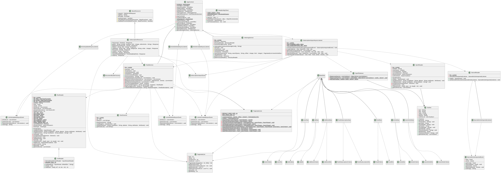

# Subscription and Content Subsystem
 This is where new feed is added to the reader. The feed can be fetched from a URL or imported via a Google Takeout ZIP or OPML format file. You can also export your subscriptions to an xml. The system also displays the 10 most recent articles when you add a new feed.

## Class Diagram

### BaseResource
BaseResource is an abstract class, which serves as a foundational class for RESTful resources in the application. It provides common functionality and properties that are likely to be shared across different REST resource classes.BaseResource is designed to streamline the development of RESTful services by providing essential security and request-handling features that can be reused across different resource classes.

### SubscriptionResource
Subscription Resource handles HTTP requests related to feed subscriptions.Manages operations related to feed subscriptions, such as listing, adding, updating, deleting, and importing/exporting subscriptions.

- Public add() : Adds a new subscription to a feed using a URL and optional title.

- Public importFile() :  Imports data into the user's account from an OPML file or a ZIP containing OPML and Google Takeout data.

- Public export() : exports all the user's feeds to an OPML file.

### Appcontext
The AppContext class is a central component in the application, designed to manage and provide access to core services and event buses. It follows the Singleton design pattern to ensure that only one instance of the application context exists throughout the application's lifecycle. This class is responsible for initializing and managing event buses for synchronous and asynchronous events, as well as providing access to key services like 'FeedService' and 'IndexingService'.

- Contructor : initializes the application context by setting up event buses and starting core services.
- resetEventBus() : Reinitializes all event buses and registers necessary event listeners. This method is called during initialization and when resetting the context.
- newAsyncEventBus() : Creates a new asynchronous event bus using a single-thread executor. This method is used to create event buses for handling asynchronous events.
- Remaing are getters for FeedService, IndexingService, and EventBus.

### SubscriptionImportedEvent
Event raised on request to import an subscriptions (OPML, Google Takeout) file.

- Contains the User object, File object.
- Set and Get methods for User, File.

### SubscriptionImportAsyncListener
SubscriptionImportAsyncListener is responsible for handling subscription import events. It listens for `SubscriptionImportedEvent` events and processes them to import user subscriptions. This class is part of the event-driven architecture, allowing asynchronous handling of import requests. It interacts with various services and DAOs to perform the import operations.

- Public onSubscriptionImport(SubscriptionImportedEvent subscriptionImportedEvent) : This method is triggered when a SubscriptionImportedEvent is posted to the event bus. It processes the import file associated with the event, creating jobs and handling the import logic

- Private createJob(User user, File importFile) : Reads the import file to determine the number of feeds and starred articles, then creates a new job to track the import process.

- Private processImportFile(User user, File importFile, Job job) : Processes the import file, extracting and importing feeds and starred articles. It handles both ZIP archives and OPML files.

- Private importOutline(User user, List<Outline> outlineList, Job job) : Imports categories and feeds from a list of outlines, creating new subscriptions and updating the user's feed list.

- Private importFeedFromStarred(User user, Feed feed, Article article) : Imports feeds referenced from starred articles, creating records even if the feed cannot be downloaded.

- Private getFeedCount() : Number of feeds in a Outline list.

### OpmlReader
OpmlReader is responsible for parsing OPML (Outline Processor Markup Language) files. It reads the XML structure of an OPML document and constructs a tree of Outline objects, representing the hierarchical structure of the document.

- Constructor : Constructor that initializes the reader, setting up necessary data structures like stacks for elements and outlines.

- Public read(InputStream is) : Reads and parses an OPML file from the provided input stream. It uses a SAX parser to process the XML content.

- Public getOutlineList() : Returns the list of outlines from the root outline, providing access to the parsed structure.

### OpmlFlattener
OpmlFlattener is a utility class designed to flatten a hierarchical list of Outline objects into a map. This map organizes outlines by category, simplifying further processing.

- Public flatten(List<Outline> outlineList) : Converts a hierarchical list of outlines into a map where the key is the category name and the value is a list of outlines under that category.

### Outline
Outline represents an individual outline in an OPML document. It contains properties such as text, title, URLs, and type, and can also contain a list of sub-outlines.

- It Just contains the properties and getter and setter methods.

### StarredReader, StarredArticleImportedEvent, StarredArticleImportAsyncListener
These classes are resposible for reading the content in Json file(Present in Google Takeout ZIP file). These Json are called Starred articles. StarredReader reads the Json file and creates the StarredArticleImportedEvent. StarredArticleImportAsyncListener listens to the StarredArticleImportedEvent and processes the Starred articles.

- setStarredArticleListener(StarredArticleImportedListener listener) : Registers a listener that will be notified whenever a starred article is imported. This allows for asynchronous handling of starred articles by external components.

- read(InputStream inputStream) : Reads starred articles from the provided input stream, processes each article, and triggers an event for each one. This method is the main entry point for processing starred articles.

### FeedService
FeedService is responsible for managing the synchronization and processing of RSS/Atom feeds. It handles the fetching, parsing, and updating of feed data, ensuring that the local database is kept up-to-date with the latest articles. The service also manages user subscriptions and provides utilities for handling feed-related events and transactions. This class extends AbstractScheduledService, allowing it to run scheduled tasks for periodic feed synchronization.

- Public synchronize(String url) : Synchronizes a specific feed from the given RSS URL. It fetches and parses the feed, updates the feed and articles in the database, and handles any changes since the last synchronization.

- Public createInitialUserArticle(String userId, FeedSubscription feedSubscription) : Creates the initial batch of user-specific articles when subscribing to a feed, ensuring the user has unread articles available.

- Private completeArticleList(List<Article> articleList) : Ensures that all articles in the list have necessary data, such as publication dates. It updates articles with missing or future publication dates.

- Private getArticleToRemove(List<Article> articleList) : Identifies articles that have been removed from the feed since the last synchronization. It returns a list of articles to be deleted from the database.

- Private parseFeedOrPage(String url, boolean parsePage) : Parses a page containing an RSS or Atom feed, or an HTML page linking to a feed. It attempts to recover from certain errors by parsing the page as HTML.

### RssReader
 RssReader is an XML parser specifically designed to handle RSS and Atom feeds. It extends the SAX DefaultHandler to process XML elements and attributes, building a structured representation of the feed and its articles. The class supports multiple feed formats and handles various date formats commonly used in feeds. RssReader is used to extract feed metadata and articles, which can then be stored or processed further by other components in the application.

- Constructor : Constructor that initializes the RssReader instance, setting up necessary data structures like stacks for elements.

- Public readRssFeed(InputStream is) : Reads and parses an RSS or Atom feed from the provided input stream. It uses a SAX parser to process the XML content, extracting feed metadata and articles.

- Private initFeed() : Initializes a new Feed object and associated lists for articles and links. This method is called when a new feed element is encountered.

### XmlReader
Starts reading the Xml file and finds the type of encoding and reads the file.

### RssExtractor
RssExtractor is an HTML parser used to identify and extract RSS and Atom feed URLs from a given HTML page. It extends the SAX DefaultHandler to process HTML elements and attributes, specifically looking for <link> tags that indicate alternate feeds. The class is useful for applications that need to discover feeds from web pages automatically. The class maintains a list of extracted feed URLs and provides functionality to read and parse HTML content using a SAX parser.

- Constructor : Constructor that initializes the RssExtractor with the URL of the HTML page to be parsed. It sets up the necessary data structures, including the list to store extracted feed URLs.

- Public readPage(InputStream is) : Reads and parses an HTML page from the provided input stream. It uses a SAX parser to process the HTML content, looking for <link> tags that specify RSS or Atom feeds.

- Public getFeedList() : Returns the list of extracted feed URLs. This list contains the URLs of RSS and Atom feeds discovered during the parsing of the HTML page.

### ArticleCreatedAsyncEvent, ArticleUpdatedAsyncEvent, ArticleDeletedAsyncEvent
Event raised when an article is created, updated, or deleted, respectively. These events are used to notify other components of changes to the article database, allowing for real-time updates and processing. When this event is raised, the corresponding listener can handle the event and perform any necessary actions, such as updating search indexes or notifying users of new content.

- Contains the List of Articles.
- Set and Get methods for List of Articles.

### Dao's
1. The DAO pattern is used to abstract and encapsulate all access to the data source. The DAO manages the connection with the data source to obtain and store data.

2. Provide CRUD (Create, Read, Update, Delete) operations for entities.

3. Handle database interactions, such as executing queries and managing transactions.

4. Isolate the application/business layer from the persistence layer.

### Criteria
1. Criteria classes are used to define search criteria for querying the database. They encapsulate the parameters needed to filter and sort data.

2. Provide a flexible way to construct database queries based on various conditions.

3. Allow dynamic query construction without the need for hardcoded SQL.

### Dto's
1. DTOs are used to transfer data between software application subsystems. They are often used to encapsulate data and send it over the network or between layers in an application.

2. Hold data that needs to be transferred between layers or systems.

3. Reduce the number of method calls by aggregating data into a single object.

### Entity's
1. Entities represent the core data objects in a system. In JPA, an entity is a lightweight, persistent domain object that is typically mapped to a database table.

2. Define the structure of the data, including fields and relationships.

3. Serve as the primary objects that are persisted in the database.

### PaginatedList, PaginatedLists
PaginatedLists provides utility methods for creating and managing paginated lists of data. It is particularly useful for handling database queries that return large datasets, allowing for efficient retrieval and display of data in pages. The class includes methods for creating paginated lists, executing queries with pagination, and counting the total number of results. This class helps manage pagination parameters such as page size and offset, ensuring that queries are executed efficiently and results are returned in a manageable format.

- Public create(Integer pageSize, Integer offset) : Constructs a paginated list with the specified page size and offset. It applies default and maximum size constraints to ensure valid pagination parameters.

- Public executeQuery(QueryParam queryParam) : Executes a non-paginated query based on the provided query parameters. It constructs the query string, applies sorting if specified, and executes the query to retrieve results.

- Private executeCountQuery(PaginatedList<E> paginatedList, QueryParam queryParam) : Executes a native count query to determine the total number of results for the given query parameters. It updates the paginated list with the result count.

- Private executeResultQuery(PaginatedList<E> paginatedList, QueryParam queryParam) : Executes a query to retrieve the data for the current page, based on the pagination parameters in the paginated list. It applies sorting and retrieves the specified range of results.

- Public executePaginatedQuery(PaginatedList<E> paginatedList, QueryParam queryParam, SortCriteria sortCriteria) : Executes a paginated query using two native queries: one to count the total number of results and another to retrieve the current page of data. It applies sorting criteria if specified.

- Private getOrderByClause(SortCriteria sortCriteria) : Constructs the SQL "ORDER BY" clause based on the provided sort criteria. It determines the column and order (ascending or descending) for sorting.

## Flow of Control
The flow of control in the Subscription and Content Subsystem is as follows:

### For Importing and Presenting Articles

1. During its initialization, **AppContext** registers the **SubscriptionImportAsyncListener** with the importEventBus.
2. Once registered, this listener waits for **SubscriptionImportedEvent** events to be posted to the importEventBus.
3. When an event is received, it triggers the onSubscriptionImport method, which contains the logic to process the subscription import.
4. calling onSubscriptionImport finally leads to creating new articles, feeds, and categories in the system.
5. In onSubscriptionImport, we first checks if the file is a ZIP archive or an OPML file.
    - If it is a ZIP archive, we extract the contents and process the import file. This ZIP file contains a OPML file and JSON file.
        - We read the JSON file to get the feeds and starred articles using **Starred Reader**.
            - **Starred Reader** reads Json and creates the **StarredArticleImportedEvent** which intilizes the **StarredArticleImportAsyncListener**.
            - Then Feed, Article and UserArticle are created if they are new articles. 
            - If Feed, Article and UserArticle are already present, then we update the UserArticle and synchronize all feeds.
        - We read the OPML file using **OPML Reader** to get the **Outline**(i.e feeds).

    - If it is an OPML file, we directly process the import file using **OPML Reader** which finally gives **Outline**(i.e feeds).
        - Creates the categories and outline maps.
        - Iterates through the category wise feeds and creates categories if they are new. Iterates through Outline of each category
        finds the feedUrl. Creates the **FeedService** Object that takes feedUrl and synchronize(creating, updating, deleting feed/articles) the feed.

6. Further **FeedService** contains methods like synchronize()(which reads the feedUrl Using **RssReader**,**RssExtractor** and get info about feed, articles and update,deletes,creates using **ArticleCreatedAsyncEvent**, **ArticleUpdatedAsyncEvent**, **ArticleDeletedAsyncEvent**.)
7. Also **FeedService** contains methods like createInitialUserArticle() that creates UserArticle and also creates **PaginatedLists**,**PaginatedList**.

### For Exporting Feed
1. When Http request of export is made, **SubscriptionResource** calls export() method.

2. When export() method is called, We get the feedsubscription data from **FeedSubscription** Entity uisng **FeedSubscriptionDao**, **FeedSubscriptionCriteria**, **FeedSubscriptionDto**.

3. We build OPML file using **DocumentBuilderFactory** and **DocumentBuilder**.

## Assumptions
1. About Dao's, Dto's, Criteria and Entity's
    - For the sake of clear visbility and clear representation. We have not represented the relation of main classes like **FeedService**, **RssReader**, **RssExtractor**, **ArticleCreatedAsyncEvent**, **ArticleUpdatedAsyncEvent** and **ArticleDeletedAsyncEvent** etc... with Dao's, Dto's, criteria and Entity's.

    - But in actual implementation, these classes are related to each other and are used to perform operations like creating, updating, deleting and reading the data from the database.

    - But we represented relations among Dao's, Dto's, criteria and Entity's.

2. Many of the external packages like **EntityManager**, **TransactionUtil**, **DocumentBuilderFcatory** etc... are not shown in UML diagram. But they are used in the actual implementation.

## **Observations & Comments**  
**Strengths**:  
- **Event-Driven Architecture**: Decouples import processing (`SubscriptionImportAsyncListener`), feed synchronization (`FeedService`), and indexing (`IndexingService`).  
- **Modular Parsing**: `OpmlReader`/`StarredReader` handle diverse file formats cleanly.  
- **Pagination Utility**: `PaginatedLists` simplifies large dataset management.  

**Weaknesses**:  
- **Singleton Overuse**: `AppContext` as a global singleton may hinder testability.  
- **Thread Safety**: `asyncEventBus` uses a single-thread executor; bottlenecks possible for large imports.  
- **Error Handling**: Limited logging in `RssReader`/`OpmlReader` could obscure parsing failures.  