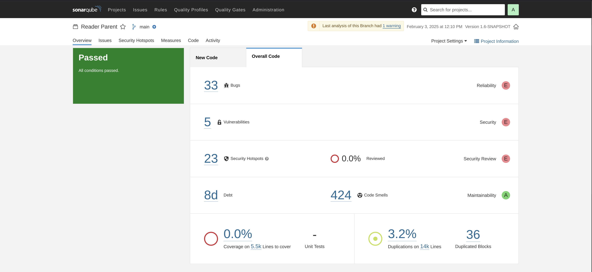
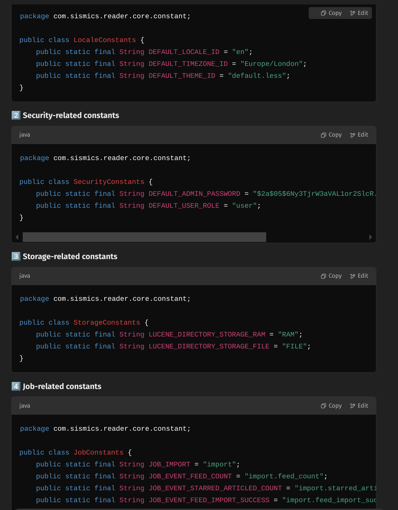

# Task 2A - Design Smells

## Tools

### SonarQube Report


Eventhough SonarQube identified 424 code smells, almost all of them are mostly code related smells and not design smells. (Ex: Try-catch blocks, refactoring if statements, etc.)

### DesigniteJava Report

Design Smells identified by DesigniteJava are included in the file `docs/designite/designCodeSmells.csv`

## Design Smell Analysis

### 1. Broken Modularization
**Location:** `com.sismics.reader.core.constant`

**Problem:**
- Constants unrelated to each other are grouped in the same class
- Violates Single Responsibility Principle

**Solution:**
1. Separate constants into domain-specific classes
2. Group related constants together

**Quality Impact:**
- Maintainability: Changes in one concern affect unrelated areas
- Scalability: Adding features requires modifying a single class
- Readability: Mixed concerns reduce code clarity
- Reusability: Unnecessary dependencies between modules

**Code Changes:**

Before: (in `com.sismics.reader.core.constant.Constants`)
```java
public class Constants {
   /**
     * Default locale.
     */
    public static final String DEFAULT_LOCALE_ID = "en";
    /**
     * Default timezone ID.
     */
    public static final String DEFAULT_TIMEZONE_ID = "Europe/London";
    ....

}
```

Here, not only there are many constants, but also they are not related to each other. There are different groups of constants in the same class.

After:

4 different classes are created:

- `com.sismics.reader.core.constant.DefaultConfig`
- `com.sismics.reader.core.constant.SecurityConfig`
- `com.sismics.reader.core.constant.LuceneConfig`
- `com.sismics.reader.core.constant.ImportJobConfig`

Each of these classes are responsible for a single concern and are not mixed with other concerns. This makes the code more maintainable and easier to understand. It is also easier to add new constants without affecting other classes.

**LLM Suggestions:**

Prompt:
`
I will provide code, type of design smell. Justify the reason why that happens, also indicate where exactly in the code it happens. Explain the quality attributes affected by that smell, and also indicate the steps to refactor it.
`

- ChatGPT:


Here the change suggested by ChatGPT is correct, the actual change made is the same. This is a relatively simple refactoring, so the LLM was able to suggest the correct solution.

### 2. Cyclic Dependency
**Location:** 
- `com.sismics.reader.core.service.FeedService`
- `com.sismics.reader.core.service.IndexService`

**Problem:**
Multiple circular dependencies:
- FeedService ↔️ FeedDao
- FeedService ↔️ AppContext
- FeedService ↔️ FeedSubscription

**Solution:**
1. Implement Dependency Injection
2. Use Factory pattern for service instantiation
3. Introduce service interfaces
4. Extract FeedSyncService for synchronization
5. Update AppContext to use factories

**Quality Impact:**
- Maintainability: Changes cascade through dependent components
- Testability: Complex mocking required
- Reusability: Components tightly coupled
- Flexibility: Changes have system-wide effects

### 3. Deficient Encapsulation
**Location:**
- `com.sismics.reader.core.dao.file.rss.RssReader`
- `com.sismics.reader.core.dao.file.html.FaviconDownloader`

**Problem:**
- Public fields expose internal state
- Direct exposure of internal data structures
- Improper access modifiers

**Solution:**
1. Make instance variables private
2. Implement defensive copying
3. Create immutable value objects

**Quality Impact:**
- Maintainability: Implementation changes affect external components
- Security: Vulnerable to state manipulation

### 4. Insufficient Modularization

**Location:**
- `com.sismics.reader.core.dao.jpa.dto.UserArticleDto`
- `com.sismics.reader.core.dao.jpa.dto.ArticleDto`
- `com.sismics.reader.core.dao.jpa.dto.FeedSubscriptionDto`

**Problem:**
- **Mixed Responsibilities:** DTOs contained fields for multiple domain concerns (e.g., article data mixed with comment and enclosure details).
- **Tight Coupling:** Changes in one concern (such as comments) required modifications in several DTOs, increasing the risk of errors.
- **Code Duplication:** Similar fields (like `commentCount`, `enclosureType`, etc.) were repeated across different DTOs, making the code hard to maintain and extend.

**Solution:**
1. **Split DTOs by Domain Concept:**  
   Create new domain-specific DTOs such as:
   - `CommentDto`
   - `EnclosureDto`
   - `CategoryDto`
   - `FeedDto`
2. **Refactor Existing DTOs:**  
   Update classes like `ArticleDto` and `FeedSubscriptionDto` to delegate responsibilities to these new DTOs.  
   **Example:**  
   - **Old Approach:**  
     ```java
     public class ArticleDto {
         private String commentUrl;
         private Integer commentCount;
         private String enclosureUrl;
         // Other fields...
     }
     ```
   - **New Approach:**  
     ```java
     public class ArticleDto {
         private CommentDto comment;
         private EnclosureDto enclosure;
         // Other fields...
     }
     ```
3. **Update Mappers:**  
   Refactor mappers (e.g., `ArticleMapper`) to map data into nested DTOs.  
   **Example:**  
   - **Old Mapping:**  
     ```java
     dto.setCommentUrl(stringValue(o[i++]));
     dto.setCommentCount(intValue(o[i++]));
     ```
   - **New Mapping:**  
     ```java
     CommentDto commentDto = new CommentDto();
     commentDto.setUrl(stringValue(o[i++]));
     commentDto.setCount(intValue(o[i++]));
     dto.setComment(commentDto);
     ```
4. **Revise Service and REST Layers:**  
   Update assemblers and service methods to access data via the nested DTOs.  
   **Example:**  
   - **Old:**  
     ```java
     userArticleJson.put("comment_url", userArticle.getArticle().getCommentUrl());
     ```
   - **New:**  
     ```java
     userArticleJson.put("comment_url", userArticle.getArticle().getComment().getUrl());
     ```

**Quality Impact:**
- **Maintainability:**  
  Isolating concerns means that modifications in one domain (e.g., comments) only affect the corresponding DTO, reducing the risk of unintended side effects.
- **Reusability:**  
  Domain-specific DTOs are more generic and can be reused across various parts of the application without duplicating code.
- **Testability:**  
  Smaller, focused DTOs simplify unit testing, as tests can target individual components rather than large, composite objects.
- **Flexibility:**  
  The modular structure makes it easier to add new features or modify existing ones without affecting unrelated components.

---

#### Detailed Comparison: Old vs. Refactored Code

| **Aspect**         | **Old Code**                                                                                                           | **New Code**                                                                                                                                                   | **Why It’s Better**                                                                                                                                                                   |
|--------------------|------------------------------------------------------------------------------------------------------------------------|----------------------------------------------------------------------------------------------------------------------------------------------------------------|----------------------------------------------------------------------------------------------------------------------------------------------------------------------------------------|
| **Responsibilities** | Mixed article data with comment/enclosure fields (e.g., `commentUrl`, `enclosureUrl`).                                  | Split into domain-specific DTOs: `ArticleDto` now uses `CommentDto`, `EnclosureDto`, etc.                                                                    | Each DTO now has a single responsibility, reducing complexity.                                                                                                                     |
| **Coupling**          | Tight coupling: Changes to comment/enclosure details required modifying multiple DTOs.                                | Loose coupling: `ArticleDto` depends on abstracted DTOs like `CommentDto`, `EnclosureDto`.                                                                   | Decouples concerns—changes in one area (like comments) only affect its corresponding DTO.                                                                                            |
| **Code Duplication**  | Fields like `commentCount` and `enclosureType` were duplicated across several DTOs.                                    | Reusable DTOs (e.g., `CommentDto` is used wherever comment data is needed).                                                                                    | Eliminates duplication, thereby improving consistency and reducing maintenance effort.                                                                                               |
| **Data Structure**    | Flat structure with all properties directly embedded in a single DTO.                                                | Hierarchical structure with nested DTOs (e.g., `article.getComment().getUrl()`).                                                                              | More accurately models real-world relationships and improves readability.                                                                                                            |
| **Maintainability**   | Modifications to comment logic required changes in multiple DTOs and mappers.                                           | Changes are localized: updating `CommentDto` automatically propagates to all DTOs that utilize it.                                                              | Simplifies maintenance and minimizes the risk of errors.                                                                                                                             |
| **Testability**       | Testing involved constructing large objects with numerous unrelated fields.                                          | Smaller, focused DTOs allow for targeted unit tests in isolation.                                                                                             | Enhances test coverage by allowing easier and more precise unit tests.                                                                                                                 |
| **Flexibility**       | Adding or removing fields (like `isFolded` in categories) required changes across multiple layers.                   | New features can be added by extending only the relevant DTO (e.g., `CategoryDto` now includes `isFolded`), without impacting other components.             | Increases adaptability to new requirements, as changes are isolated within specific domain areas.                                                                                      |

---

**LLM Suggestions:**

Prompt:
`
I will provide code, type of design smell. Justify the reason why that happens, also indicate where exactly in the code it happens. Explain the quality attributes affected by that smell, and also indicate the steps to refactor it.
`


#### Conclusion

By refactoring the DTOs to enforce proper modularization, we directly address the issues of mixed responsibilities, tight coupling, and code duplication. This change aligns with the Single Responsibility Principle, leading to a cleaner, more maintainable, and testable codebase. Future changes—such as updating comment details or extending feed information—will be isolated to their respective DTOs, thereby reducing the risk of unintended side effects and streamlining the overall development process.

### 5. Unutilized Abstraction
**Location:** `com.sismics.reader.rest.resource.*`

**Problem:**
- Ineffective use of BaseResource inheritance
- Duplicated logic across resources
- Repeated authentication and error handling

**Solution:**
1. Extract common logic to base class
2. Implement proper inheritance
3. Standardize error handling

**Quality Impact:**
- Maintainability: Duplicated code increases maintenance burden
- Reusability: Common functionality not shared
- Complexity: Duplicate patterns increase cognitive load

### 6. Wide Hierarchy
**Location:** `com.sismics.reader.rest.resource.BaseResource`

**Problem:**
- Too many direct subclasses
- Missing intermediate abstractions
- Poor organization of endpoints

**Solution:**
1. Create intermediate abstract classes
2. Group related functionality
3. Reorganize inheritance hierarchy

**Quality Impact:**
- Maintainability: Inconsistent patterns
- Reliability: Inconsistent error handling
- Security: Varying authentication implementations


All of these design smells are identified using DesigniteJava. It identified many more, but these were selected.