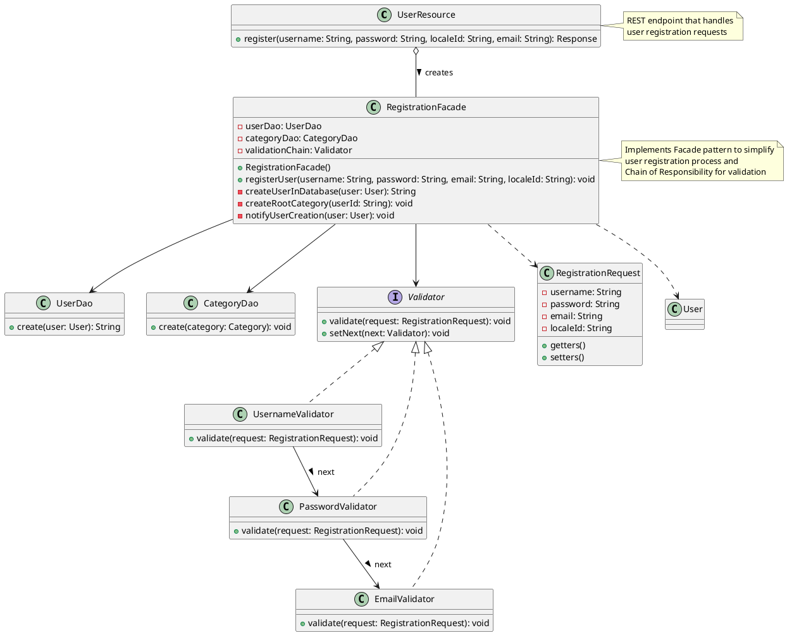
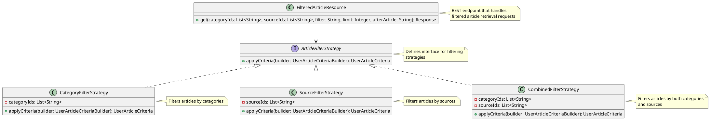
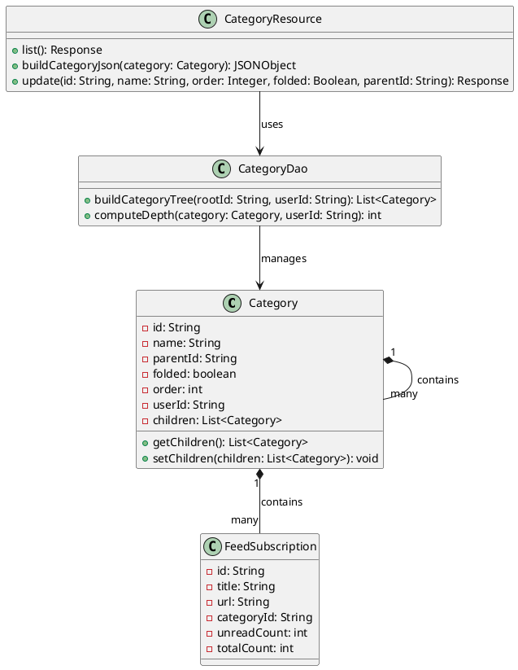
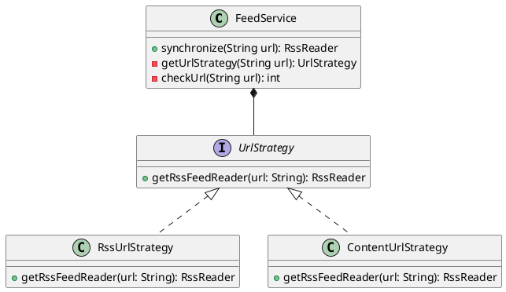
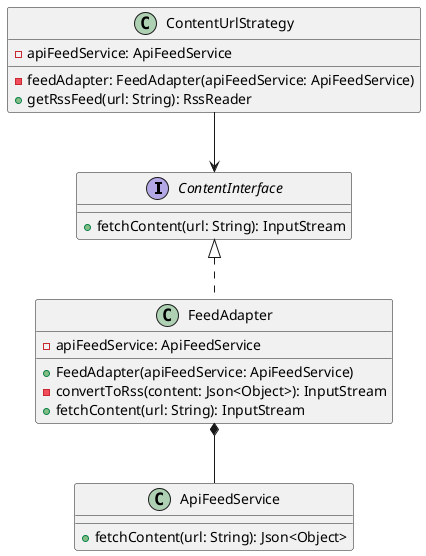

# Project - 2


## Feature - 1: User Registration

### Frontend Changes

Added a sign-up button, and a form. On clicking the sign-up button, the data is sent to the backend through the API endpoint *../user* using a **PUT** request. Also, the warning of changing the default password is removed for newly created users.

### Design Patterns Used

#### Facade

In the method `register` in `UserResource.java`, all of the new user creation is taking place. This includes communication with the Database, creation of new `User` objects, handling connection with front-end, validating the user details etc. This is a problem as the Single Responisbility principle is violated. So, Facade pattern is used.

**Rationale:**

Facade is a structural design pattern that provides a simplified interface to a library, a framework, or any other complex set of classes.

This seperates the concerns and abstracts the details required by the method handiling the end-point.

Currently, `register` method handlesonly the connection to front-end.


**Changes**

- A class RegistrationFacade is created, whcih handles all the user creation logic. 
- All the steps like validation, creating the `User` object and updating the database is done by this class using different methods.
- Only one method `registerUser` is exposed by this class, encapsulating all the other details to other classes.
- This greatly improves extensibility of system as it is easy to extend each of these steps by just modifying the method relating to it.
- Testability is also increased as each step can be independently unit tested.


**Refactoring:**
`
```plantuml

class UserResource {
    + register(username: String, password: String, localeId: String, email: String): Response
}

class RegistrationFacade {
    - userDao: UserDao
    - categoryDao: CategoryDao
    - validationChain: Validator

    + RegistrationFacade()
    + registerUser(username: String, password: String, email: String, localeId: String): void
    - createUserInDatabase(user: User): String
    - createRootCategory(userId: String): void
    - notifyUserCreation(user: User): void
}

UserResource o-- RegistrationFacade : creates >


note right of UserResource
  REST endpoint that handles
  user registration requests
end note


note right of RegistrationFacade
  Implements Facade pattern to simplify
  user registration process
end note

@enduml

```


#### Chain of Responsibility


In the validation step, currently various methods are present for validating different attributes (Ex. `validateEmail`, `validatePassword` etc.). All of these are used sequentially one after one whenever there is a need for validation. This hampers extensibility where we want to expand the validation checks.

**Rationale:**

Chain of Responsibility is a behavioral design pattern that lets you pass requests along a chain of handlers. Upon receiving a request, each handler decides either to process the request or to pass it to the next handler in the chain.

This separates the validation logic into individual classes and allows for easy addition or modification of validation rules.

Currently, the validation chain processes username, password, and email validations in sequence.

**Changes**

- Created abstract BaseValidator class implementing the Validator interface to provide common chain functionality
- Created separate validator classes (UsernameValidator, PasswordValidator, EmailValidator) for each validation rule
- Each validator can be configured with a next validator to form the chain
- RegistrationFacade sets up the chain during initialization
- Each validator independently handles its validation logic and passes the request to the next validator
- New validation rules can be easily added by creating new validator classes and inserting them into the chain

**Refactoring:**

```plantuml
interface Validator {
    + validate(request: RegistrationRequest): void
    + setNext(next: Validator): void
}

abstract class BaseValidator {
    # nextValidator: Validator
    + setNext(next: Validator): void
    # validateNext(request: RegistrationRequest): void
}

class UsernameValidator {
    + validate(request: RegistrationRequest): void
}

class PasswordValidator {
    + validate(request: RegistrationRequest): void
}

class EmailValidator {
    + validate(request: RegistrationRequest): void
}

class RegistrationRequest {
    - username: String
    - password: String
    - email: String
    - localeId: String
}

Validator <|.. BaseValidator
BaseValidator <|-- UsernameValidator
BaseValidator <|-- PasswordValidator
BaseValidator <|-- EmailValidator

UsernameValidator --> PasswordValidator : next >
PasswordValidator --> EmailValidator : next >

note right of Validator
  Defines interface for handling
  validation requests
end note

note right of BaseValidator
  Provides common functionality
  for chaining validators
end note

@enduml
```

Currently the following checks are implemented:

- Unique Email
- Email Format
- Password > 8 letters

**Example Usage:**

```java
// Setting up the chain
UsernameValidator usernameValidator = new UsernameValidator();
PasswordValidator passwordValidator = new PasswordValidator();
EmailValidator emailValidator = new EmailValidator();

usernameValidator.setNext(passwordValidator);
passwordValidator.setNext(emailValidator);

// Using the chain
RegistrationRequest request = new RegistrationRequest(username, password, email, localeId);
usernameValidator.validate(request); // Starts the validation chain
```

This pattern makes the validation process more maintainable and extensible while keeping each validation rule focused and independent.


**Complete Refactoring for this feature:**




## Feature-2: Filtering Articles

### Backend Changes

The `FilteredArticleResource` class provides an API endpoint to retrieve articles filtered by categories, sources, and other criteria. It uses a combination of strategies to apply these filters effectively.


### Design Patterns Used

#### Strategy Pattern

The `FilteredArticleResource` uses the Strategy design pattern to apply different filtering strategies based on the input parameters. This pattern allows the system to choose the appropriate filtering strategy at runtime, making the code more flexible and easier to extend.

**Rationale:**

The Strategy pattern is a behavioral design pattern that enables selecting an algorithm's behavior at runtime. It defines a family of algorithms, encapsulates each one, and makes them interchangeable.

In `FilteredArticleResource`, different strategies are used to filter articles by categories, sources, or a combination of both. This approach separates the filtering logic from the resource class, adhering to the Single Responsibility Principle.

**Changes:**

- Introduced `ArticleFilterStrategy` interface to define the contract for filtering strategies.
- Implemented multiple strategies: `CategoryFilterStrategy`, `SourceFilterStrategy`, and `CombinedFilterStrategy`.
- The `get` method in `FilteredArticleResource` selects the appropriate strategy based on the input parameters.

**Implementation:**




**Example Usage:**

```java
// Selecting the appropriate strategy
ArticleFilterStrategy filterStrategy;
if (!categoryIds.isEmpty() && !sourceIds.isEmpty()) {
    filterStrategy = new CombinedFilterStrategy(categoryIds, sourceIds);
} else if (!categoryIds.isEmpty()) {
    filterStrategy = new CategoryFilterStrategy(categoryIds);
} else if (!sourceIds.isEmpty()) {
    filterStrategy = new SourceFilterStrategy(sourceIds);
} else {
    filterStrategy = new DefaultFilterStrategy();
}

// Applying the strategy
UserArticleCriteria userArticleCriteria = filterStrategy.applyCriteria(criteriaBuilder);
```

This pattern makes the filtering process more maintainable and extensible while keeping each filtering rule focused and independent.

## Feature-4: Making Categories Better 
Task - Enhance the category system to support nesting, allowing up to 5 levels of subcategories. Each category and subcategory should display metadata such as the number of unread items and the total count of articles. The UI should render nested categories in a collapsible format, allowing categories to host both individual feeds and subcategories simultaneously.
### Features Implemented
1. Hierarchical Structure:

- Categories can contain both subscriptions and subcategories
- Support for up to 5 levels of nesting
- Proper parent-child relationships maintained


2. Metadata Display:

- Unread counts calculated and displayed for each category
- Total article counts aggregated through the hierarchy
- Visual distinction between unread and total counts


3. Interactive UI:

- Collapsible/expandable categories
- Drag-and-drop reorganization of categories and subscriptions
- Persistent state across sessions


### Design Patterns Used:
1. **Composite Pattern**
The Composite Design Pattern is a structural design pattern that lets you compose objects into tree-like structures to represent part-whole hierarchies. It allows clients to treat individual objects and compositions of objects uniformly. In other words, whether dealing with a single object or a group of objects (composite), clients can use them interchangeably.

#### Rationale:
The Composite pattern is a structural design pattern that lets you compose objects into tree structures to represent part-whole hierarchies. In our RSS reader, we needed to represent a hierarchical structure of categories and subscriptions, where categories can contain both subscriptions (leaf nodes) and other categories (composite nodes).
This pattern provides an elegant solution for treating individual objects and compositions of objects uniformly. For our nested categories implementation, this meant we could handle operations on both simple subscriptions and complex nested category structures using the same interface.The most compelling evidence of the Composite pattern is in our recursive implementations. The recursive approach elegantly handles the tree structure without needing to know the depth or complexity of the hierarchy.

Categories function as the composite nodes in our tree. The dual containment capability is the essence of the Composite pattern and is implemented through the children and subscriptions lists in our Category class.
Subscriptions represent the leaf nodes in our hierarchy. They have no children and serve as the endpoints of our tree structure. In our implementation, each subscription:
- Contains data from a single RSS feed
- Maintains its own count of unread and total articles
- Can be moved between different categories
#### Changes:
- Modified the Category class to support parent-child relationships between categories
- Implemented a tree structure in both backend and frontend to represent the hierarchy
- Created recursive functions to process and display the nested structure
- Added depth calculation and restrictions to respect the 5-level nesting limit
- Added calculation of unread and total counts for each category in the hierarchy
- Implemented propagation of counts from child categories to parent categories
- Created a mechanism to update these counts when articles are read or new articles are added

#### Implementation:



In the backend, the Category entity was enhanced to maintain parent-child relationships, and the CategoryDao and the Category Dto was extended to build and manage category trees. The CategoryResource provides REST endpoints to interact with the nested structure.
In the frontend, the UI components were modified to render the hierarchical structure in a collapsible format, allowing users to expand and collapse categories as needed.

#### System Architecture
The nested category implementation follows a client-server architecture:

1. Backend (Java):

- CategoryDao: Manages category persistence and tree construction
- CategoryResource: Provides RESTful endpoints for category operations
- SubscriptionResource: Handles subscription management within categories


2. Frontend (JavaScript):

- r.subscription.js: Manages the rendering and interaction with the category tree
- Event handlers for user interactions (collapse/expand, drag-drop, etc.)

## Feature-5A: Simulating Rss Feeds

The tasks we have to implement in this feature are:

1. Take the Url and check if it is a valid RSS feed.
2. If not valid get content from the page using NewsAPI.
3. Convert that content into RSS feed.
4. API calls should be optimized to minimize request overhead.

### Design Patterns Used:
1. **Strategy Pattern**

#### Rationale:
The Strategy pattern is a behavioral design pattern that enables selecting an algorithm's behavior at runtime. It defines a family of algorithms, encapsulates each one, and makes them interchangeable. Strategy lets the algorithm vary independently from the clients that use it.

In `FeedService` we have to get RssReader object which contains feed data by parsing the Url. We have two algorithms to get the RssReader object. So, we used the Strategy pattern to implement the different strategies for fetching the content from the URL.

#### Changes:
- In this we implement the different strategies for fetching the content from the URL. We have two strategies:
    - `RssUrlStrategy` : This strategy is to parse the rssfeeds from the url which supports RSS feed which returns the RssReader object.
    - `ContentUrlStartegy` : This strategy is used to fetch the content from the URL if it is not a valid RSS feed which returns the RssReader object.
    - `UrlStrategy` : This is the interface which is implemented by the above two strategies.
- We will pick pattern based on the URL for thata i have written a function to check the URL is RSS feed or not and creates the object of repective strategy.

#### Implementation:


This pattern makes the code more modular and easy to maintain. If we want to add more strategies in the future, we can easily add them without changing the existing code.

2. **Adapter Pattern**

#### Rationale:
The Adapter pattern is a structural design pattern that allows objects with incompatible interfaces to collaborate. It acts as a bridge between two incompatible interfaces. This pattern involves a single class called adapter that is responsible for joining functionalities of independent or incompatible interfaces.

In `ContentUrlStrategy` we have to get the content from the URL using NewsAPI. We have to convert the content into RSS feed. So, we used the Adapter pattern to convert the content into RSS feed.

#### Changes:
- `ContentUrlStrategy` class is used to fetch the content from the URL if it is not a valid RSS feed.

- `ContentInterface` is the interface which is implemented by the `FeedAdapter` class.

- `ApiFeedService` is the class which is used to get the content from the URL using NewsAPI.

- `FeedAdapter` class is used to convert the content into RSS feed.

#### Implementation:

This pattern makes that single adapter can be used to for many different type of adaptees which takes Json and converts it into RssfeedFormat.

### Efficient API Calls:
- We have used the `Cache` pattern to store the data in the cache. So, if the same URL is requested again, we can get the data from the cache instead of making the API call again.

- I used Time-Based Expiration (TTL - Time to Live) for the cache. So, the cache will be valid for a certain amount of time. After that time, the cache will be invalidated and the data will be fetched from the API.

#### Changes:
- `ApiCache` class is used to store the data in the cache.
- `CacheEntry` class is used to store the data in the cache with the time to live.
- `ApiFeedService` class is used to get the content from the URL using NewsAPI. It checks if the data is present in the cache. If the data is present in the cache, it will return the data from the cache. If the data is not present in the cache, it will make the API call and store the data in the cache.

```java
private ApiCache cache = new ApiCache(Duration.ofMinutes(15));

private ApiFeedService() {
}

public static ApiFeedService getInstance() {
    if (instance == null) {
        instance = new ApiFeedService();
    }
    return instance;
    }

public Optional<JSONObject> fetchContent(String apiCall) {
   
  Optional<JSONObject> cachedContent = cache.get(apiCall);
   if (cachedContent.isPresent()) {
        logger.info("Returning cached content for: {}", apiCall);
      return cachedContent;
   }

   try {
        logger.info("Fetching content from: {}", apiCall);
        URL url = new URL(apiCall);
        HttpURLConnection conn = (HttpURLConnection) url.openConnection();
        conn.setRequestMethod("GET");
        conn.setRequestProperty("Accept", "application/json");
        
        int responseCode = conn.getResponseCode();
        if (responseCode == HttpURLConnection.HTTP_OK) {
            try (BufferedReader reader = new BufferedReader(new InputStreamReader(conn.getInputStream(), StandardCharsets.UTF_8))) {
                StringBuilder response = new StringBuilder();
                String line;
                while ((line = reader.readLine()) != null) {
                    response.append(line);
                }
                cache.put(apiCall, Optional.of(new JSONObject(response.toString())));
                return Optional.of(new JSONObject(response.toString()));
            }
        } else {
            logger.error("Failed to fetch content. HTTP Response Code: {}", responseCode);
        }
    } catch (Exception e) {
        logger.error("Exception while fetching content: ", e);
    }
    cache.put(apiCall, Optional.empty());
    return Optional.empty();
}
```

#### llm Responses:
I asked llm what are the different techniques to optimize the API calls. It suggested me to use the `Caching`, `Batching`, `Reduce Frequency of Requests`.


- We can also use `Conditional Requests` to optimize the API calls. We can use the `ETag` and `Last-Modified` headers to check if the data has been modified since the last request. If the data has not been modified, we can return the `304 Not Modified` response.

But NewsApi does not support the `ETag` and `Last-Modified` headers. So, we cannot use the `Conditional Requests` technique.

- Batch Requesting is better in this case than caching but NewsApi does not support the Batch Requesting. So, we cannot use the `Batch Requesting` technique.