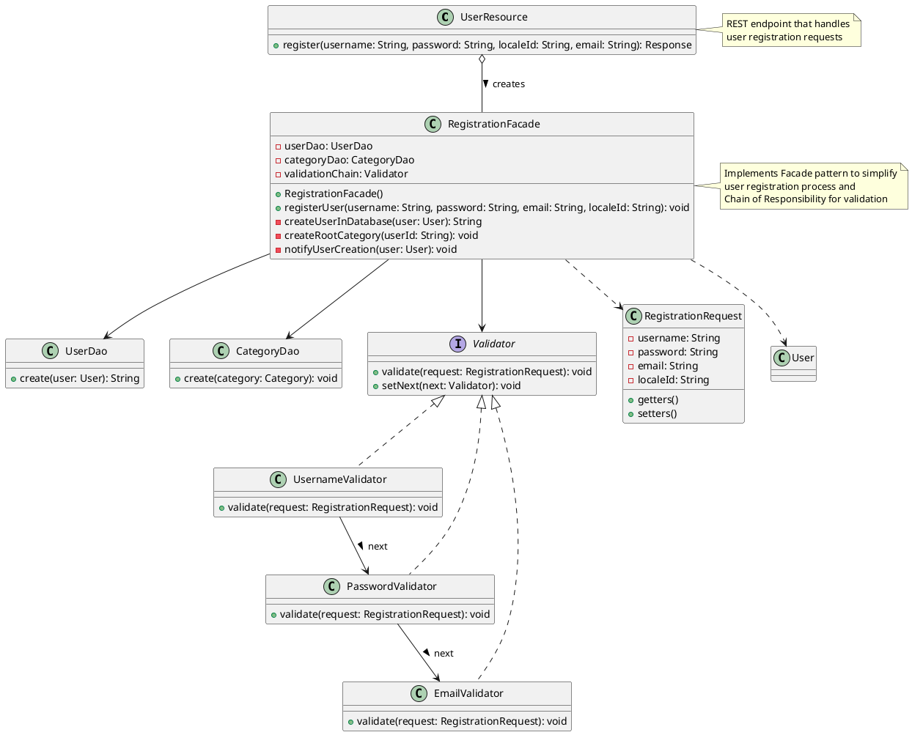
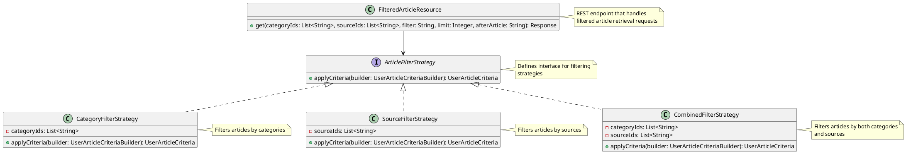

# Project - 2


## Feature - 1: User Registration

### Frontend Changes

Added a sign-up button, and a form. On clicking the sign-up button, the data is sent to the backend through the API endpoint *../user* using a **PUT** request. Also, the warning of changing the default password is removed for newly created users.

### Design Patterns Used

#### Facade

In the method `register` in `UserResource.java`, all of the new user creation is taking place. This includes communication with the Database, creation of new `User` objects, handling connection with front-end, validating the user details etc. This is a problem as the Single Responisbility principle is violated. So, Facade pattern is used.

**Rationale:**

Facade is a structural design pattern that provides a simplified interface to a library, a framework, or any other complex set of classes.

This seperates the concerns and abstracts the details required by the method handiling the end-point.

Currently, `register` method handlesonly the connection to front-end.


**Changes**

- A class RegistrationFacade is created, whcih handles all the user creation logic. 
- All the steps like validation, creating the `User` object and updating the database is done by this class using different methods.
- Only one method `registerUser` is exposed by this class, encapsulating all the other details to other classes.
- This greatly improves extensibility of system as it is easy to extend each of these steps by just modifying the method relating to it.
- Testability is also increased as each step can be independently unit tested.


**Refactoring:**
`
```plantuml

class UserResource {
    + register(username: String, password: String, localeId: String, email: String): Response
}

class RegistrationFacade {
    - userDao: UserDao
    - categoryDao: CategoryDao
    - validationChain: Validator

    + RegistrationFacade()
    + registerUser(username: String, password: String, email: String, localeId: String): void
    - createUserInDatabase(user: User): String
    - createRootCategory(userId: String): void
    - notifyUserCreation(user: User): void
}

UserResource o-- RegistrationFacade : creates >


note right of UserResource
  REST endpoint that handles
  user registration requests
end note


note right of RegistrationFacade
  Implements Facade pattern to simplify
  user registration process
end note

@enduml

```


#### Chain of Responsibility


In the validation step, currently various methods are present for validating different attributes (Ex. `validateEmail`, `validatePassword` etc.). All of these are used sequentially one after one whenever there is a need for validation. This hampers extensibility where we want to expand the validation checks.

**Rationale:**

Chain of Responsibility is a behavioral design pattern that lets you pass requests along a chain of handlers. Upon receiving a request, each handler decides either to process the request or to pass it to the next handler in the chain.

This separates the validation logic into individual classes and allows for easy addition or modification of validation rules.

Currently, the validation chain processes username, password, and email validations in sequence.

**Changes**

- Created abstract BaseValidator class implementing the Validator interface to provide common chain functionality
- Created separate validator classes (UsernameValidator, PasswordValidator, EmailValidator) for each validation rule
- Each validator can be configured with a next validator to form the chain
- RegistrationFacade sets up the chain during initialization
- Each validator independently handles its validation logic and passes the request to the next validator
- New validation rules can be easily added by creating new validator classes and inserting them into the chain

**Refactoring:**

```plantuml
interface Validator {
    + validate(request: RegistrationRequest): void
    + setNext(next: Validator): void
}

abstract class BaseValidator {
    # nextValidator: Validator
    + setNext(next: Validator): void
    # validateNext(request: RegistrationRequest): void
}

class UsernameValidator {
    + validate(request: RegistrationRequest): void
}

class PasswordValidator {
    + validate(request: RegistrationRequest): void
}

class EmailValidator {
    + validate(request: RegistrationRequest): void
}

class RegistrationRequest {
    - username: String
    - password: String
    - email: String
    - localeId: String
}

Validator <|.. BaseValidator
BaseValidator <|-- UsernameValidator
BaseValidator <|-- PasswordValidator
BaseValidator <|-- EmailValidator

UsernameValidator --> PasswordValidator : next >
PasswordValidator --> EmailValidator : next >

note right of Validator
  Defines interface for handling
  validation requests
end note

note right of BaseValidator
  Provides common functionality
  for chaining validators
end note

@enduml
```

Currently the following checks are implemented:

- Unique Email
- Email Format
- Password > 8 letters

**Example Usage:**

```java
// Setting up the chain
UsernameValidator usernameValidator = new UsernameValidator();
PasswordValidator passwordValidator = new PasswordValidator();
EmailValidator emailValidator = new EmailValidator();

usernameValidator.setNext(passwordValidator);
passwordValidator.setNext(emailValidator);

// Using the chain
RegistrationRequest request = new RegistrationRequest(username, password, email, localeId);
usernameValidator.validate(request); // Starts the validation chain
```

This pattern makes the validation process more maintainable and extensible while keeping each validation rule focused and independent.


**Complete Refactoring for this feature:**




## Feature-2: Filtering Articles

### Backend Changes

The `FilteredArticleResource` class provides an API endpoint to retrieve articles filtered by categories, sources, and other criteria. It uses a combination of strategies to apply these filters effectively.


### Design Patterns Used

#### Strategy Pattern

The `FilteredArticleResource` uses the Strategy design pattern to apply different filtering strategies based on the input parameters. This pattern allows the system to choose the appropriate filtering strategy at runtime, making the code more flexible and easier to extend.

**Rationale:**

The Strategy pattern is a behavioral design pattern that enables selecting an algorithm's behavior at runtime. It defines a family of algorithms, encapsulates each one, and makes them interchangeable.

In `FilteredArticleResource`, different strategies are used to filter articles by categories, sources, or a combination of both. This approach separates the filtering logic from the resource class, adhering to the Single Responsibility Principle.

**Changes:**

- Introduced `ArticleFilterStrategy` interface to define the contract for filtering strategies.
- Implemented multiple strategies: `CategoryFilterStrategy`, `SourceFilterStrategy`, and `CombinedFilterStrategy`.
- The `get` method in `FilteredArticleResource` selects the appropriate strategy based on the input parameters.

**Implementation:**




**Example Usage:**

```java
// Selecting the appropriate strategy
ArticleFilterStrategy filterStrategy;
if (!categoryIds.isEmpty() && !sourceIds.isEmpty()) {
    filterStrategy = new CombinedFilterStrategy(categoryIds, sourceIds);
} else if (!categoryIds.isEmpty()) {
    filterStrategy = new CategoryFilterStrategy(categoryIds);
} else if (!sourceIds.isEmpty()) {
    filterStrategy = new SourceFilterStrategy(sourceIds);
} else {
    filterStrategy = new DefaultFilterStrategy();
}

// Applying the strategy
UserArticleCriteria userArticleCriteria = filterStrategy.applyCriteria(criteriaBuilder);
```

This pattern makes the filtering process more maintainable and extensible while keeping each filtering rule focused and independent.
