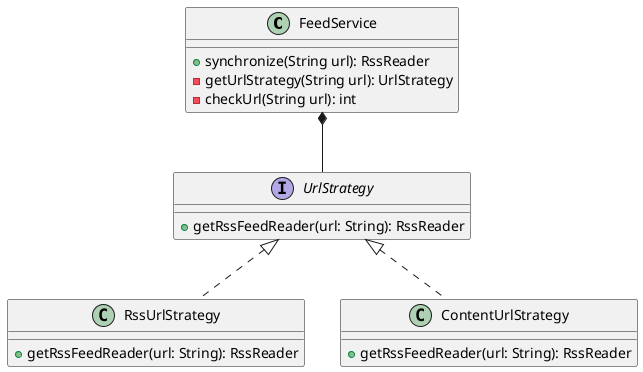
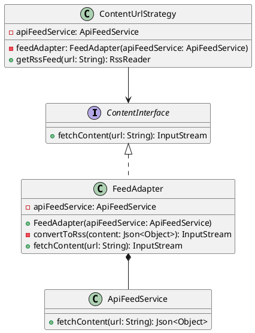

## Feature-5A: Simulating Rss Feeds

The tasks we have to implement in this feature are:

1. Take the Url and check if it is a valid RSS feed.
2. If not valid get content from the page using NewsAPI.
3. Convert that content into RSS feed.
4. API calls should be optimized to minimize request overhead.

### Design Patterns Used:
1. **Strategy Pattern**

#### Rationale:
The Strategy pattern is a behavioral design pattern that enables selecting an algorithm's behavior at runtime. It defines a family of algorithms, encapsulates each one, and makes them interchangeable. Strategy lets the algorithm vary independently from the clients that use it.

In `FeedService` we have to get RssReader object which contains feed data by parsing the Url. We have two algorithms to get the RssReader object. So, we used the Strategy pattern to implement the different strategies for fetching the content from the URL.

#### Changes:
- In this we implement the different strategies for fetching the content from the URL. We have two strategies:
    - `RssUrlStrategy` : This strategy is to parse the rssfeeds from the url which supports RSS feed which returns the RssReader object.
    - `ContentUrlStartegy` : This strategy is used to fetch the content from the URL if it is not a valid RSS feed which returns the RssReader object.
    - `UrlStrategy` : This is the interface which is implemented by the above two strategies.
- We will pick pattern based on the URL for thata i have written a function to check the URL is RSS feed or not and creates the object of repective strategy.

#### Implementation:


This pattern makes the code more modular and easy to maintain. If we want to add more strategies in the future, we can easily add them without changing the existing code.

2. **Adapter Pattern**

#### Rationale:
The Adapter pattern is a structural design pattern that allows objects with incompatible interfaces to collaborate. It acts as a bridge between two incompatible interfaces. This pattern involves a single class called adapter that is responsible for joining functionalities of independent or incompatible interfaces.

In `ContentUrlStrategy` we have to get the content from the URL using NewsAPI. We have to convert the content into RSS feed. So, we used the Adapter pattern to convert the content into RSS feed.

#### Changes:
- `ContentUrlStrategy` class is used to fetch the content from the URL if it is not a valid RSS feed.

- `ContentInterface` is the interface which is implemented by the `FeedAdapter` class.

- `ApiFeedService` is the class which is used to get the content from the URL using NewsAPI.

- `FeedAdapter` class is used to convert the content into RSS feed.

#### Implementation:

This pattern makes that single adapter can be used to for many different type of adaptees which takes Json and converts it into RssfeedFormat.

### Efficient API Calls:
- We have used the `Cache` pattern to store the data in the cache. So, if the same URL is requested again, we can get the data from the cache instead of making the API call again.

- I used Time-Based Expiration (TTL - Time to Live) for the cache. So, the cache will be valid for a certain amount of time. After that time, the cache will be invalidated and the data will be fetched from the API.

#### Changes:
- `ApiCache` class is used to store the data in the cache.
- `CacheEntry` class is used to store the data in the cache with the time to live.
- `ApiFeedService` class is used to get the content from the URL using NewsAPI. It checks if the data is present in the cache. If the data is present in the cache, it will return the data from the cache. If the data is not present in the cache, it will make the API call and store the data in the cache.

```java
private ApiCache cache = new ApiCache(Duration.ofMinutes(15));

private ApiFeedService() {
}

public static ApiFeedService getInstance() {
    if (instance == null) {
        instance = new ApiFeedService();
    }
    return instance;
}

public Optional<JSONObject> fetchContent(String apiCall) {
    
    Optional<JSONObject> cachedContent = cache.get(apiCall);
    if (cachedContent.isPresent()) {
        logger.info("Returning cached content for: {}", apiCall);
        return cachedContent;
    }

    try {
        logger.info("Fetching content from: {}", apiCall);
        URL url = new URL(apiCall);
        HttpURLConnection conn = (HttpURLConnection) url.openConnection();
        conn.setRequestMethod("GET");
        conn.setRequestProperty("Accept", "application/json");
        
        int responseCode = conn.getResponseCode();
        if (responseCode == HttpURLConnection.HTTP_OK) {
            try (BufferedReader reader = new BufferedReader(new InputStreamReader(conn.getInputStream(), StandardCharsets.UTF_8))) {
                StringBuilder response = new StringBuilder();
                String line;
                while ((line = reader.readLine()) != null) {
                    response.append(line);
                }
                cache.put(apiCall, Optional.of(new JSONObject(response.toString())));
                return Optional.of(new JSONObject(response.toString()));
            }
        } else {
            logger.error("Failed to fetch content. HTTP Response Code: {}", responseCode);
        }
    } catch (Exception e) {
        logger.error("Exception while fetching content: ", e);
    }
    cache.put(apiCall, Optional.empty());
    return Optional.empty();
}
```

#### llm Responses:
I asked llm what are the different techniques to optimize the API calls. It suggested me to use the `Caching`, `Batching`, `Reduce Frequency of Requests`.


- We can also use `Conditional Requests` to optimize the API calls. We can use the `ETag` and `Last-Modified` headers to check if the data has been modified since the last request. If the data has not been modified, we can return the `304 Not Modified` response.

But NewsApi does not support the `ETag` and `Last-Modified` headers. So, we cannot use the `Conditional Requests` technique.

- Batch Requesting is better in this case than caching but NewsApi does not support the Batch Requesting. So, we cannot use the `Batch Requesting` technique.


